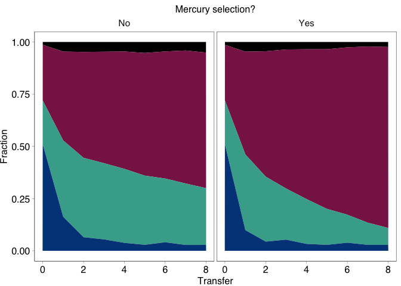
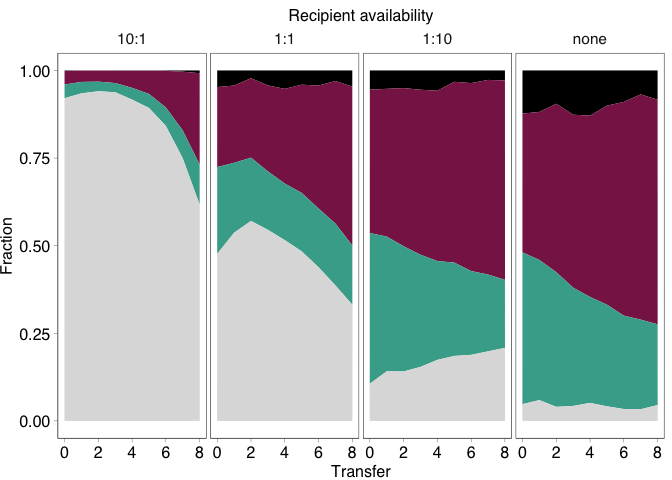

COMPMUT Dynamics 1: Generation of dynamics figures
================
jpjh
compiled November 2023

### Read in and pre-process data

Plots for the dynamics experiments.

Read in data frame.

``` r
df <- read.table("./data/fraction_data.txt", header=TRUE, quote='""')

summary(df) %>% kable()
```

|     | Treatment        | Replicate     | Transfer    | Total_count   | Fraction_Yellow   | Fraction_Red   | Fraction_Orange | Fraction_Blue   | Experiment    | Ratio         |
|:----|:-----------------|:--------------|:------------|:--------------|:------------------|:---------------|:----------------|:----------------|:--------------|:--------------|
|     | Length:1598      | Min. : 1.00   | Min. :0.0   | Min. : 1313   | Min. :0.0002484   | Min. :0.0000   | Min. :0.00000   | Min. :0.01133   | Min. :1.000   | Min. : 0.00   |
|     | Class :character | 1st Qu.: 2.00 | 1st Qu.:2.0 | 1st Qu.: 4729 | 1st Qu.:0.1020344 | 1st Qu.:0.1282 | 1st Qu.:0.00833 | 1st Qu.:0.03830 | 1st Qu.:1.000 | 1st Qu.: 0.10 |
|     | Mode :character  | Median : 4.00 | Median :4.0 | Median : 6854 | Median :0.2472315 | Median :0.2940 | Median :0.02903 | Median :0.12648 | Median :2.000 | Median : 1.00 |
|     | NA               | Mean : 4.25   | Mean :4.1   | Mean : 7483   | Mean :0.3159037   | Mean :0.3547   | Mean :0.03377   | Mean :0.29562   | Mean :1.507   | Mean : 2.96   |
|     | NA               | 3rd Qu.: 6.00 | 3rd Qu.:6.0 | 3rd Qu.: 9845 | 3rd Qu.:0.4629614 | 3rd Qu.:0.5450 | 3rd Qu.:0.04757 | 3rd Qu.:0.51243 | 3rd Qu.:2.000 | 3rd Qu.:10.00 |
|     | NA               | Max. :10.00   | Max. :8.0   | Max. :22594   | Max. :0.9883617   | Max. :0.9877   | Max. :0.15942   | Max. :0.98943   | Max. :2.000   | Max. :10.00   |
|     | NA               | NA            | NA          | NA            | NA                | NA             | NA              | NA              | NA            | NA’s :788     |

Summarise variables for examination.

Rough plot of everything to see how things look.

``` r
df %>% pivot_longer(starts_with("Fraction"), names_to = "Subpop", values_to = "Fraction") %>%
  ggplot(aes(x=Transfer, y=Fraction, fill=Subpop)) +
  geom_area() + 
  facet_grid(Treatment ~ Replicate + Ratio) +
  scale_fill_viridis_d()
```

<!-- -->

Looks good.

Plot each experiment in turn as described in the manuscript.

Experiment 1 part 1: Effect of selection.

Treatments under consideration:

- A SBW25.GmR ; SBW25.GmR pQBR57d59.GmR.GFP ; SBW25d4242.GmR.dTomato
  pQBR57
- AM SBW25.GmR ; SBW25.GmR pQBR57d59.GmR.GFP ; SBW25d4242.GmR.dTomato
  pQBR57 + Mercury
- C SBW25.GmR ; SBW25.GmR pQBR57d59.GmR.tdTomato ; SBW25d4242.GmR.YFP
  pQBR57
- CM SBW25.GmR ; SBW25.GmR pQBR57d59.GmR.tdTomato ; SBW25d4242.GmR.YFP
  pQBR57 + Mercury

For A and AM, chrCM = Fraction_Yellow and plaCM = Fraction_Red. For C
and CM, chrCM = Fraction_Red and plaCM = Fraction_Yellow.

``` r
(df_expt1 <- df %>%
  filter(Experiment == 1 & Treatment %in% c("A", "AM", "C", "CM")) %>%
  pivot_longer(starts_with("Fraction"), names_to = "Fluorescence", names_prefix = "Fraction_",
               values_to = "Fraction") %>%
  mutate(Population = factor(
    case_when(startsWith(Treatment, "A") & Fluorescence == "Yellow" ~ "plaCM",
              startsWith(Treatment, "A") & Fluorescence == "Red" ~ "chrCM",
              startsWith(Treatment, "C") & Fluorescence == "Yellow" ~ "chrCM",
              startsWith(Treatment, "C") & Fluorescence == "Red" ~ "plaCM",
              Fluorescence == "Orange" ~ "double / clumped",
              Fluorescence == "Blue" ~ "none"),
    levels=c("double / clumped", "chrCM", "plaCM", "none")),
         Selection = ifelse(endsWith(Treatment, "M"), "Yes", "No"),
         Markers = ifelse(startsWith(Treatment, "A"), "Red / Yellow",
                          "Yellow / Red")))
```

    ## # A tibble: 1,360 × 11
    ##    Treatment Replicate Transfer Total_count Experiment Ratio Fluorescence
    ##    <chr>         <int>    <int>       <int>      <int> <dbl> <chr>       
    ##  1 AM                4        3        4540          1    NA Yellow      
    ##  2 AM                4        3        4540          1    NA Red         
    ##  3 AM                4        3        4540          1    NA Orange      
    ##  4 AM                4        3        4540          1    NA Blue        
    ##  5 A                 5        3        4764          1    NA Yellow      
    ##  6 A                 5        3        4764          1    NA Red         
    ##  7 A                 5        3        4764          1    NA Orange      
    ##  8 A                 5        3        4764          1    NA Blue        
    ##  9 AM                5        3        3618          1    NA Yellow      
    ## 10 AM                5        3        3618          1    NA Red         
    ## # ℹ 1,350 more rows
    ## # ℹ 4 more variables: Fraction <dbl>, Population <fct>, Selection <chr>,
    ## #   Markers <chr>

``` r
(p1_supp <- df_expt1 %>%
  ggplot(aes(x=Transfer, y=Fraction, fill=Population)) +
  geom_area() + 
  facet_grid(Selection + Markers ~ Replicate) +
  scale_fill_manual(
    breaks=c("chrCM", "plaCM", "none", "double / clumped"),
    values=c("#882255", "#44AA99", "#DDDDDD", "#000000")))
```

<!-- -->

Looks good — now make an image with averaging over reps.

``` r
(p1 <- df_expt1 %>%
  group_by(Population, Markers, Selection, Transfer) %>%
  summarise(mean = mean(Fraction), 
            n = n(), 
            se = sd(Fraction)/sqrt(n), 
            ci = (qt(0.95/2 + 0.5, n-1)) * se) %>%
  rename(Fraction=mean) %>%
  ggplot(aes(x=Transfer, y=Fraction, fill=Population)) +
  geom_area() + 
  facet_grid(Selection ~ Markers) +
  scale_fill_manual(
    breaks=c("chrCM", "plaCM", "none", "double / clumped"),
    values=c("#882255", "#44AA99", "#DDDDDD", "#000000")))
```

    ## `summarise()` has grouped output by 'Population', 'Markers', 'Selection'. You
    ## can override using the `.groups` argument.

<!-- -->

To create the main figure for the paper, also average over markers, and
copy the t=0 data to the Selection=Yes treatment.

``` r
df_expt1_summ <- df_expt1 %>%
  group_by(Population, Selection, Transfer) %>%
  summarise(mean = mean(Fraction), 
            n = n(), 
            se = sd(Fraction)/sqrt(n), 
            ci = (qt(0.95/2 + 0.5, n-1)) * se) %>%
  rename(Fraction=mean)
```

    ## `summarise()` has grouped output by 'Population', 'Selection'. You can override
    ## using the `.groups` argument.

``` r
(p1_summ <- df_expt1_summ %>% filter(Transfer==0) %>%
  mutate(Selection = "Yes") %>%
  bind_rows(df_expt1_summ) %>%
  ggplot(aes(x=Transfer, y=Fraction, fill=Population)) +
  geom_area() + 
  facet_grid(. ~ Selection) +
  scale_fill_manual(
    breaks=c("chrCM", "plaCM", "none", "double / clumped"),
    values=c("#882255", "#44AA99", "#DDDDDD", "#000000")))
```

<!-- -->

``` r
png("./figs/p1.png", width=3.6, height=2, units="in", res=300)
p1_summ + theme_pub() + theme(legend.position="bottom")
dev.off()
```

    ## quartz_off_screen 
    ##                 2

``` r
png("./figs/p1_supp.png", width=7.2, height=4, units="in", res=300)
p1_supp + theme_pub() + theme(legend.position="bottom")
dev.off()
```

    ## quartz_off_screen 
    ##                 2

Now experiment 2.

``` r
(df_expt2 <- df %>%
  filter(Experiment == 1 & Treatment %in% c("B", "BM", "D", "DM")) %>%
  pivot_longer(starts_with("Fraction"), names_to = "Fluorescence", names_prefix = "Fraction_",
               values_to = "Fraction") %>%
  mutate(Population = factor(
    case_when(startsWith(Treatment, "B") & Fluorescence == "Yellow" ~ "plaCM",
              startsWith(Treatment, "B") & Fluorescence == "Red" ~ "chrCM",
              startsWith(Treatment, "D") & Fluorescence == "Yellow" ~ "chrCM",
              startsWith(Treatment, "D") & Fluorescence == "Red" ~ "plaCM",
              Fluorescence == "Orange" ~ "double / clumped",
              Fluorescence == "Blue" ~ "pQBR103 only"),
    levels=c("double / clumped", "chrCM", "plaCM", "pQBR103 only")),
         Selection = ifelse(endsWith(Treatment, "M"), "Yes", "No"),
         Markers = ifelse(startsWith(Treatment, "B"), "Red / Yellow",
                          "Yellow / Red")))
```

    ## # A tibble: 1,360 × 11
    ##    Treatment Replicate Transfer Total_count Experiment Ratio Fluorescence
    ##    <chr>         <int>    <int>       <int>      <int> <dbl> <chr>       
    ##  1 BM                4        3        5392          1    NA Yellow      
    ##  2 BM                4        3        5392          1    NA Red         
    ##  3 BM                4        3        5392          1    NA Orange      
    ##  4 BM                4        3        5392          1    NA Blue        
    ##  5 B                 5        3        5117          1    NA Yellow      
    ##  6 B                 5        3        5117          1    NA Red         
    ##  7 B                 5        3        5117          1    NA Orange      
    ##  8 B                 5        3        5117          1    NA Blue        
    ##  9 BM                5        3        4241          1    NA Yellow      
    ## 10 BM                5        3        4241          1    NA Red         
    ## # ℹ 1,350 more rows
    ## # ℹ 4 more variables: Fraction <dbl>, Population <fct>, Selection <chr>,
    ## #   Markers <chr>

``` r
(p2_supp <- df_expt2 %>%
  ggplot(aes(x=Transfer, y=Fraction, fill=Population)) +
  geom_area() + 
  facet_grid(Selection + Markers ~ Replicate) +
  scale_fill_manual(
    breaks=c("chrCM", "plaCM", "pQBR103 only", "double / clumped"),
    values=c("#882255", "#44AA99", "#004488", "#000000")))
```

<!-- -->

And the summary plot:

``` r
(p2 <- df_expt2 %>%
  group_by(Population, Markers, Selection, Transfer) %>%
  summarise(mean = mean(Fraction), 
            n = n(), 
            se = sd(Fraction)/sqrt(n), 
            ci = (qt(0.95/2 + 0.5, n-1)) * se) %>%
  rename(Fraction=mean) %>%
  ggplot(aes(x=Transfer, y=Fraction, fill=Population)) +
  geom_area() + 
  facet_grid(Selection ~ Markers) +
  scale_fill_manual(
    breaks=c("chrCM", "plaCM", "pQBR103 only", "double / clumped"),
    values=c("#882255", "#44AA99", "#004488", "#000000")))
```

    ## `summarise()` has grouped output by 'Population', 'Markers', 'Selection'. You
    ## can override using the `.groups` argument.

<!-- -->

And the average:

``` r
df_expt2_summ <- df_expt2 %>%
  group_by(Population, Selection, Transfer) %>%
  summarise(mean = mean(Fraction), 
            n = n(), 
            se = sd(Fraction)/sqrt(n), 
            ci = (qt(0.95/2 + 0.5, n-1)) * se) %>%
  rename(Fraction=mean)
```

    ## `summarise()` has grouped output by 'Population', 'Selection'. You can override
    ## using the `.groups` argument.

``` r
(p2_summ <- df_expt2_summ %>% filter(Transfer==0) %>%
  mutate(Selection = "Yes") %>%
  bind_rows(df_expt2_summ) %>%
  ggplot(aes(x=Transfer, y=Fraction, fill=Population)) +
  geom_area() + 
  facet_grid(. ~ Selection) +
  scale_fill_manual(
    breaks=c("chrCM", "plaCM", "pQBR103 only", "double / clumped"),
    values=c("#882255", "#44AA99", "#004488", "#000000")))
```

<!-- -->

``` r
png("./figs/p2.png", width=3.6, height=2, units="in", res=300)
p2_summ + theme_pub() + theme(legend.position="bottom")
dev.off()
```

    ## quartz_off_screen 
    ##                 2

``` r
png("./figs/p2_supp.png", width=7.2, height=4, units="in", res=300)
p2_supp + theme_pub() + theme(legend.position="bottom")
dev.off()
```

    ## quartz_off_screen 
    ##                 2

Plot the controls.

``` r
(df_ctrls <- df %>% filter(startsWith(Treatment, "F")) %>%
  pivot_longer(starts_with("Fraction"), names_to = "Fluorescence", names_prefix = "Fraction_",
               values_to = "Fraction") %>%
  mutate(Controls = case_when(Treatment == "F1" ~ "Yellow plaCM only",
                                Treatment == "F2" ~ "Red chrCM only",
                                Treatment == "F3" ~ "Red plaCM only",
                                Treatment == "F4" ~ "Yellow chrCM only"))) %>%
  ggplot(aes(x=Transfer, y=Fraction, fill=Fluorescence)) +
  geom_area() + 
  facet_grid(Controls ~ Replicate) +
  scale_fill_viridis_d()
```

<!-- -->

### The host availability experiments

First head-to-head CMs.

``` r
(df_expt3 <- df %>%
  filter(Experiment == 2 & Treatment == "A") %>%
  pivot_longer(starts_with("Fraction"), names_to = "Fluorescence", names_prefix = "Fraction_",
               values_to = "Fraction") %>%
  mutate(Population = factor(
    case_when(Fluorescence == "Yellow" ~ "plaCM",
              Fluorescence == "Red" ~ "chrCM",
              Fluorescence == "Orange" ~ "double / clumped",
              Fluorescence == "Blue" ~ "none"),
    levels=c("double / clumped", "chrCM", "plaCM", "none")),
         Ratio = factor(Ratio,
                        levels=c(10, 1, 0.1, 0),
                        labels=c("10:1", "1:1", "1:10", "none"))))
```

    ## # A tibble: 864 × 9
    ##    Treatment Replicate Transfer Total_count Experiment Ratio Fluorescence
    ##    <chr>         <int>    <int>       <int>      <int> <fct> <chr>       
    ##  1 A                 1        2       11885          2 10:1  Yellow      
    ##  2 A                 1        2       11885          2 10:1  Red         
    ##  3 A                 1        2       11885          2 10:1  Orange      
    ##  4 A                 1        2       11885          2 10:1  Blue        
    ##  5 A                 5        2       13219          2 1:10  Yellow      
    ##  6 A                 5        2       13219          2 1:10  Red         
    ##  7 A                 5        2       13219          2 1:10  Orange      
    ##  8 A                 5        2       13219          2 1:10  Blue        
    ##  9 A                 6        2       12609          2 10:1  Yellow      
    ## 10 A                 6        2       12609          2 10:1  Red         
    ## # ℹ 854 more rows
    ## # ℹ 2 more variables: Fraction <dbl>, Population <fct>

``` r
(p3_supp <- df_expt3 %>%
  ggplot(aes(x=Transfer, y=Fraction, fill=Population)) +
  geom_area() + 
  facet_grid(Replicate ~ Ratio) +
    scale_fill_manual(
    breaks=c("chrCM", "plaCM", "none", "double / clumped"),
    values=c("#882255", "#44AA99", "#DDDDDD", "#000000")))
```

<!-- -->

And the summary figure:

``` r
(p3 <- df_expt3 %>%
   group_by(Population, Ratio, Transfer) %>%
   summarise(mean = mean(Fraction), 
             n = n(), 
             se = sd(Fraction)/sqrt(n), 
             ci = (qt(0.95/2 + 0.5, n-1)) * se) %>%
   rename(Fraction=mean) %>%
   ggplot(aes(x=Transfer, y=Fraction, fill=Population)) +
   geom_area() + 
   facet_grid(. ~ Ratio) +
   scale_fill_manual(
     breaks=c("chrCM", "plaCM", "none", "double / clumped"),
     values=c("#882255", "#44AA99", "#DDDDDD", "#000000")))
```

    ## `summarise()` has grouped output by 'Population', 'Ratio'. You can override
    ## using the `.groups` argument.

<!-- -->

``` r
png("./figs/p3.png", width=4.6, height=2, units="in", res=300)
p3 + theme_pub() + theme(legend.position="bottom")
dev.off()
```

    ## quartz_off_screen 
    ##                 2

``` r
png("./figs/p3_supp.png", width=4.6, height=7.2, units="in", res=300)
p3_supp + theme_pub() + theme(legend.position="bottom")
dev.off()
```

    ## quartz_off_screen 
    ##                 2

Then the plasmids from the corresponding CMs:

``` r
(df_expt4 <- df %>%
  filter(Experiment == 2 & Treatment == "B") %>%
  pivot_longer(starts_with("Fraction"), names_to = "Fluorescence", names_prefix = "Fraction_",
               values_to = "Fraction") %>%
  mutate(Population = factor(
    case_when(Fluorescence == "Yellow" ~ "plaCM",
              Fluorescence == "Red" ~ "pQBR57 (wild-type) starting in chrCM",
              Fluorescence == "Orange" ~ "double / clumped",
              Fluorescence == "Blue" ~ "none"),
    levels=c("double / clumped", "pQBR57 (wild-type) starting in chrCM", "plaCM", "none")),
         Ratio = factor(Ratio,
                        levels=c(10, 1, 0.1, 0),
                        labels=c("10:1", "1:1", "1:10", "none")))) 
```

    ## # A tibble: 864 × 9
    ##    Treatment Replicate Transfer Total_count Experiment Ratio Fluorescence
    ##    <chr>         <int>    <int>       <int>      <int> <fct> <chr>       
    ##  1 B                 1        2       12255          2 10:1  Yellow      
    ##  2 B                 1        2       12255          2 10:1  Red         
    ##  3 B                 1        2       12255          2 10:1  Orange      
    ##  4 B                 1        2       12255          2 10:1  Blue        
    ##  5 B                 5        2       14021          2 1:10  Yellow      
    ##  6 B                 5        2       14021          2 1:10  Red         
    ##  7 B                 5        2       14021          2 1:10  Orange      
    ##  8 B                 5        2       14021          2 1:10  Blue        
    ##  9 B                 6        2       14816          2 10:1  Yellow      
    ## 10 B                 6        2       14816          2 10:1  Red         
    ## # ℹ 854 more rows
    ## # ℹ 2 more variables: Fraction <dbl>, Population <fct>

``` r
(p4_supp <- df_expt4 %>%
  ggplot(aes(x=Transfer, y=Fraction, fill=Population)) +
  geom_area() + 
  facet_grid(Replicate ~ Ratio) +
    scale_fill_manual(
    breaks=c("pQBR57 (wild-type) starting in chrCM", "plaCM", "none", "double / clumped"),
    values=c("#CC6677", "#44AA99", "#DDDDDD", "#000000")))
```

<!-- -->

And the summary figure:

``` r
(p4 <- df_expt4 %>%
   group_by(Population, Ratio, Transfer) %>%
   summarise(mean = mean(Fraction), 
             n = n(), 
             se = sd(Fraction)/sqrt(n), 
             ci = (qt(0.95/2 + 0.5, n-1)) * se) %>%
   rename(Fraction=mean) %>%
   ggplot(aes(x=Transfer, y=Fraction, fill=Population)) +
   geom_area() + 
   facet_grid(. ~ Ratio) +
    scale_fill_manual(
    breaks=c("pQBR57 (wild-type) starting in chrCM", "plaCM", "none", "double / clumped"),
    values=c("#CC6677", "#44AA99", "#DDDDDD", "#000000")))
```

    ## `summarise()` has grouped output by 'Population', 'Ratio'. You can override
    ## using the `.groups` argument.

<!-- -->

``` r
png("./figs/p4.png", width=4.6, height=2, units="in", res=300)
p4 + theme_pub() + theme(legend.position="bottom")
dev.off()
```

    ## quartz_off_screen 
    ##                 2

``` r
png("./figs/p4_supp.png", width=4.6, height=7.2, units="in", res=300)
p4_supp + theme_pub() + theme(legend.position="bottom")
dev.off()
```

    ## quartz_off_screen 
    ##                 2

And finally the wild-type vs. plaCM

``` r
(df_expt5 <- df %>%
  filter(Experiment == 2 & Treatment == "C") %>%
  pivot_longer(starts_with("Fraction"), names_to = "Fluorescence", names_prefix = "Fraction_",
               values_to = "Fraction") %>%
  mutate(Population = factor(
    case_when(Fluorescence == "Yellow" ~ "plaCM",
              Fluorescence == "Red" ~ "pQBR57 (wild-type) starting in uncompensated",
              Fluorescence == "Orange" ~ "double / clumped",
              Fluorescence == "Blue" ~ "none"),
    levels=c("double / clumped", "pQBR57 (wild-type) starting in uncompensated", "plaCM", "none")),
         Ratio = factor(Ratio,
                        levels=c(10, 1, 0.1, 0),
                        labels=c("10:1", "1:1", "1:10", "none")))) 
```

    ## # A tibble: 864 × 9
    ##    Treatment Replicate Transfer Total_count Experiment Ratio Fluorescence
    ##    <chr>         <int>    <int>       <int>      <int> <fct> <chr>       
    ##  1 C                 1        2       11866          2 10:1  Yellow      
    ##  2 C                 1        2       11866          2 10:1  Red         
    ##  3 C                 1        2       11866          2 10:1  Orange      
    ##  4 C                 1        2       11866          2 10:1  Blue        
    ##  5 C                 5        2       14095          2 1:10  Yellow      
    ##  6 C                 5        2       14095          2 1:10  Red         
    ##  7 C                 5        2       14095          2 1:10  Orange      
    ##  8 C                 5        2       14095          2 1:10  Blue        
    ##  9 C                 6        2       14547          2 10:1  Yellow      
    ## 10 C                 6        2       14547          2 10:1  Red         
    ## # ℹ 854 more rows
    ## # ℹ 2 more variables: Fraction <dbl>, Population <fct>

``` r
(p5_supp <- df_expt5 %>%
  ggplot(aes(x=Transfer, y=Fraction, fill=Population)) +
  geom_area() + 
  facet_grid(Replicate ~ Ratio) +
    scale_fill_manual(
    breaks=c("pQBR57 (wild-type) starting in uncompensated", "plaCM", "none", "double / clumped"),
    values=c("#DDCC77", "#44AA99", "#DDDDDD", "#000000")))
```

<!-- -->

And the summary figure:

``` r
(p5 <- df_expt5 %>%
   group_by(Population, Ratio, Transfer) %>%
   summarise(mean = mean(Fraction), 
             n = n(), 
             se = sd(Fraction)/sqrt(n), 
             ci = (qt(0.95/2 + 0.5, n-1)) * se) %>%
   rename(Fraction=mean) %>%
   ggplot(aes(x=Transfer, y=Fraction, fill=Population)) +
   geom_area() + 
   facet_grid(. ~ Ratio) +
    scale_fill_manual(
    breaks=c("pQBR57 (wild-type) starting in uncompensated", "plaCM", "none", "double / clumped"),
    values=c("#DDCC77", "#44AA99", "#DDDDDD", "#000000")))
```

    ## `summarise()` has grouped output by 'Population', 'Ratio'. You can override
    ## using the `.groups` argument.

<!-- -->

``` r
png("./figs/p5.png", width=4.6, height=2, units="in", res=300)
p5 + theme_pub() + theme(legend.position="bottom")
dev.off()
```

    ## quartz_off_screen 
    ##                 2

``` r
png("./figs/p5_supp.png", width=4.6, height=7.2, units="in", res=300)
p5_supp + theme_pub() + theme(legend.position="bottom")
dev.off()
```

    ## quartz_off_screen 
    ##                 2

There was also an experiment performed with *P. putida* KT2440 as an
alternative donor.

``` r
(df_expt5 <- df %>%
  filter(Experiment == 2 & Treatment == "D") %>%
  pivot_longer(starts_with("Fraction"), names_to = "Fluorescence", names_prefix = "Fraction_",
               values_to = "Fraction") %>%
  mutate(Population = factor(
    case_when(Fluorescence == "Yellow" ~ "plaCM",
              Fluorescence == "Red" ~ "chrCM",
              Fluorescence == "Orange" ~ "double / clumped",
              Fluorescence == "Blue" ~ "KT2440"),
    levels=c("double / clumped", "chrCM", "plaCM", "KT2440")),
         Ratio = factor(Ratio,
                        levels=c(10, 1, 0.1, 0),
                        labels=c("10:1", "1:1", "1:10", "none")))) %>%
  ggplot(aes(x=Transfer, y=Fraction, fill=Population)) +
  geom_area() + 
  facet_grid(Replicate ~ Ratio) +
    scale_fill_manual(
    breaks=c("chrCM", "plaCM", "KT2440", "double / clumped"),
    values=c("#882255", "#44AA99", "#332288", "#000000")) +
  theme(legend.position="bottom")
```

<!-- -->

However, in all cases *P. putida* outcompeted *P. fluorescens* SBW25,
with no difference between the CMs. As these experiments did not reveal
anything of interest regarding plasmid biology they were not included in
the manuscript.

------------------------------------------------------------------------

**[Back to index.](../README.md)**
