COMPMUT Dynamics 2: Data analysis
================
jpjh
compiled November 2023

## Analysis of plaCM/chrCM experiment dynamics

### Experiment 1

Quick look at data:

``` r
(df <- read.table("./data/fraction_data.txt", header=TRUE, quote='""')) %>% head() %>% kable()
```

| Treatment | Replicate | Transfer | Total_count | Fraction_Yellow | Fraction_Red | Fraction_Orange | Fraction_Blue | Experiment | Ratio |
|:----------|----------:|---------:|------------:|----------------:|-------------:|----------------:|--------------:|-----------:|------:|
| F3        |         1 |        2 |        5344 |       0.0194611 |    0.9230913 |       0.0071108 |     0.0503368 |          1 |    NA |
| AM        |         4 |        3 |        4540 |       0.2273128 |    0.6841410 |       0.0290749 |     0.0594714 |          1 |    NA |
| A         |         5 |        3 |        4764 |       0.2153652 |    0.2636440 |       0.0136440 |     0.5073468 |          1 |    NA |
| AM        |         5 |        3 |        3618 |       0.2501382 |    0.6672195 |       0.0320619 |     0.0505804 |          1 |    NA |
| A         |         1 |        3 |        5994 |       0.1596597 |    0.2712713 |       0.0058392 |     0.5632299 |          1 |    NA |
| AM        |         1 |        3 |        4542 |       0.2322765 |    0.6845002 |       0.0237781 |     0.0594452 |          1 |    NA |

Reminder for output from Experiment 1:

``` r
(df_expt1 <- df %>%
  filter(Experiment == 1 & Treatment %in% c("A", "AM", "C", "CM")) %>%
  pivot_longer(starts_with("Fraction"), names_to = "Fluorescence", names_prefix = "Fraction_",
               values_to = "Fraction") %>%
  mutate(Population = factor(
    case_when(startsWith(Treatment, "A") & Fluorescence == "Yellow" ~ "plaCM",
              startsWith(Treatment, "A") & Fluorescence == "Red" ~ "chrCM",
              startsWith(Treatment, "C") & Fluorescence == "Yellow" ~ "chrCM",
              startsWith(Treatment, "C") & Fluorescence == "Red" ~ "plaCM",
              Fluorescence == "Orange" ~ "double / clumped",
              Fluorescence == "Blue" ~ "none"),
    levels=c("double / clumped", "chrCM", "plaCM", "none")),
         Selection = ifelse(endsWith(Treatment, "M"), "Yes", "No"),
         Markers = ifelse(startsWith(Treatment, "A"), "Red / Yellow",
                          "Yellow / Red"))) %>%
  ggplot(aes(x=Transfer, y=Fraction, fill=Population)) +
  geom_area() + 
  facet_grid(Selection + Markers ~ Replicate) +
  scale_fill_manual(
    breaks=c("chrCM", "plaCM", "none", "double / clumped"),
    values=c("#882255", "#44AA99", "#DDDDDD", "#000000"))
```

<!-- -->

Plot the ratio of chrCM to plaCM, averaged over reps with SE. Add in the
Transfer = 0 data for the ‘Selection = Yes’ treatment.

``` r
(dat_1 <- df_expt1 %>% filter(Transfer==0) %>%
  mutate(Selection = "Yes") %>%
  bind_rows(df_expt1) %>%
  select(-Fluorescence, -Ratio) %>%
  pivot_wider(names_from="Population", values_from="Fraction") %>%
   mutate(pop = as.factor(paste(Treatment, Replicate, sep=".")),
          count_plaCM = round(Total_count * plaCM),
          count_chrCM = round(Total_count * chrCM),
          plaCM_ratio = count_plaCM / (count_plaCM + count_chrCM),
          transf = scale(Transfer))) %>% head()
```

    ## # A tibble: 6 × 16
    ##   Treatment Replicate Transfer Total_count Experiment Selection Markers    plaCM
    ##   <chr>         <int>    <int>       <int>      <int> <chr>     <chr>      <dbl>
    ## 1 A                 5        0        4895          1 Yes       Red / Yel… 0.231
    ## 2 A                 1        0        4092          1 Yes       Red / Yel… 0.162
    ## 3 A                 2        0        3719          1 Yes       Red / Yel… 0.190
    ## 4 A                 3        0        5857          1 Yes       Red / Yel… 0.232
    ## 5 A                 4        0        3516          1 Yes       Red / Yel… 0.265
    ## 6 C                 5        0        4176          1 Yes       Yellow / … 0.210
    ## # ℹ 8 more variables: chrCM <dbl>, `double / clumped` <dbl>, none <dbl>,
    ## #   pop <fct>, count_plaCM <dbl>, count_chrCM <dbl>, plaCM_ratio <dbl>,
    ## #   transf <dbl[,1]>

``` r
ggplot(data=dat_1, aes(x=Transfer, y=plaCM_ratio, colour=Markers,
                       group=interaction(Replicate, Markers))) +
  geom_point() + geom_line() + 
    ggtitle("Experiment 1") +
  facet_grid(.~Selection) + theme(legend.position="bottom")
```

<!-- -->

#### Experiment 1: Analysis

Pre-model diagnostics. Plot transformed response against groups to test
for inhomogeneity in variance.

``` r
library(car)
```

    ## Loading required package: carData

    ## 
    ## Attaching package: 'car'

    ## The following object is masked from 'package:dplyr':
    ## 
    ##     recode

    ## The following object is masked from 'package:purrr':
    ## 
    ##     some

``` r
dat_1 <- within(dat_1, {
  groups <- interaction(Selection, Markers, transf)
  groups <- reorder(groups, plaCM_ratio, mean)
  logitrat = logit(plaCM_ratio)
})

ggplot(data=dat_1, aes(x=groups, y=logitrat)) + 
  geom_point() + theme(axis.text.x = element_text(angle = 45, hjust = 1))
```

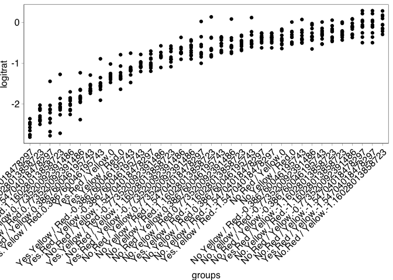<!-- -->

Looks good – variance appears largely homogenous across
samples/timepoint.

Plot data with logit transform.

``` r
ggplot(data=dat_1, aes(x=Transfer, y=logitrat, colour=Markers)) +
  geom_point(alpha=0.4) + geom_line(aes(group=interaction(Replicate, Markers)), alpha=0.4) + 
  geom_smooth(method='lm', formula=y ~ x) +
  ggtitle("Experiment 1") +
  facet_grid(.~Selection) + theme(legend.position="bottom")
```

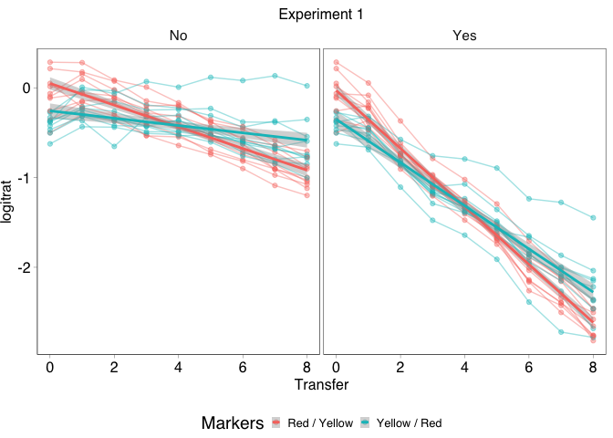<!-- -->

As our data is technically proportional and bounded at 0 and 1, it is
better to use a binomial regression GLMM as previously. But since we
have relatively large sample sizes towards the middle of the \[0,1\]
distribution, first check using a LMM. Use the centred ‘Transfers’
(`scale(Transfer)`) to assist calculations and model convergence.

``` r
library(nlme)
```

    ## 
    ## Attaching package: 'nlme'

    ## The following object is masked from 'package:dplyr':
    ## 
    ##     collapse

``` r
lmm_dat_1 <- lme(logitrat ~ transf * Selection * Markers,
                 random = ~1 + transf|pop, data = dat_1)

plot(lmm_dat_1) # no significant outliers
```

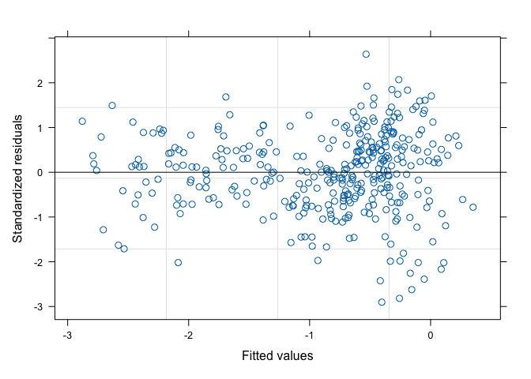<!-- -->

``` r
qqPlot(residuals(lmm_dat_1), envelope=0.99)
```

<!-- -->

    ## C.1 A.1 
    ## 334 182

``` r
# timepoint zero are outliers, smaller than predicted, 
##  indicating that plaCM does better than expected in initial expansion

VarCorr(lmm_dat_1) # moderate positive correlation (0.6)
```

    ## pop = pdLogChol(1 + transf) 
    ##             Variance    StdDev     Corr  
    ## (Intercept) 0.030162100 0.17367239 (Intr)
    ## transf      0.005133567 0.07164891 0.621 
    ## Residual    0.007434432 0.08622315

Model looks appropriate. Test for significance of fixed effects.

``` r
drop1(update(lmm_dat_1, method="ML"), test = "Chisq")
```

    ## Single term deletions
    ## 
    ## Model:
    ## logitrat ~ transf * Selection * Markers
    ##                          Df     AIC      LRT Pr(>Chi)
    ## <none>                      -520.83                  
    ## transf:Selection:Markers  1 -522.80 0.026007   0.8719

``` r
# no 3-way effect

lmm_dat_1.1 <- lme(logitrat ~ transf + Selection + Markers + transf:Selection +
                          transf:Markers + Selection:Markers,
                   random = ~1 + transf|pop,
                   data=dat_1, method="ML")
drop1(lmm_dat_1.1, test="Chisq")
```

    ## Single term deletions
    ## 
    ## Model:
    ## logitrat ~ transf + Selection + Markers + transf:Selection + 
    ##     transf:Markers + Selection:Markers
    ##                   Df     AIC     LRT  Pr(>Chi)    
    ## <none>               -522.80                      
    ## transf:Selection   1 -422.18 102.625 < 2.2e-16 ***
    ## transf:Markers     1 -480.71  44.089 3.138e-11 ***
    ## Selection:Markers  1 -524.72   0.084    0.7724    
    ## ---
    ## Signif. codes:  0 '***' 0.001 '**' 0.01 '*' 0.05 '.' 0.1 ' ' 1

No marker:selection effect.

``` r
lmm_dat_1.2 <- lme(logitrat ~ transf + Selection + transf:Selection +
                          transf:Markers + Markers,
                   random = ~1 + transf|pop,
                   data=dat_1, method="REML")

plot(lmm_dat_1.2)
```

<!-- -->

``` r
qqPlot(residuals(lmm_dat_1.2), envelope=0.99) 
```

<!-- -->

    ## C.1 A.1 
    ## 334 182

``` r
VarCorr(lmm_dat_1.2) # moderate correlation (0.6)
```

    ## pop = pdLogChol(1 + transf) 
    ##             Variance    StdDev     Corr  
    ## (Intercept) 0.029733829 0.17243500 (Intr)
    ## transf      0.004977618 0.07055223 0.615 
    ## Residual    0.007412655 0.08609678

``` r
summary(lmm_dat_1.2)
```

    ## Linear mixed-effects model fit by REML
    ##   Data: dat_1 
    ##         AIC       BIC   logLik
    ##   -490.4502 -451.7572 255.2251
    ## 
    ## Random effects:
    ##  Formula: ~1 + transf | pop
    ##  Structure: General positive-definite, Log-Cholesky parametrization
    ##             StdDev     Corr  
    ## (Intercept) 0.17243500 (Intr)
    ## transf      0.07055223 0.615 
    ## Residual    0.08609678       
    ## 
    ## Fixed effects:  logitrat ~ transf + Selection + transf:Selection + transf:Markers +      Markers 
    ##                                 Value  Std.Error  DF    t-value p-value
    ## (Intercept)                -0.4024889 0.04422088 316  -9.101784   0.000
    ## transf                     -0.3148399 0.02090653 316 -15.059404   0.000
    ## SelectionYes               -0.9449881 0.04018229 316 -23.517526   0.000
    ## MarkersYellow / Red         0.0104599 0.05530684  38   0.189125   0.851
    ## transf:SelectionYes        -0.5297922 0.02432529 316 -21.779485   0.000
    ## transf:MarkersYellow / Red  0.2110797 0.02424496 316   8.706128   0.000
    ##  Correlation: 
    ##                            (Intr) transf SlctnY MrkY/R trn:SY
    ## transf                      0.610                            
    ## SelectionYes               -0.467 -0.455                     
    ## MarkersYellow / Red        -0.625 -0.322  0.000              
    ## transf:SelectionYes        -0.391 -0.569  0.852  0.000       
    ## transf:MarkersYellow / Red -0.347 -0.580  0.000  0.554  0.000
    ## 
    ## Standardized Within-Group Residuals:
    ##         Min          Q1         Med          Q3         Max 
    ## -2.89093574 -0.57600423  0.06556848  0.56465376  2.64839840 
    ## 
    ## Number of Observations: 360
    ## Number of Groups: 40

Interpretation. Detect significant interactions between Transfer and
Selection, and between Transfer and Markers.

Overall, plaCM is outcompeted over time (effect of (centred) Transfer =
-0.31). This is stronger in the presence of selection (interaction
effect = -0.53). One set of markers (Yellow/Red) has a reduced loss of
plaCM (Marker:Transfer effect = 0.21) but this marker effect does not
overcome the overall outcompetition of plaCM.

Now attempt GLMM with glmmTMB and a beta-binomial distribution.
Beta-binomial rather than binomial, since preliminary analyses indicated
overdispersion.

``` r
library(glmmTMB)
```

    ## Warning in checkDepPackageVersion(dep_pkg = "TMB"): Package version inconsistency detected.
    ## glmmTMB was built with TMB version 1.9.3
    ## Current TMB version is 1.9.4
    ## Please re-install glmmTMB from source or restore original 'TMB' package (see '?reinstalling' for more information)

``` r
glmm_dat_1 <-glmmTMB(cbind(count_plaCM, count_chrCM) ~ transf * Selection * Markers + (1 + transf|pop),
                     data=dat_1, family="betabinomial")

summary(glmm_dat_1)
```

    ##  Family: betabinomial  ( logit )
    ## Formula:          
    ## cbind(count_plaCM, count_chrCM) ~ transf * Selection * Markers +  
    ##     (1 + transf | pop)
    ## Data: dat_1
    ## 
    ##      AIC      BIC   logLik deviance df.resid 
    ##   4154.7   4201.3  -2065.3   4130.7      348 
    ## 
    ## Random effects:
    ## 
    ## Conditional model:
    ##  Groups Name        Variance Std.Dev. Corr 
    ##  pop    (Intercept) 0.027655 0.16630       
    ##         transf      0.004366 0.06608  0.61 
    ## Number of obs: 360, groups:  pop, 40
    ## 
    ## Dispersion parameter for betabinomial family ():  872 
    ## 
    ## Conditional model:
    ##                                          Estimate Std. Error z value Pr(>|z|)
    ## (Intercept)                             -0.399370   0.047089  -8.481  < 2e-16
    ## transf                                  -0.311759   0.022878 -13.627  < 2e-16
    ## SelectionYes                            -0.950353   0.055823 -17.024  < 2e-16
    ## MarkersYellow / Red                      0.009862   0.066114   0.149    0.881
    ## transf:SelectionYes                     -0.538433   0.034026 -15.824  < 2e-16
    ## transf:MarkersYellow / Red               0.205137   0.031897   6.431 1.27e-10
    ## SelectionYes:MarkersYellow / Red         0.003932   0.077193   0.051    0.959
    ## transf:SelectionYes:MarkersYellow / Red  0.012993   0.046890   0.277    0.782
    ##                                            
    ## (Intercept)                             ***
    ## transf                                  ***
    ## SelectionYes                            ***
    ## MarkersYellow / Red                        
    ## transf:SelectionYes                     ***
    ## transf:MarkersYellow / Red              ***
    ## SelectionYes:MarkersYellow / Red           
    ## transf:SelectionYes:MarkersYellow / Red    
    ## ---
    ## Signif. codes:  0 '***' 0.001 '**' 0.01 '*' 0.05 '.' 0.1 ' ' 1

Test model assumptions.

``` r
plot(residuals(glmm_dat_1, type="p"))     
```

<!-- -->

``` r
# two possible outliers, but otherwise no trends/patterns

qqPlot(residuals(glmm_dat_1), envelope=0.99) 
```

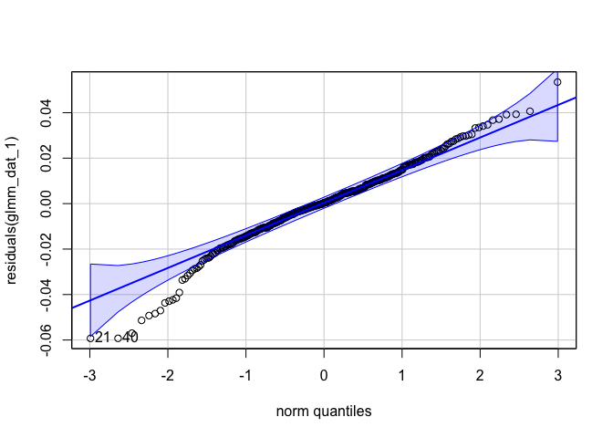<!-- -->

    ## [1] 182 334

``` r
# again, timepoint zero are outliers, smaller than predicted, 
##  indicating that plaCM does better than modelled in initial expansion

# Check for correlation between random effects
VarCorr(glmm_dat_1) # moderate correlation (0.6)
```

    ## 
    ## Conditional model:
    ##  Groups Name        Std.Dev. Corr  
    ##  pop    (Intercept) 0.166298       
    ##         transf      0.066079 0.606

Looks mostly ok, though some outliers in qqPlot from transfer 0.

Select optimal fixed effects structure.

``` r
glmm_dat_1.1 <- glmmTMB(cbind(count_plaCM, count_chrCM) ~ (transf + Selection + Markers)^2 + (1 + transf|pop),
                     data=dat_1, family="betabinomial")
anova(glmm_dat_1, glmm_dat_1.1)
```

    ## Data: dat_1
    ## Models:
    ## glmm_dat_1.1: cbind(count_plaCM, count_chrCM) ~ (transf + Selection + Markers)^2 + , zi=~0, disp=~1
    ## glmm_dat_1.1:     (1 + transf | pop), zi=~0, disp=~1
    ## glmm_dat_1: cbind(count_plaCM, count_chrCM) ~ transf * Selection * Markers + , zi=~0, disp=~1
    ## glmm_dat_1:     (1 + transf | pop), zi=~0, disp=~1
    ##              Df    AIC    BIC  logLik deviance  Chisq Chi Df Pr(>Chisq)
    ## glmm_dat_1.1 11 4152.7 4195.5 -2065.4   4130.7                         
    ## glmm_dat_1   12 4154.7 4201.3 -2065.3   4130.7 0.0766      1     0.7819

No detectable 3-way interaction.

``` r
drop1(glmm_dat_1.1, test="Chisq")
```

    ## Single term deletions
    ## 
    ## Model:
    ## cbind(count_plaCM, count_chrCM) ~ (transf + Selection + Markers)^2 + 
    ##     (1 + transf | pop)
    ##                   Df    AIC     LRT  Pr(>Chi)    
    ## <none>               4152.7                      
    ## transf:Selection   1 4253.7 102.913 < 2.2e-16 ***
    ## transf:Markers     1 4195.0  44.260 2.876e-11 ***
    ## Selection:Markers  1 4150.9   0.131    0.7173    
    ## ---
    ## Signif. codes:  0 '***' 0.001 '**' 0.01 '*' 0.05 '.' 0.1 ' ' 1

``` r
glmm_dat_1.2 <- glmmTMB(cbind(count_plaCM, count_chrCM) ~ transf + Selection + transf:Selection +
                          transf:Markers + Markers + (1 + transf|pop),
                     data=dat_1, family="betabinomial")
drop1(glmm_dat_1.2, test="Chisq") %>% kable()
```

|                  |  Df |      AIC |       LRT | Pr(\>Chi) |
|:-----------------|----:|---------:|----------:|----------:|
| <none>           |  NA | 4150.873 |        NA |        NA |
| transf:Selection |   1 | 4251.803 | 102.92966 |         0 |
| transf:Markers   |   1 | 4193.410 |  44.53684 |         0 |

Check model assumptions.

``` r
plot(residuals(glmm_dat_1.2, type="p"))
```

<!-- -->

``` r
qqPlot(residuals(glmm_dat_1.2), envelope=0.99) 
```

<!-- -->

    ## [1] 182 334

``` r
VarCorr(glmm_dat_1.2) # moderate correlation (0.61)
```

    ## 
    ## Conditional model:
    ##  Groups Name        Std.Dev. Corr  
    ##  pop    (Intercept) 0.166281       
    ##         transf      0.066168 0.606

Interpretation. Significant interactions between selection and transfer
(steeper loss of plaCM under selection), and significant interaction
between marker and transfer (shallower slope for one set of markers).

|                    |  Df |      AIC |       LRT | Pr(\>Chi) |
|:-------------------|----:|---------:|----------:|----------:|
| <none>             |  NA | 4150.873 |        NA |        NA |
| Transfer:Selection |   1 | 4251.803 | 102.92966 |         0 |
| Transfer:Markers   |   1 | 4193.410 |  44.53684 |         0 |

p = 0 here indicates \< 1e-7.

``` r
summary(glmm_dat_1.2)
```

    ##  Family: betabinomial  ( logit )
    ## Formula:          
    ## cbind(count_plaCM, count_chrCM) ~ transf + Selection + transf:Selection +  
    ##     transf:Markers + Markers + (1 + transf | pop)
    ## Data: dat_1
    ## 
    ##      AIC      BIC   logLik deviance df.resid 
    ##   4150.9   4189.7  -2065.4   4130.9      350 
    ## 
    ## Random effects:
    ## 
    ## Conditional model:
    ##  Groups Name        Variance Std.Dev. Corr 
    ##  pop    (Intercept) 0.027649 0.16628       
    ##         transf      0.004378 0.06617  0.61 
    ## Number of obs: 360, groups:  pop, 40
    ## 
    ## Dispersion parameter for betabinomial family ():  872 
    ## 
    ## Conditional model:
    ##                            Estimate Std. Error z value Pr(>|z|)    
    ## (Intercept)                -0.40008    0.04280  -9.347   <2e-16 ***
    ## transf                     -0.31524    0.02007 -15.705   <2e-16 ***
    ## SelectionYes               -0.94822    0.03992 -23.752   <2e-16 ***
    ## MarkersYellow / Red         0.01116    0.05344   0.209    0.835    
    ## transf:SelectionYes        -0.53179    0.02432 -21.868   <2e-16 ***
    ## transf:MarkersYellow / Red  0.21196    0.02331   9.092   <2e-16 ***
    ## ---
    ## Signif. codes:  0 '***' 0.001 '**' 0.01 '*' 0.05 '.' 0.1 ' ' 1

Overall, output and interpretation is qualitatively similar to the LMM
above.

### Experiment 2

Reminder for output from Experiment 2:

``` r
(df_expt2 <- df %>%
  filter(Experiment == 1 & Treatment %in% c("B", "BM", "D", "DM")) %>%
  pivot_longer(starts_with("Fraction"), names_to = "Fluorescence", names_prefix = "Fraction_",
               values_to = "Fraction") %>%
  mutate(Population = factor(
    case_when(startsWith(Treatment, "B") & Fluorescence == "Yellow" ~ "plaCM",
              startsWith(Treatment, "B") & Fluorescence == "Red" ~ "chrCM",
              startsWith(Treatment, "D") & Fluorescence == "Yellow" ~ "chrCM",
              startsWith(Treatment, "D") & Fluorescence == "Red" ~ "plaCM",
              Fluorescence == "Orange" ~ "double / clumped",
              Fluorescence == "Blue" ~ "pQBR103 only"),
    levels=c("double / clumped", "chrCM", "plaCM", "pQBR103 only")),
         Selection = ifelse(endsWith(Treatment, "M"), "Yes", "No"),
         Markers = ifelse(startsWith(Treatment, "B"), "Red / Yellow",
                          "Yellow / Red"))) %>%
  ggplot(aes(x=Transfer, y=Fraction, fill=Population)) +
  geom_area() + 
  facet_grid(Selection + Markers ~ Replicate) +
  scale_fill_manual(
    breaks=c("chrCM", "plaCM", "pQBR103 only", "double / clumped"),
    values=c("#882255", "#44AA99", "#004488", "#000000"))
```

<!-- -->

Plot the ratio of chrCM to plaCM. Add in the Transfer = 0 data for the
‘Selection = Yes’ treatment.

``` r
(dat_2 <- df_expt2 %>% filter(Transfer==0) %>%
  mutate(Selection = "Yes") %>%
  bind_rows(df_expt2) %>%
  select(-Fluorescence, -Ratio) %>%
  pivot_wider(names_from="Population", values_from="Fraction") %>%
   mutate(pop = as.factor(paste(Treatment, Replicate, sep=".")),
          count_plaCM = round(Total_count * plaCM),
          count_chrCM = round(Total_count * chrCM),
          plaCM_ratio = count_plaCM / (count_plaCM + count_chrCM),
          transf = scale(Transfer))) %>% head()
```

    ## # A tibble: 6 × 16
    ##   Treatment Replicate Transfer Total_count Experiment Selection Markers    plaCM
    ##   <chr>         <int>    <int>       <int>      <int> <chr>     <chr>      <dbl>
    ## 1 B                 5        0        2105          1 Yes       Red / Yel… 0.247
    ## 2 B                 1        0        2157          1 Yes       Red / Yel… 0.171
    ## 3 B                 2        0        1954          1 Yes       Red / Yel… 0.225
    ## 4 B                 3        0        2215          1 Yes       Red / Yel… 0.257
    ## 5 B                 4        0        1781          1 Yes       Red / Yel… 0.218
    ## 6 D                 5        0        4578          1 Yes       Yellow / … 0.202
    ## # ℹ 8 more variables: chrCM <dbl>, `double / clumped` <dbl>,
    ## #   `pQBR103 only` <dbl>, pop <fct>, count_plaCM <dbl>, count_chrCM <dbl>,
    ## #   plaCM_ratio <dbl>, transf <dbl[,1]>

``` r
ggplot(data=dat_2, aes(x=Transfer, y=plaCM_ratio, colour=Markers,
                       group=interaction(Replicate, Markers))) +
  geom_point() + geom_line() + 
  ggtitle("Experiment 2") +
  facet_grid(.~Selection) + theme(legend.position="bottom")
```

<!-- -->

#### Experiment 2: Analysis

Pre-model diagnostics. Plot transformed response against groups to test
for inhomogeneity in variance.

``` r
dat_2 <- within(dat_2, {
  groups <- interaction(Selection, Markers, transf)
  groups <- reorder(groups, plaCM_ratio, mean)
  logitrat = logit(plaCM_ratio)
})

ggplot(data=dat_2, aes(x=groups, y=logitrat)) + 
  geom_point() + theme(axis.text.x = element_text(angle = 45, hjust = 1))
```

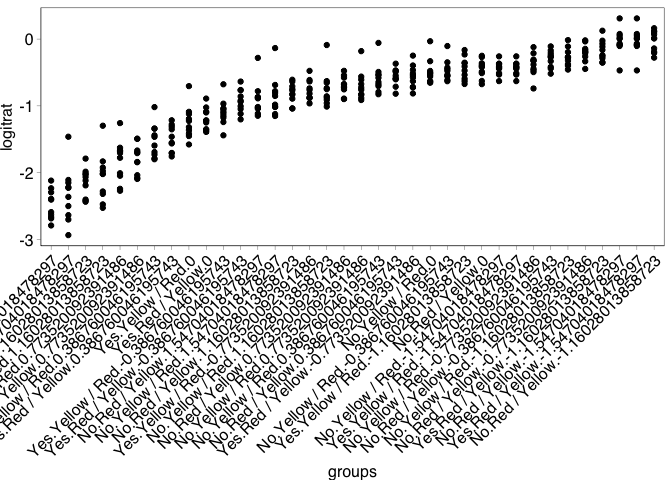<!-- -->

Looks good – variance appears homogenous across samples/timepoint.

Plot data with logit transform.

``` r
ggplot(data=dat_2, aes(x=Transfer, y=logitrat, colour=Markers)) +
  geom_point(alpha=0.4) + geom_line(aes(group=interaction(Replicate, Markers)), alpha=0.4) + 
  geom_smooth(method='lm', formula=y ~ x) +
  ggtitle("Experiment 2") +
  facet_grid(.~Selection) + theme(legend.position="bottom")
```

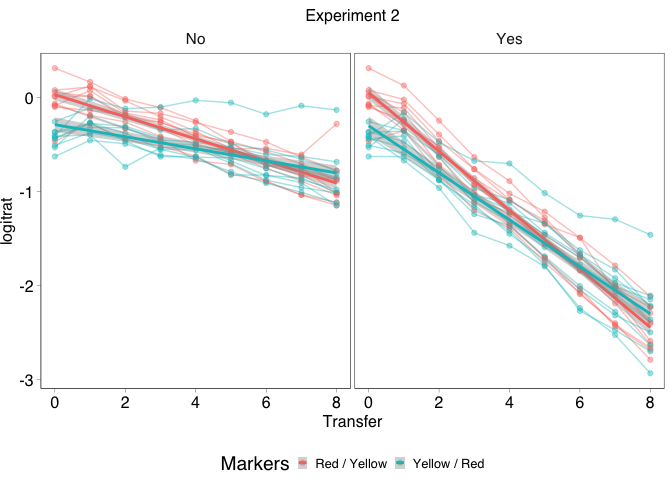<!-- -->

Again, start with a LMM.

``` r
lmm_dat_2 <- lme(logitrat ~ transf * Selection * Markers,
                 random = ~1 + transf|pop, data = dat_2)

plot(lmm_dat_2) # one significant outlier, otherwise largely homogenous
```

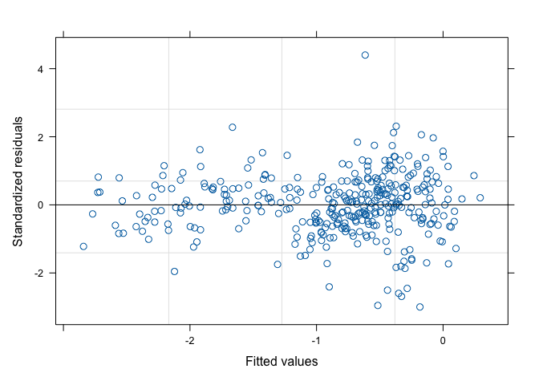<!-- -->

``` r
qqPlot(residuals(lmm_dat_2), envelope=0.99)
```

<!-- -->

    ## B.5 D.9 
    ## 232 280

``` r
# again timepoint zero are outliers, smaller than predicted, 
##  indicating that plaCM does better than expected in initial expansion
##  One other significant outlier as identified above.

VarCorr(lmm_dat_2) # some positive correlation (0.7)
```

    ## pop = pdLogChol(1 + transf) 
    ##             Variance    StdDev     Corr  
    ## (Intercept) 0.039917762 0.19979430 (Intr)
    ## transf      0.005485130 0.07406166 0.68  
    ## Residual    0.005748172 0.07581670

Model looks appropriate. Test for significance of fixed effects.

``` r
drop1(update(lmm_dat_2, method="ML"), test = "Chisq")
```

    ## Single term deletions
    ## 
    ## Model:
    ## logitrat ~ transf * Selection * Markers
    ##                          Df     AIC      LRT Pr(>Chi)
    ## <none>                      -586.44                  
    ## transf:Selection:Markers  1 -588.42 0.015945   0.8995

``` r
# no 3-way effect

lmm_dat_2.1 <- lme(logitrat ~ transf + Selection + transf:Selection +
                          transf:Markers + Markers,
                   random = ~1 + transf|pop,
                   data=dat_2, method="ML")
drop1(lmm_dat_2.1, test="Chisq")
```

    ## Single term deletions
    ## 
    ## Model:
    ## logitrat ~ transf + Selection + transf:Selection + transf:Markers + 
    ##     Markers
    ##                  Df     AIC    LRT  Pr(>Chi)    
    ## <none>              -586.78                     
    ## transf:Selection  1 -498.42 90.358 < 2.2e-16 ***
    ## transf:Markers    1 -561.50 27.280 1.761e-07 ***
    ## ---
    ## Signif. codes:  0 '***' 0.001 '**' 0.01 '*' 0.05 '.' 0.1 ' ' 1

No marker:selection effect.

``` r
lmm_dat_2.2 <- lme(logitrat ~ transf + Selection + transf:Selection +
                          transf:Markers + Markers,
                   random = ~1 + transf|pop,
                   data=dat_2, method="REML")

plot(lmm_dat_2.2)
```

<!-- -->

``` r
qqPlot(residuals(lmm_dat_2.2), envelope=0.99) 
```

<!-- -->

    ## B.5 D.9 
    ## 232 280

``` r
VarCorr(lmm_dat_2.2) # moderate correlation (0.68)
```

    ## pop = pdLogChol(1 + transf) 
    ##             Variance    StdDev     Corr  
    ## (Intercept) 0.039063307 0.19764440 (Intr)
    ## transf      0.005310061 0.07287017 0.679 
    ## Residual    0.005816270 0.07626447

``` r
summary(lmm_dat_2.2)
```

    ## Linear mixed-effects model fit by REML
    ##   Data: dat_2 
    ##         AIC       BIC   logLik
    ##   -552.6387 -513.9458 286.3194
    ## 
    ## Random effects:
    ##  Formula: ~1 + transf | pop
    ##  Structure: General positive-definite, Log-Cholesky parametrization
    ##             StdDev     Corr  
    ## (Intercept) 0.19764440 (Intr)
    ## transf      0.07287017 0.679 
    ## Residual    0.07626447       
    ## 
    ## Fixed effects:  logitrat ~ transf + Selection + transf:Selection + transf:Markers +      Markers 
    ##                                 Value  Std.Error  DF    t-value p-value
    ## (Intercept)                -0.3627976 0.04931521 316  -7.356709  0.0000
    ## transf                     -0.3034842 0.02111961 316 -14.369785  0.0000
    ## SelectionYes               -0.9006331 0.04115007 316 -21.886549  0.0000
    ## MarkersYellow / Red        -0.1033349 0.06303557  38  -1.639311  0.1094
    ## transf:SelectionYes        -0.5268787 0.02464734 316 -21.376698  0.0000
    ## transf:MarkersYellow / Red  0.1478460 0.02453349 316   6.026291  0.0000
    ##  Correlation: 
    ##                            (Intr) transf SlctnY MrkY/R trn:SY
    ## transf                      0.669                            
    ## SelectionYes               -0.428 -0.479                     
    ## MarkersYellow / Red        -0.639 -0.366  0.000              
    ## transf:SelectionYes        -0.374 -0.568  0.886  0.000       
    ## transf:MarkersYellow / Red -0.403 -0.581  0.000  0.630  0.000
    ## 
    ## Standardized Within-Group Residuals:
    ##         Min          Q1         Med          Q3         Max 
    ## -2.85185190 -0.53541602  0.02587315  0.51654742  4.43758826 
    ## 
    ## Number of Observations: 360
    ## Number of Groups: 40

Interpretation. As with experiment 1, we detect significant interactions
between Transfer and Selection, and between Transfer and Markers.

Overall, plaCM is outcompeted over time (effect of (scaled) Transfer =
-0.3). This is stronger in the presence of selection (interaction effect
= -0.53). One set of markers (Yellow/Red) has a reduced loss of plaCM
(Marker:Transfer effect = 0.14) but this marker effect does not overcome
the overall outcompetition of plaCM.

Now attempt GLMM with glmmTMB and a beta-binomial distribution, since
preliminary analyses indicated overdispersion.

``` r
glmm_dat_2 <-glmmTMB(cbind(count_plaCM, count_chrCM) ~ transf * Selection * Markers + (1 + transf|pop),
                     data=dat_2, family="betabinomial")

summary(glmm_dat_2)
```

    ##  Family: betabinomial  ( logit )
    ## Formula:          
    ## cbind(count_plaCM, count_chrCM) ~ transf * Selection * Markers +  
    ##     (1 + transf | pop)
    ## Data: dat_2
    ## 
    ##      AIC      BIC   logLik deviance df.resid 
    ##   4202.2   4248.8  -2089.1   4178.2      348 
    ## 
    ## Random effects:
    ## 
    ## Conditional model:
    ##  Groups Name        Variance Std.Dev. Corr 
    ##  pop    (Intercept) 0.03629  0.19049       
    ##         transf      0.00462  0.06797  0.68 
    ## Number of obs: 360, groups:  pop, 40
    ## 
    ## Dispersion parameter for betabinomial family (): 1.14e+03 
    ## 
    ## Conditional model:
    ##                                          Estimate Std. Error z value Pr(>|z|)
    ## (Intercept)                             -0.379975   0.052323  -7.262 3.81e-13
    ## transf                                  -0.302990   0.023321 -12.992  < 2e-16
    ## SelectionYes                            -0.864975   0.059113 -14.633  < 2e-16
    ## MarkersYellow / Red                     -0.067152   0.073088  -0.919    0.358
    ## transf:SelectionYes                     -0.527207   0.034975 -15.074  < 2e-16
    ## transf:MarkersYellow / Red               0.142160   0.032253   4.408 1.04e-05
    ## SelectionYes:MarkersYellow / Red        -0.065664   0.080223  -0.819    0.413
    ## transf:SelectionYes:MarkersYellow / Red  0.007194   0.047554   0.151    0.880
    ##                                            
    ## (Intercept)                             ***
    ## transf                                  ***
    ## SelectionYes                            ***
    ## MarkersYellow / Red                        
    ## transf:SelectionYes                     ***
    ## transf:MarkersYellow / Red              ***
    ## SelectionYes:MarkersYellow / Red           
    ## transf:SelectionYes:MarkersYellow / Red    
    ## ---
    ## Signif. codes:  0 '***' 0.001 '**' 0.01 '*' 0.05 '.' 0.1 ' ' 1

Test model assumptions.

``` r
plot(residuals(glmm_dat_2, type="p"))     
```

<!-- -->

``` r
# one extreme outlier, but everything else looking mostly ok

qqPlot(residuals(glmm_dat_2), envelope=0.99, col=as.factor(dat_2$Transfer))
```

<!-- -->

    ## [1] 232 280

``` r
# A few outliers here, where expected values are larger/smaller than expected. 

# Check for correlation between random effects
VarCorr(glmm_dat_2) # some positive correlation (0.68)
```

    ## 
    ## Conditional model:
    ##  Groups Name        Std.Dev. Corr  
    ##  pop    (Intercept) 0.190494       
    ##         transf      0.067971 0.684

Looks ok, though more outliers larger/smaller than expected than with
Experiment 1.

Select optimal fixed effects structure.

``` r
glmm_dat_2.1 <- glmmTMB(cbind(count_plaCM, count_chrCM) ~ (transf + Selection + Markers)^2 + (1 + transf|pop),
                     data=dat_2, family="betabinomial")
anova(glmm_dat_2, glmm_dat_2.1)
```

    ## Data: dat_2
    ## Models:
    ## glmm_dat_2.1: cbind(count_plaCM, count_chrCM) ~ (transf + Selection + Markers)^2 + , zi=~0, disp=~1
    ## glmm_dat_2.1:     (1 + transf | pop), zi=~0, disp=~1
    ## glmm_dat_2: cbind(count_plaCM, count_chrCM) ~ transf * Selection * Markers + , zi=~0, disp=~1
    ## glmm_dat_2:     (1 + transf | pop), zi=~0, disp=~1
    ##              Df    AIC    BIC  logLik deviance  Chisq Chi Df Pr(>Chisq)
    ## glmm_dat_2.1 11 4200.2 4242.9 -2089.1   4178.2                         
    ## glmm_dat_2   12 4202.2 4248.8 -2089.1   4178.2 0.0229      1     0.8798

No 3-way interaction.

``` r
drop1(glmm_dat_2.1, test="Chisq") %>% kable()
```

|                   |  Df |      AIC |       LRT | Pr(\>Chi) |
|:------------------|----:|---------:|----------:|----------:|
| <none>            |  NA | 4200.195 |        NA |        NA |
| transf:Selection  |   1 | 4289.504 | 91.308654 | 0.0000000 |
| transf:Markers    |   1 | 4225.078 | 26.883206 | 0.0000002 |
| Selection:Markers |   1 | 4202.180 |  3.985244 | 0.0459004 |

A marginal marker by selection effect (0.05 \> p \> 0.045), so leave in
the model.

Check model assumptions.

``` r
plot(residuals(glmm_dat_2.1, type="p"))
```

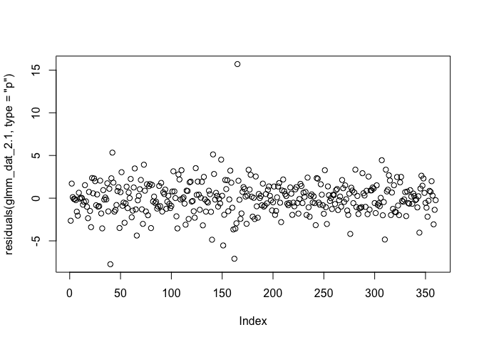<!-- -->

``` r
qqPlot(residuals(glmm_dat_2.1), envelope=0.99) 
```

<!-- -->

    ## [1] 232 280

``` r
# some departure from normality for residuals at the extremes
VarCorr(glmm_dat_2.1) # some positive correlation
```

    ## 
    ## Conditional model:
    ##  Groups Name        Std.Dev. Corr  
    ##  pop    (Intercept) 0.190896       
    ##         transf      0.068021 0.686

Interpretation. Detect significant interactions between Transfer and
Selection, and between Transfer and Markers.

|                    |  Df |      AIC |       LRT | Pr(\>Chi) |
|:-------------------|----:|---------:|----------:|----------:|
| <none>             |  NA | 4200.195 |        NA |        NA |
| Transfer:Selection |   1 | 4289.504 | 91.308654 | 0.0000000 |
| Transfer:Markers   |   1 | 4225.078 | 26.883206 | 0.0000002 |
| Selection:Markers  |   1 | 4202.180 |  3.985244 | 0.0459004 |

``` r
summary(glmm_dat_2.1)
```

    ##  Family: betabinomial  ( logit )
    ## Formula:          
    ## cbind(count_plaCM, count_chrCM) ~ (transf + Selection + Markers)^2 +  
    ##     (1 + transf | pop)
    ## Data: dat_2
    ## 
    ##      AIC      BIC   logLik deviance df.resid 
    ##   4200.2   4242.9  -2089.1   4178.2      349 
    ## 
    ## Random effects:
    ## 
    ## Conditional model:
    ##  Groups Name        Variance Std.Dev. Corr 
    ##  pop    (Intercept) 0.036441 0.19090       
    ##         transf      0.004627 0.06802  0.69 
    ## Number of obs: 360, groups:  pop, 40
    ## 
    ## Dispersion parameter for betabinomial family (): 1.14e+03 
    ## 
    ## Conditional model:
    ##                                  Estimate Std. Error z value Pr(>|z|)    
    ## (Intercept)                      -0.38239    0.04990  -7.663 1.81e-14 ***
    ## transf                           -0.30451    0.02104 -14.472  < 2e-16 ***
    ## SelectionYes                     -0.86010    0.04955 -17.358  < 2e-16 ***
    ## MarkersYellow / Red              -0.06185    0.06424  -0.963   0.3357    
    ## transf:SelectionYes              -0.52391    0.02738 -19.137  < 2e-16 ***
    ## transf:MarkersYellow / Red        0.14551    0.02346   6.204 5.52e-10 ***
    ## SelectionYes:MarkersYellow / Red -0.07635    0.03815  -2.001   0.0454 *  
    ## ---
    ## Signif. codes:  0 '***' 0.001 '**' 0.01 '*' 0.05 '.' 0.1 ' ' 1

Again we see significant effect on plaCM (-0.30), which is exacerbated
by selection (-0.52).

### Experiment 3

Load up data and reminder of figure.

``` r
(df_expt3 <- df %>%
  filter(Experiment == 2 & Treatment == "A") %>%
  pivot_longer(starts_with("Fraction"), names_to = "Fluorescence", names_prefix = "Fraction_",
               values_to = "Fraction") %>%
  mutate(Population = factor(
    case_when(Fluorescence == "Yellow" ~ "plaCM",
              Fluorescence == "Red" ~ "chrCM",
              Fluorescence == "Orange" ~ "double / clumped",
              Fluorescence == "Blue" ~ "none"),
    levels=c("double / clumped", "chrCM", "plaCM", "none")),
         Ratio = factor(Ratio,
                        levels=c(10, 1, 0.1, 0),
                        labels=c("10:1", "1:1", "1:10", "none")))) %>%
  ggplot(aes(x=Transfer, y=Fraction, fill=Population)) +
  geom_area() + 
  facet_grid(Replicate ~ Ratio) +
    scale_fill_manual(
    breaks=c("chrCM", "plaCM", "none", "double / clumped"),
    values=c("#882255", "#44AA99", "#DDDDDD", "#000000"))
```

<!-- -->

Plot the ratio of chrCM to plaCM.

``` r
(dat_3 <- df_expt3 %>%
  select(-Fluorescence) %>%
  pivot_wider(names_from="Population", values_from="Fraction") %>%
   mutate(pop = as.factor(paste(Replicate, Ratio, sep=".")),
          count_plaCM = round(Total_count * plaCM),
          count_chrCM = round(Total_count * chrCM),
          plaCM_ratio = count_plaCM / (count_plaCM + count_chrCM),
          transf = scale(Transfer))) %>% head()
```

    ## # A tibble: 6 × 15
    ##   Treatment Replicate Transfer Total_count Experiment Ratio  plaCM  chrCM
    ##   <chr>         <int>    <int>       <int>      <int> <fct>  <dbl>  <dbl>
    ## 1 A                 1        2       11885          2 10:1  0.0300 0.0356
    ## 2 A                 5        2       13219          2 1:10  0.350  0.459 
    ## 3 A                 6        2       12609          2 10:1  0.0256 0.0337
    ## 4 A                 6        2       10969          2 1:10  0.362  0.432 
    ## 5 A                 1        2       10054          2 1:10  0.348  0.485 
    ## 6 A                 2        2       11282          2 10:1  0.0240 0.0252
    ## # ℹ 7 more variables: `double / clumped` <dbl>, none <dbl>, pop <fct>,
    ## #   count_plaCM <dbl>, count_chrCM <dbl>, plaCM_ratio <dbl>, transf <dbl[,1]>

``` r
ggplot(data=dat_3, aes(x=Transfer, y=plaCM_ratio,
                       group=Replicate)) +
  geom_point() + geom_line() + 
  ggtitle("Experiment 3") +
  facet_grid(.~Ratio) + theme(legend.position="bottom")
```

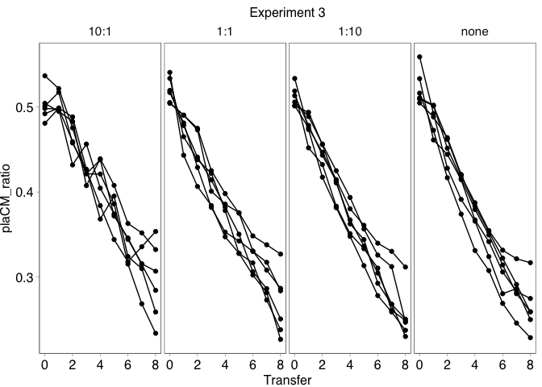<!-- -->

#### Experiment 3: Analysis

Pre-model diagnostics. Plot transformed response against groups to test
for inhomogeneity in variance.

``` r
dat_3 <- within(dat_3, {
  groups <- interaction(Ratio, Transfer)
  groups <- reorder(groups, plaCM_ratio, mean)
  logitrat = logit(plaCM_ratio)
})

ggplot(data=dat_3, aes(x=groups, y=logitrat)) + 
  geom_point() + theme(axis.text.x = element_text(angle = 45, hjust = 1))
```

<!-- -->

Looks mostly good – variance appears largely homogenous across
samples/timepoint, though perhaps increased variance for those
measurements with low plaCM proportion towards the end of the
experiment.

Plot data with logit transform.

``` r
ggplot(data=dat_3, aes(x=Transfer, y=logitrat)) +
  geom_point(alpha=0.4) + geom_line(aes(group=Replicate), alpha=0.4) + 
  geom_smooth(method='lm', formula=y ~ x) +
  ggtitle("Experiment 3") +
  facet_grid(.~Ratio) + theme(legend.position="bottom")
```

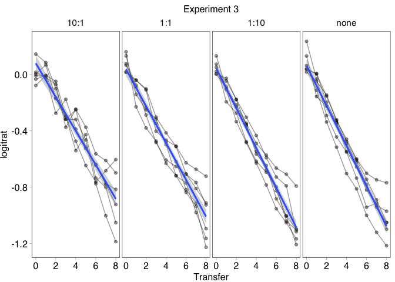<!-- -->

Again, start with a LMM.

``` r
lmm_dat_3 <- lme(logitrat ~ transf * Ratio,
                 random = ~1 + transf|pop, data = dat_3)

plot(lmm_dat_3) # largely homogenous
```

<!-- -->

``` r
qqPlot(residuals(lmm_dat_3), envelope=0.99)
```

<!-- -->

    ## 1.10:1 1.10:1 
    ##    145     97

``` r
VarCorr(lmm_dat_3)
```

    ## pop = pdLogChol(1 + transf) 
    ##             Variance    StdDev     Corr  
    ## (Intercept) 0.003586447 0.05988695 (Intr)
    ## transf      0.002637863 0.05136014 0.912 
    ## Residual    0.004600110 0.06782411

Some fairly strong correlation between random effects (0.9) —
populations with more PlaCM tended to lose plaCM more slowly, as can be
seen in the following plot:

``` r
ggplot(data=dat_3, aes(x=transf, y=logitrat, colour=as.factor(Replicate))) +
  geom_hline(yintercept=-0.5, linewidth=0.2) + 
  geom_vline(xintercept=0, linewidth=0.2) +
  geom_point(alpha=0.6) + geom_line(aes(group=Replicate), alpha=0.6) + 
  geom_smooth(method='lm', formula=y ~ x, alpha=0) +
  ggtitle("Experiment 3") +
  facet_grid(.~Ratio) + theme(legend.position="bottom")
```

<!-- -->

Overall, model looks appropriate. Test for significance of fixed
effects.

``` r
drop1(update(lmm_dat_3, method="ML"), test = "Chisq") %>% kable()
```

|              |  Df |       AIC |      LRT | Pr(\>Chi) |
|:-------------|----:|----------:|---------:|----------:|
| <none>       |  NA | -463.2797 |       NA |        NA |
| transf:Ratio |   3 | -464.8135 | 4.466257 | 0.2153199 |

No detected interaction effect.

|              |  Df |       AIC |      LRT | Pr(\>Chi) |
|:-------------|----:|----------:|---------:|----------:|
| <none>       |  NA | -463.2797 |       NA |        NA |
| transf:Ratio |   3 | -464.8135 | 4.466257 | 0.2153199 |

Check for main effects.

``` r
lmm_dat_3.1 <- lme(logitrat ~ transf + Ratio, 
                   random = ~1 + transf|pop, data = dat_3)
                   
drop1(update(lmm_dat_3.1, method="ML"), test = "Chisq") %>% kable()
```

|        |  Df |       AIC |      LRT | Pr(\>Chi) |
|:-------|----:|----------:|---------:|----------:|
| <none> |  NA | -464.8135 |       NA |        NA |
| transf |   1 | -378.9176 | 87.89586 | 0.0000000 |
| Ratio  |   3 | -460.7863 | 10.02714 | 0.0183368 |

Significant effects of both ratio and transfer:

|        |  Df |       AIC |      LRT | Pr(\>Chi) |
|:-------|----:|----------:|---------:|----------:|
| <none> |  NA | -464.8135 |       NA |        NA |
| transf |   1 | -378.9176 | 87.89586 | 0.0000000 |
| Ratio  |   3 | -460.7863 | 10.02714 | 0.0183368 |

``` r
summary(lmm_dat_3.1)
```

    ## Linear mixed-effects model fit by REML
    ##   Data: dat_3 
    ##         AIC       BIC  logLik
    ##   -431.7961 -401.6294 224.898
    ## 
    ## Random effects:
    ##  Formula: ~1 + transf | pop
    ##  Structure: General positive-definite, Log-Cholesky parametrization
    ##             StdDev     Corr  
    ## (Intercept) 0.06086778 (Intr)
    ## transf      0.05279496 0.914 
    ## Residual    0.06782411       
    ## 
    ## Fixed effects:  logitrat ~ transf + Ratio 
    ##                  Value  Std.Error  DF    t-value p-value
    ## (Intercept) -0.4314986 0.01938222 191 -22.262599  0.0000
    ## transf      -0.3464856 0.01172748 191 -29.544773  0.0000
    ## Ratio1:1    -0.0607690 0.02309420  20  -2.631351  0.0160
    ## Ratio1:10   -0.0732385 0.02309420  20  -3.171293  0.0048
    ## Rationone   -0.0545826 0.02309420  20  -2.363477  0.0283
    ##  Correlation: 
    ##           (Intr) transf Rat1:1 Rt1:10
    ## transf     0.539                     
    ## Ratio1:1  -0.596  0.000              
    ## Ratio1:10 -0.596  0.000  0.500       
    ## Rationone -0.596  0.000  0.500  0.500
    ## 
    ## Standardized Within-Group Residuals:
    ##         Min          Q1         Med          Q3         Max 
    ## -2.27738107 -0.60477741  0.00932152  0.57542948  3.39133592 
    ## 
    ## Number of Observations: 216
    ## Number of Groups: 24

The effect of transfer is very strong, indicating the loss of plaCM from
the system. The effect of ratio is much weaker, and indicates a slightly
reduced intercept for the populations without significant plasmid-free.

Now attempt GLMM with glmmTMB and a beta-binomial distribution, since
preliminary analyses indicated overdispersion.

``` r
glmm_dat_3 <-glmmTMB(cbind(count_plaCM, count_chrCM) ~ transf * Ratio + (1 + transf|pop),
                     data=dat_3, family="betabinomial")
```

Test model assumptions.

``` r
plot(residuals(glmm_dat_3, type="p"))     
```

<!-- -->

``` r
# two outliers, but everything else looking mostly ok

qqPlot(residuals(glmm_dat_3), envelope=0.99)
```

<!-- -->

    ## [1] 145  60

``` r
# Check for correlation between random effects
VarCorr(glmm_dat_3) # strong positive correlation, as above
```

    ## 
    ## Conditional model:
    ##  Groups Name        Std.Dev. Corr  
    ##  pop    (Intercept) 0.057438       
    ##         transf      0.044786 0.975

Select optimal fixed effects structure.

``` r
drop1(glmm_dat_3, test="Chisq") %>% kable()
```

|              |  Df |      AIC |      LRT | Pr(\>Chi) |
|:-------------|----:|---------:|---------:|----------:|
| <none>       |  NA | 2465.136 |       NA |        NA |
| transf:Ratio |   3 | 2464.137 | 5.001105 | 0.1717162 |

Again, no significant interaction:

|              |  Df |      AIC |      LRT | Pr(\>Chi) |
|:-------------|----:|---------:|---------:|----------:|
| <none>       |  NA | 2465.136 |       NA |        NA |
| transf:Ratio |   3 | 2464.137 | 5.001105 | 0.1717162 |

Check for main effects.

``` r
glmm_dat_3.1 <- glmmTMB(cbind(count_plaCM, count_chrCM) ~ transf + Ratio + (1 + transf|pop),
                     data=dat_3, family="betabinomial")
                   
drop1(update(glmm_dat_3.1), test = "Chisq") %>% kable()
```

|        |  Df |      AIC |       LRT | Pr(\>Chi) |
|:-------|----:|---------:|----------:|----------:|
| <none> |  NA | 2464.137 |        NA |        NA |
| transf |   1 | 2550.729 | 88.592073 | 0.0000000 |
| Ratio  |   3 | 2464.826 |  6.689211 | 0.0824918 |

Here, ratio is not significant (0.1 \> p \> 0.05), suggesting that it is
not a robust finding, though the trend is similar to that reported
above.

|        |  Df |      AIC |       LRT | Pr(\>Chi) |
|:-------|----:|---------:|----------:|----------:|
| <none> |  NA | 2464.137 |        NA |        NA |
| transf |   1 | 2550.729 | 88.592073 | 0.0000000 |
| Ratio  |   3 | 2464.826 |  6.689211 | 0.0824918 |

``` r
summary(glmm_dat_3.1)
```

    ##  Family: betabinomial  ( logit )
    ## Formula:          
    ## cbind(count_plaCM, count_chrCM) ~ transf + Ratio + (1 + transf |      pop)
    ## Data: dat_3
    ## 
    ##      AIC      BIC   logLik deviance df.resid 
    ##   2464.1   2494.5  -1223.1   2446.1      207 
    ## 
    ## Random effects:
    ## 
    ## Conditional model:
    ##  Groups Name        Variance Std.Dev. Corr 
    ##  pop    (Intercept) 0.003863 0.06215       
    ##         transf      0.002572 0.05072  0.97 
    ## Number of obs: 216, groups:  pop, 24
    ## 
    ## Dispersion parameter for betabinomial family (): 1.54e+03 
    ## 
    ## Conditional model:
    ##             Estimate Std. Error z value Pr(>|z|)    
    ## (Intercept) -0.43881    0.02237 -19.618   <2e-16 ***
    ## transf      -0.34807    0.01131 -30.783   <2e-16 ***
    ## Ratio1:1    -0.05391    0.02411  -2.236   0.0253 *  
    ## Ratio1:10   -0.06427    0.02488  -2.583   0.0098 ** 
    ## Rationone   -0.04403    0.02517  -1.749   0.0802 .  
    ## ---
    ## Signif. codes:  0 '***' 0.001 '**' 0.01 '*' 0.05 '.' 0.1 ' ' 1

As with the LMM, the effect of Ratio is relatively small compared with
the effect of Transfer.

### Experiment 4

Load up data and plot figure:

``` r
(df_expt4 <- df %>%
  filter(Experiment == 2 & Treatment == "B") %>%
  pivot_longer(starts_with("Fraction"), names_to = "Fluorescence", names_prefix = "Fraction_",
               values_to = "Fraction") %>%
  mutate(Population = factor(
    case_when(Fluorescence == "Yellow" ~ "plaCM",
              Fluorescence == "Red" ~ "pQBR57_chrCM",
              Fluorescence == "Orange" ~ "double / clumped",
              Fluorescence == "Blue" ~ "none"),
    levels=c("double / clumped", "pQBR57_chrCM", "plaCM", "none")),
         Ratio = factor(Ratio,
                        levels=c(10, 1, 0.1, 0),
                        labels=c("10:1", "1:1", "1:10", "none")))) %>%
  ggplot(aes(x=Transfer, y=Fraction, fill=Population)) +
  geom_area() + 
  facet_grid(Replicate ~ Ratio) +
    scale_fill_manual(
    breaks=c("pQBR57_chrCM", "plaCM", "none", "double / clumped"),
    values=c("#CC6677", "#44AA99", "#DDDDDD", "#000000"))
```

<!-- -->

Plot the ratio of chrCM to plaCM, averaged over reps with SE.

``` r
(dat_4 <- df_expt4 %>%
  select(-Fluorescence) %>%
  pivot_wider(names_from="Population", values_from="Fraction") %>%
   mutate(pop = as.factor(paste(Replicate, Ratio, sep=".")),
          count_plaCM = round(Total_count * plaCM),
          count_chrCM = round(Total_count * pQBR57_chrCM),
          plaCM_ratio = count_plaCM / (count_plaCM + count_chrCM),
          transf = scale(Transfer))) %>% head()
```

    ## # A tibble: 6 × 15
    ##   Treatment Replicate Transfer Total_count Experiment Ratio  plaCM pQBR57_chrCM
    ##   <chr>         <int>    <int>       <int>      <int> <fct>  <dbl>        <dbl>
    ## 1 B                 1        2       12255          2 10:1  0.0288       0.0486
    ## 2 B                 5        2       14021          2 1:10  0.294        0.529 
    ## 3 B                 6        2       14816          2 10:1  0.0281       0.0511
    ## 4 B                 6        2       10638          2 1:10  0.311        0.514 
    ## 5 B                 1        2       13487          2 1:10  0.338        0.370 
    ## 6 B                 2        2       12311          2 10:1  0.0250       0.0408
    ## # ℹ 7 more variables: `double / clumped` <dbl>, none <dbl>, pop <fct>,
    ## #   count_plaCM <dbl>, count_chrCM <dbl>, plaCM_ratio <dbl>, transf <dbl[,1]>

``` r
ggplot(data=dat_4, aes(x=Transfer, y=plaCM_ratio,
                       group=Replicate)) +
  geom_point() + geom_line() + 
  ggtitle("Experiment 4") +
  facet_grid(.~Ratio) + theme(legend.position="bottom")
```

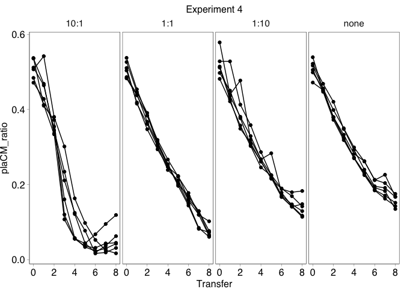<!-- -->

These results might be harder to fit straight lines to, since we see
some persistence/success of plaCM at high recipient levels, possibly due
to the RPS dynamics described in the analytic model.

#### Experiment 4: Analysis

Pre-model diagnostics. Plot transformed response against groups to test
for inhomogeneity in variance.

``` r
dat_4 <- within(dat_4, {
  groups <- interaction(Ratio, Transfer)
  groups <- reorder(groups, plaCM_ratio, mean)
  logitrat = logit(plaCM_ratio)
})

ggplot(data=dat_4, aes(x=groups, y=logitrat)) + 
  geom_point() + theme(axis.text.x = element_text(angle = 45, hjust = 1))
```

<!-- -->

Looks good – though again some increased variance for those measurements
with low plaCM proportion.

Plot data with logit transform.

``` r
ggplot(data=dat_4, aes(x=Transfer, y=logitrat)) +
  geom_point(alpha=0.4) + geom_line(aes(group=Replicate), alpha=0.4) + 
  geom_smooth(method='lm', formula=y ~ x) +
  ggtitle("Experiment 4") +
  facet_grid(.~Ratio) + theme(legend.position="bottom")
```

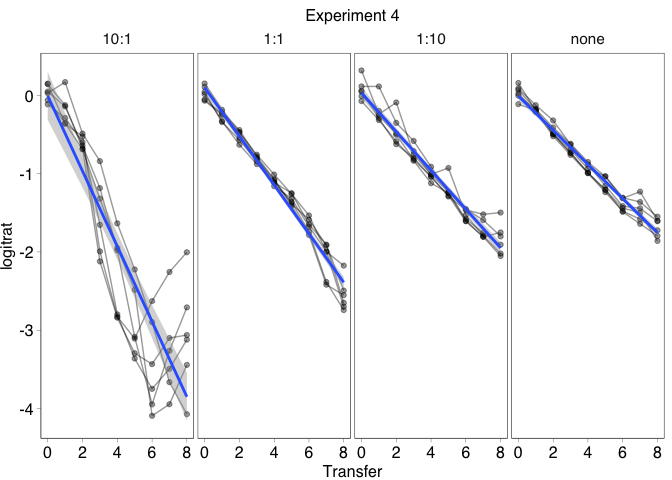<!-- -->

Logit transform helps with the linearity of the 10:1 ratio experiments
somewhat. However, a polynomial term is likely to improve the model.

``` r
ggplot(data=dat_4, aes(x=Transfer, y=logitrat)) +
  geom_point(alpha=0.4) + geom_line(aes(group=Replicate), alpha=0.4) + 
  geom_smooth(method='lm', formula=y ~ poly(x,2)) +
  ggtitle("Experiment 4") +
  facet_grid(.~Ratio) + theme(legend.position="bottom")
```

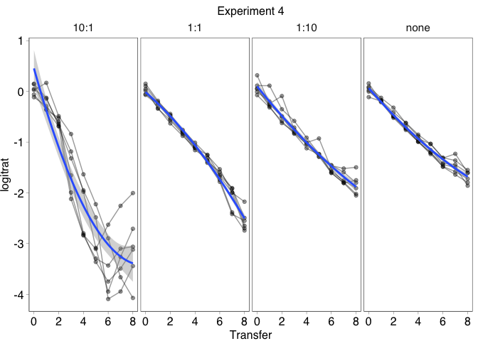<!-- -->

``` r
ggplot(data=dat_4, aes(x=Transfer, y=logitrat)) +
  geom_point(alpha=0.4) + geom_line(aes(group=Replicate), alpha=0.4) + 
  geom_smooth(method='lm', formula=y ~ poly(x,3)) +
  ggtitle("Experiment 4") +
  facet_grid(.~Ratio) + theme(legend.position="bottom")
```

<!-- -->

``` r
ggplot(data=dat_4, aes(x=Transfer, y=logitrat)) +
  geom_point(alpha=0.4) + geom_line(aes(group=Replicate), alpha=0.4) + 
  geom_smooth(method='lm', formula=y ~ poly(x,4)) +
  ggtitle("Experiment 4") +
  facet_grid(.~Ratio) + theme(legend.position="bottom")
```

<!-- -->

Again, start with a LMM. Preliminary analyses indicated an extremely
high correlation between random effects and very low values for the
random effect on slope, so for these analyses the random effect of
population on slope was excluded.

``` r
lmm_dat_4 <- lme(logitrat ~ transf * Ratio,
                 random = ~1|pop, data = dat_4)

lmm_dat_4_poly2 <- lme(logitrat ~ poly(transf,2, raw=TRUE) * Ratio,
                       random = ~1|pop, data = dat_4)

lmm_dat_4_poly3 <- lme(logitrat ~ poly(transf,3, raw=TRUE) * Ratio,
                       random = ~1|pop, data = dat_4)

lmm_dat_4_poly4 <- lme(logitrat ~ poly(transf,4, raw=TRUE) * Ratio,
                       random = ~1|pop, data = dat_4)

plot(lmm_dat_4) 
```

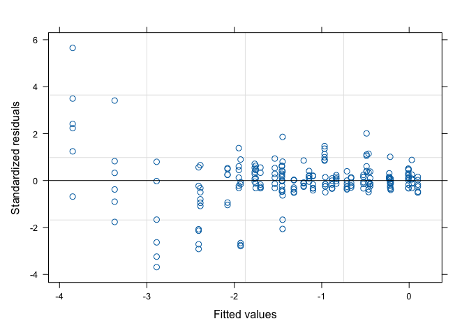<!-- -->

``` r
plot(lmm_dat_4_poly2) 
```

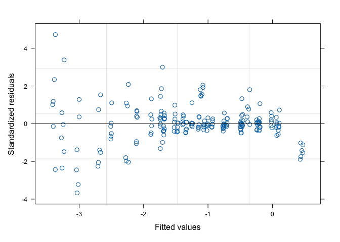<!-- -->

``` r
plot(lmm_dat_4_poly3)
```

<!-- -->

``` r
plot(lmm_dat_4_poly4)
```

<!-- -->

``` r
 # some significant outliers at low fitted values

par(mfrow=c(1,4))
qqPlot(residuals(lmm_dat_4), envelope=0.99)
```

    ## 1.10:1 5.10:1 
    ##    145    108

``` r
qqPlot(residuals(lmm_dat_4_poly2), envelope=0.99)
```

    ## 1.10:1 5.10:1 
    ##    145    108

``` r
qqPlot(residuals(lmm_dat_4_poly3), envelope=0.99)
```

    ## 2.10:1 1.10:1 
    ##    150    121

``` r
qqPlot(residuals(lmm_dat_4_poly4), envelope=0.99)
```

<!-- -->

    ## 2.10:1 1.10:1 
    ##    150    121

``` r
# all of these show substantial divergence from expected values

VarCorr(lmm_dat_4) #extremely low variance on random effects
```

    ## pop = pdLogChol(1) 
    ##             Variance     StdDev      
    ## (Intercept) 2.962411e-10 1.721165e-05
    ## Residual    1.066754e-01 3.266120e-01

``` r
VarCorr(lmm_dat_4_poly2) 
```

    ## pop = pdLogChol(1) 
    ##             Variance    StdDev    
    ## (Intercept) 0.001066545 0.03265801
    ## Residual    0.083462527 0.28889882

``` r
VarCorr(lmm_dat_4_poly3) 
```

    ## pop = pdLogChol(1) 
    ##             Variance    StdDev    
    ## (Intercept) 0.003886916 0.06234514
    ## Residual    0.058079217 0.24099630

``` r
VarCorr(lmm_dat_4_poly4) 
```

    ## pop = pdLogChol(1) 
    ##             Variance   StdDev    
    ## (Intercept) 0.00384300 0.06199194
    ## Residual    0.05847447 0.24181494

Test for the effects of each polynomial.

``` r
anova(update(lmm_dat_4, method="ML"), 
      update(lmm_dat_4_poly2, method="ML"),
      update(lmm_dat_4_poly3, method="ML"),
      update(lmm_dat_4_poly4, method="ML"))
```

    ##                                        Model df       AIC       BIC    logLik
    ## update(lmm_dat_4, method = "ML")           1 10 141.42918 175.18196 -60.71459
    ## update(lmm_dat_4_poly2, method = "ML")     2 14  94.65185 141.90575 -33.32593
    ## update(lmm_dat_4_poly3, method = "ML")     3 18  28.80455  89.55956   3.59772
    ## update(lmm_dat_4_poly4, method = "ML")     4 22  33.79196 108.04809   5.10402
    ##                                          Test  L.Ratio p-value
    ## update(lmm_dat_4, method = "ML")                              
    ## update(lmm_dat_4_poly2, method = "ML") 1 vs 2 54.77733  <.0001
    ## update(lmm_dat_4_poly3, method = "ML") 2 vs 3 73.84730  <.0001
    ## update(lmm_dat_4_poly4, method = "ML") 3 vs 4  3.01259  0.5557

Third-degree polynomial is the best fit…

``` r
par(mfrow=c(1,1))
qqPlot(residuals(lmm_dat_4_poly3), envelope=0.99, col=dat_4$Ratio)
```

<!-- -->

    ## 2.10:1 1.10:1 
    ##    150    121

…though there are still lots of outliers from the 10:1 ratio treatment.

Test for significance of fixed effects.

``` r
drop1(update(lmm_dat_4_poly3, method="ML"), 
             test = "Chisq") %>% kable()
```

|                                   |  Df |       AIC |      LRT | Pr(\>Chi) |
|:----------------------------------|----:|----------:|---------:|----------:|
| <none>                            |  NA |  28.80455 |       NA |        NA |
| poly(transf, 3, raw = TRUE):Ratio |   9 | 235.61572 | 224.8112 |         0 |

There is a significant effect of starting ratio on the loss of plaCM:

|                       |  Df |       AIC |      LRT | Pr(\>Chi) |
|:----------------------|----:|----------:|---------:|----------:|
| <none>                |  NA |  28.80455 |       NA |        NA |
| poly(transf, 3):Ratio |   9 | 235.61572 | 224.8112 |         0 |

``` r
summary(lmm_dat_4_poly3)
```

    ## Linear mixed-effects model fit by REML
    ##   Data: dat_4 
    ##       AIC      BIC    logLik
    ##   103.977 163.3467 -33.98848
    ## 
    ## Random effects:
    ##  Formula: ~1 | pop
    ##         (Intercept)  Residual
    ## StdDev:  0.06234514 0.2409963
    ## 
    ## Fixed effects:  logitrat ~ poly(transf, 3, raw = TRUE) * Ratio 
    ##                                             Value  Std.Error  DF   t-value
    ## (Intercept)                            -2.2562534 0.05585845 180 -40.39234
    ## poly(transf, 3, raw = TRUE)1           -1.9649640 0.08609773 180 -22.82248
    ## poly(transf, 3, raw = TRUE)2            0.3297400 0.03754771 180   8.78190
    ## poly(transf, 3, raw = TRUE)3            0.4097069 0.04516707 180   9.07092
    ## Ratio1:1                                1.1936931 0.07899578  20  15.11084
    ## Ratio1:10                               1.2487250 0.07899578  20  15.80749
    ## Rationone                               1.3219997 0.07899578  20  16.73507
    ## poly(transf, 3, raw = TRUE)1:Ratio1:1   1.2572402 0.12176058 180  10.32551
    ## poly(transf, 3, raw = TRUE)2:Ratio1:1  -0.4120271 0.05310048 180  -7.75939
    ## poly(transf, 3, raw = TRUE)3:Ratio1:1  -0.4649388 0.06387589 180  -7.27878
    ## poly(transf, 3, raw = TRUE)1:Ratio1:10  1.2692408 0.12176058 180  10.42407
    ## poly(transf, 3, raw = TRUE)2:Ratio1:10 -0.2808628 0.05310048 180  -5.28927
    ## poly(transf, 3, raw = TRUE)3:Ratio1:10 -0.3782717 0.06387589 180  -5.92198
    ## poly(transf, 3, raw = TRUE)1:Rationone  1.3687615 0.12176058 180  11.24142
    ## poly(transf, 3, raw = TRUE)2:Rationone -0.2772220 0.05310048 180  -5.22071
    ## poly(transf, 3, raw = TRUE)3:Rationone -0.3919121 0.06387589 180  -6.13552
    ##                                        p-value
    ## (Intercept)                                  0
    ## poly(transf, 3, raw = TRUE)1                 0
    ## poly(transf, 3, raw = TRUE)2                 0
    ## poly(transf, 3, raw = TRUE)3                 0
    ## Ratio1:1                                     0
    ## Ratio1:10                                    0
    ## Rationone                                    0
    ## poly(transf, 3, raw = TRUE)1:Ratio1:1        0
    ## poly(transf, 3, raw = TRUE)2:Ratio1:1        0
    ## poly(transf, 3, raw = TRUE)3:Ratio1:1        0
    ## poly(transf, 3, raw = TRUE)1:Ratio1:10       0
    ## poly(transf, 3, raw = TRUE)2:Ratio1:10       0
    ## poly(transf, 3, raw = TRUE)3:Ratio1:10       0
    ## poly(transf, 3, raw = TRUE)1:Rationone       0
    ## poly(transf, 3, raw = TRUE)2:Rationone       0
    ## poly(transf, 3, raw = TRUE)3:Rationone       0
    ##  Correlation: 
    ##                                        (Intr) pl(,3,r=TRUE)1 pl(,3,r=TRUE)2
    ## poly(transf, 3, raw = TRUE)1            0.000                              
    ## poly(transf, 3, raw = TRUE)2           -0.669  0.000                       
    ## poly(transf, 3, raw = TRUE)3            0.000 -0.924          0.000        
    ## Ratio1:1                               -0.707  0.000          0.473        
    ## Ratio1:10                              -0.707  0.000          0.473        
    ## Rationone                              -0.707  0.000          0.473        
    ## poly(transf, 3, raw = TRUE)1:Ratio1:1   0.000 -0.707          0.000        
    ## poly(transf, 3, raw = TRUE)2:Ratio1:1   0.473  0.000         -0.707        
    ## poly(transf, 3, raw = TRUE)3:Ratio1:1   0.000  0.654          0.000        
    ## poly(transf, 3, raw = TRUE)1:Ratio1:10  0.000 -0.707          0.000        
    ## poly(transf, 3, raw = TRUE)2:Ratio1:10  0.473  0.000         -0.707        
    ## poly(transf, 3, raw = TRUE)3:Ratio1:10  0.000  0.654          0.000        
    ## poly(transf, 3, raw = TRUE)1:Rationone  0.000 -0.707          0.000        
    ## poly(transf, 3, raw = TRUE)2:Rationone  0.473  0.000         -0.707        
    ## poly(transf, 3, raw = TRUE)3:Rationone  0.000  0.654          0.000        
    ##                                        pl(,3,r=TRUE)3 Rat1:1 Rt1:10 Ratinn
    ## poly(transf, 3, raw = TRUE)1                                              
    ## poly(transf, 3, raw = TRUE)2                                              
    ## poly(transf, 3, raw = TRUE)3                                              
    ## Ratio1:1                                0.000                             
    ## Ratio1:10                               0.000          0.500              
    ## Rationone                               0.000          0.500  0.500       
    ## poly(transf, 3, raw = TRUE)1:Ratio1:1   0.654          0.000  0.000  0.000
    ## poly(transf, 3, raw = TRUE)2:Ratio1:1   0.000         -0.669 -0.335 -0.335
    ## poly(transf, 3, raw = TRUE)3:Ratio1:1  -0.707          0.000  0.000  0.000
    ## poly(transf, 3, raw = TRUE)1:Ratio1:10  0.654          0.000  0.000  0.000
    ## poly(transf, 3, raw = TRUE)2:Ratio1:10  0.000         -0.335 -0.669 -0.335
    ## poly(transf, 3, raw = TRUE)3:Ratio1:10 -0.707          0.000  0.000  0.000
    ## poly(transf, 3, raw = TRUE)1:Rationone  0.654          0.000  0.000  0.000
    ## poly(transf, 3, raw = TRUE)2:Rationone  0.000         -0.335 -0.335 -0.669
    ## poly(transf, 3, raw = TRUE)3:Rationone -0.707          0.000  0.000  0.000
    ##                                        pl(,3,r=TRUE)1:R1:1 pl(,3,r=TRUE)2:R1:1
    ## poly(transf, 3, raw = TRUE)1                                                  
    ## poly(transf, 3, raw = TRUE)2                                                  
    ## poly(transf, 3, raw = TRUE)3                                                  
    ## Ratio1:1                                                                      
    ## Ratio1:10                                                                     
    ## Rationone                                                                     
    ## poly(transf, 3, raw = TRUE)1:Ratio1:1                                         
    ## poly(transf, 3, raw = TRUE)2:Ratio1:1   0.000                                 
    ## poly(transf, 3, raw = TRUE)3:Ratio1:1  -0.924               0.000             
    ## poly(transf, 3, raw = TRUE)1:Ratio1:10  0.500               0.000             
    ## poly(transf, 3, raw = TRUE)2:Ratio1:10  0.000               0.500             
    ## poly(transf, 3, raw = TRUE)3:Ratio1:10 -0.462               0.000             
    ## poly(transf, 3, raw = TRUE)1:Rationone  0.500               0.000             
    ## poly(transf, 3, raw = TRUE)2:Rationone  0.000               0.500             
    ## poly(transf, 3, raw = TRUE)3:Rationone -0.462               0.000             
    ##                                        pl(,3,r=TRUE)3:R1:1 p(,3,r=TRUE)1:R1:10
    ## poly(transf, 3, raw = TRUE)1                                                  
    ## poly(transf, 3, raw = TRUE)2                                                  
    ## poly(transf, 3, raw = TRUE)3                                                  
    ## Ratio1:1                                                                      
    ## Ratio1:10                                                                     
    ## Rationone                                                                     
    ## poly(transf, 3, raw = TRUE)1:Ratio1:1                                         
    ## poly(transf, 3, raw = TRUE)2:Ratio1:1                                         
    ## poly(transf, 3, raw = TRUE)3:Ratio1:1                                         
    ## poly(transf, 3, raw = TRUE)1:Ratio1:10 -0.462                                 
    ## poly(transf, 3, raw = TRUE)2:Ratio1:10  0.000               0.000             
    ## poly(transf, 3, raw = TRUE)3:Ratio1:10  0.500              -0.924             
    ## poly(transf, 3, raw = TRUE)1:Rationone -0.462               0.500             
    ## poly(transf, 3, raw = TRUE)2:Rationone  0.000               0.000             
    ## poly(transf, 3, raw = TRUE)3:Rationone  0.500              -0.462             
    ##                                        p(,3,r=TRUE)2:R1:10 p(,3,r=TRUE)3:R1:10
    ## poly(transf, 3, raw = TRUE)1                                                  
    ## poly(transf, 3, raw = TRUE)2                                                  
    ## poly(transf, 3, raw = TRUE)3                                                  
    ## Ratio1:1                                                                      
    ## Ratio1:10                                                                     
    ## Rationone                                                                     
    ## poly(transf, 3, raw = TRUE)1:Ratio1:1                                         
    ## poly(transf, 3, raw = TRUE)2:Ratio1:1                                         
    ## poly(transf, 3, raw = TRUE)3:Ratio1:1                                         
    ## poly(transf, 3, raw = TRUE)1:Ratio1:10                                        
    ## poly(transf, 3, raw = TRUE)2:Ratio1:10                                        
    ## poly(transf, 3, raw = TRUE)3:Ratio1:10  0.000                                 
    ## poly(transf, 3, raw = TRUE)1:Rationone  0.000              -0.462             
    ## poly(transf, 3, raw = TRUE)2:Rationone  0.500               0.000             
    ## poly(transf, 3, raw = TRUE)3:Rationone  0.000               0.500             
    ##                                        pl(,3,r=TRUE)1:R pl(,3,r=TRUE)2:R
    ## poly(transf, 3, raw = TRUE)1                                            
    ## poly(transf, 3, raw = TRUE)2                                            
    ## poly(transf, 3, raw = TRUE)3                                            
    ## Ratio1:1                                                                
    ## Ratio1:10                                                               
    ## Rationone                                                               
    ## poly(transf, 3, raw = TRUE)1:Ratio1:1                                   
    ## poly(transf, 3, raw = TRUE)2:Ratio1:1                                   
    ## poly(transf, 3, raw = TRUE)3:Ratio1:1                                   
    ## poly(transf, 3, raw = TRUE)1:Ratio1:10                                  
    ## poly(transf, 3, raw = TRUE)2:Ratio1:10                                  
    ## poly(transf, 3, raw = TRUE)3:Ratio1:10                                  
    ## poly(transf, 3, raw = TRUE)1:Rationone                                  
    ## poly(transf, 3, raw = TRUE)2:Rationone  0.000                           
    ## poly(transf, 3, raw = TRUE)3:Rationone -0.924            0.000          
    ## 
    ## Standardized Within-Group Residuals:
    ##         Min          Q1         Med          Q3         Max 
    ## -4.77980073 -0.30949988 -0.03173836  0.25636455  4.65350891 
    ## 
    ## Number of Observations: 216
    ## Number of Groups: 24

The polynomial terms are larger for the base level (10:1 Ratio),
indicating that the significant effect is driven by more non-linear
relationships at the 10:1 ratio compared with the others.

Interpretation below (after the GLMM analysis).

Now attempt GLMM with glmmTMB and a beta-binomial distribution, since
preliminary analyses indicated overdispersion.

Again, preliminary analyses indicated issues with incorporating a random
effect on slope, so this term was not included.

``` r
glmm_dat_4 <- glmmTMB(cbind(count_plaCM, count_chrCM) ~ transf * Ratio + (1|pop),
                 data = dat_4, family="betabinomial")

glmm_dat_4_poly2 <- glmmTMB(cbind(count_plaCM, count_chrCM) ~ poly(transf,2, raw=TRUE) * Ratio + (1|pop),
                       data = dat_4, family="betabinomial")

glmm_dat_4_poly3 <- glmmTMB(cbind(count_plaCM, count_chrCM) ~ poly(transf,3, raw=TRUE) * Ratio + (1|pop),
                       data = dat_4, family="betabinomial")

glmm_dat_4_poly4 <- glmmTMB(cbind(count_plaCM, count_chrCM) ~ poly(transf,4, raw=TRUE) * Ratio + (1|pop),
                       data = dat_4, family="betabinomial")

plot(residuals(glmm_dat_4), type="p")
```

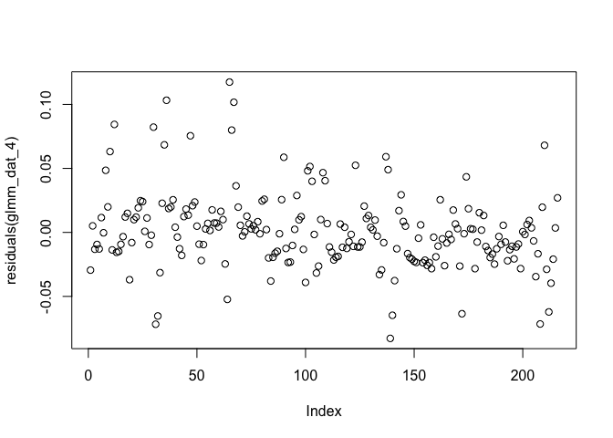<!-- -->

``` r
plot(residuals(glmm_dat_4_poly2), type="p")
```

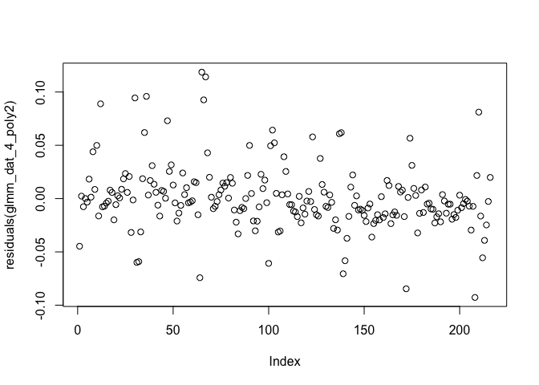<!-- -->

``` r
plot(residuals(glmm_dat_4_poly3), type="p")
```

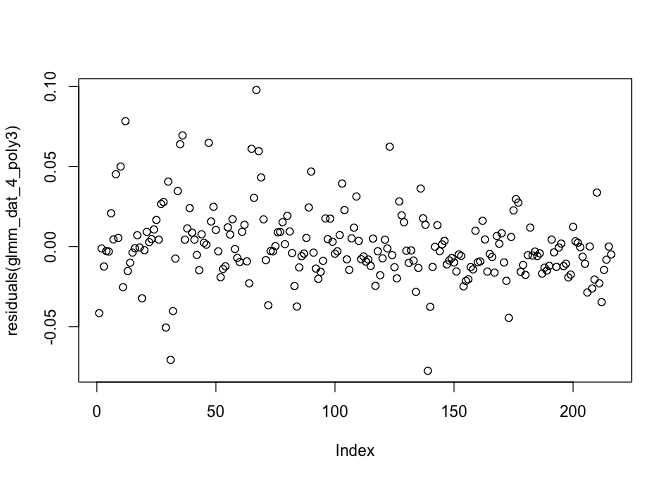<!-- -->

``` r
plot(residuals(glmm_dat_4_poly4), type="p")
```

<!-- -->

``` r
 # looks much better than the LMM

par(mfrow=c(1,4))
qqPlot(residuals(glmm_dat_4), envelope=0.99)
```

    ## [1] 198 145

``` r
qqPlot(residuals(glmm_dat_4_poly2), envelope=0.99)
```

    ## [1] 198  30

``` r
qqPlot(residuals(glmm_dat_4_poly3), envelope=0.99)
```

    ## [1] 30 34

``` r
qqPlot(residuals(glmm_dat_4_poly4), envelope=0.99)
```

<!-- -->

    ## [1] 30  5

``` r
# again, substantial divergence from expected values at the extremes
```

Test significance of polynomial terms.

``` r
anova(glmm_dat_4,
      glmm_dat_4_poly2,
      glmm_dat_4_poly3,
      glmm_dat_4_poly4)
```

    ## Data: dat_4
    ## Models:
    ## glmm_dat_4: cbind(count_plaCM, count_chrCM) ~ transf * Ratio + (1 | pop), zi=~0, disp=~1
    ## glmm_dat_4_poly2: cbind(count_plaCM, count_chrCM) ~ poly(transf, 2, raw = TRUE) * , zi=~0, disp=~1
    ## glmm_dat_4_poly2:     Ratio + (1 | pop), zi=~0, disp=~1
    ## glmm_dat_4_poly3: cbind(count_plaCM, count_chrCM) ~ poly(transf, 3, raw = TRUE) * , zi=~0, disp=~1
    ## glmm_dat_4_poly3:     Ratio + (1 | pop), zi=~0, disp=~1
    ## glmm_dat_4_poly4: cbind(count_plaCM, count_chrCM) ~ poly(transf, 4, raw = TRUE) * , zi=~0, disp=~1
    ## glmm_dat_4_poly4:     Ratio + (1 | pop), zi=~0, disp=~1
    ##                  Df    AIC    BIC  logLik deviance  Chisq Chi Df Pr(>Chisq)    
    ## glmm_dat_4       10 2893.1 2926.9 -1436.6   2873.1                             
    ## glmm_dat_4_poly2 14 2886.5 2933.8 -1429.2   2858.5 14.617      4   0.005565 ** 
    ## glmm_dat_4_poly3 18 2804.7 2865.5 -1384.4   2768.7 89.786      4  < 2.2e-16 ***
    ## glmm_dat_4_poly4 22 2810.1 2884.4 -1383.0   2766.1  2.619      4   0.623468    
    ## ---
    ## Signif. codes:  0 '***' 0.001 '**' 0.01 '*' 0.05 '.' 0.1 ' ' 1

As with the LMM, the third degree polynomial is most appropriate.

``` r
par(mfrow=c(1,1))
qqPlot(residuals(glmm_dat_4_poly3), envelope=0.99, col=dat_4$Ratio)
```

<!-- -->

    ## [1] 30 34

Looks better than the LMM, though still some divergence.

Select optimal fixed effects structure.

``` r
drop1(glmm_dat_4_poly3, test="Chisq") %>% kable()
```

|                                   |  Df |      AIC |      LRT | Pr(\>Chi) |
|:----------------------------------|----:|---------:|---------:|----------:|
| <none>                            |  NA | 2804.723 |       NA |        NA |
| poly(transf, 3, raw = TRUE):Ratio |   9 | 3074.079 | 287.3561 |         0 |

Again, we detect the significant effect of Ratio on the shape of the
slope

|                       |  Df |      AIC |      LRT | Pr(\>Chi) |
|:----------------------|----:|---------:|---------:|----------:|
| <none>                |  NA | 2804.723 |       NA |        NA |
| poly(transf, 3):Ratio |   9 | 3074.079 | 287.3561 |         0 |

``` r
summary(glmm_dat_4_poly3)
```

    ##  Family: betabinomial  ( logit )
    ## Formula:          
    ## cbind(count_plaCM, count_chrCM) ~ poly(transf, 3, raw = TRUE) *  
    ##     Ratio + (1 | pop)
    ## Data: dat_4
    ## 
    ##      AIC      BIC   logLik deviance df.resid 
    ##   2804.7   2865.5  -1384.4   2768.7      198 
    ## 
    ## Random effects:
    ## 
    ## Conditional model:
    ##  Groups Name        Variance Std.Dev.
    ##  pop    (Intercept) 0.002204 0.04695 
    ## Number of obs: 216, groups:  pop, 24
    ## 
    ## Dispersion parameter for betabinomial family ():  251 
    ## 
    ## Conditional model:
    ##                                        Estimate Std. Error z value Pr(>|z|)    
    ## (Intercept)                            -2.23958    0.05270  -42.49  < 2e-16 ***
    ## poly(transf, 3, raw = TRUE)1           -1.99489    0.08260  -24.15  < 2e-16 ***
    ## poly(transf, 3, raw = TRUE)2            0.32673    0.03547    9.21  < 2e-16 ***
    ## poly(transf, 3, raw = TRUE)3            0.42944    0.04152   10.34  < 2e-16 ***
    ## Ratio1:1                                1.18057    0.06441   18.33  < 2e-16 ***
    ## Ratio1:10                               1.23697    0.06374   19.41  < 2e-16 ***
    ## Rationone                               1.30906    0.06339   20.65  < 2e-16 ***
    ## poly(transf, 3, raw = TRUE)1:Ratio1:1   1.28899    0.09959   12.94  < 2e-16 ***
    ## poly(transf, 3, raw = TRUE)2:Ratio1:1  -0.40500    0.04470   -9.06  < 2e-16 ***
    ## poly(transf, 3, raw = TRUE)3:Ratio1:1  -0.48161    0.05162   -9.33  < 2e-16 ***
    ## poly(transf, 3, raw = TRUE)1:Ratio1:10  1.30737    0.09793   13.35  < 2e-16 ***
    ## poly(transf, 3, raw = TRUE)2:Ratio1:10 -0.27789    0.04282   -6.49 8.63e-11 ***
    ## poly(transf, 3, raw = TRUE)3:Ratio1:10 -0.40051    0.05015   -7.99 1.38e-15 ***
    ## poly(transf, 3, raw = TRUE)1:Rationone  1.39730    0.09730   14.36  < 2e-16 ***
    ## poly(transf, 3, raw = TRUE)2:Rationone -0.27338    0.04230   -6.46 1.03e-10 ***
    ## poly(transf, 3, raw = TRUE)3:Rationone -0.40886    0.04965   -8.23  < 2e-16 ***
    ## ---
    ## Signif. codes:  0 '***' 0.001 '**' 0.01 '*' 0.05 '.' 0.1 ' ' 1

As with the LMM, we see steeper loss of plaCM when there are numerous
recipients, and the effect size is relatively large (the first-order
polynomial term is strongly negative for the 10:1 ratio, and ameliorated
with all of the others). However it’s important to note that there
appears to be a levelling-out at around 0.04, as fitted by the
polynomial term in the model (the second and third-degree polynomial
terms are ameliorated at the other ratios). Again, the results here are
driven by an increased persistence of plaCM under conditions where there
are fewer plasmid-free competitors.

Pulling this together with the results from Experiment 3.

- PlaCM is outcompeted by ChrCM regardless of recipient availability.
- PlaCM is outcompeted by wild-type pQBR57 from ChrCM. This effect is
  slightly mitigated when there are few/no plasmid-free cells to
  conjugate into, but the ultimate fate is the same.
- The fact that wild-type pQBR57 from ChrCM is more effective at
  displacing plaCM in the presence of recipients is consistent with the
  results from Experiment 5.

### Experiment 5

Load up data and plot figure:

``` r
(df_expt5 <- df %>%
  filter(Experiment == 2 & Treatment == "C") %>%
  pivot_longer(starts_with("Fraction"), names_to = "Fluorescence", names_prefix = "Fraction_",
               values_to = "Fraction") %>%
  mutate(Population = factor(
    case_when(Fluorescence == "Yellow" ~ "plaCM",
              Fluorescence == "Red" ~ "pQBR57",
              Fluorescence == "Orange" ~ "double / clumped",
              Fluorescence == "Blue" ~ "none"),
    levels=c("double / clumped", "pQBR57", "plaCM", "none")),
         Ratio = factor(Ratio,
                        levels=c(10, 1, 0.1, 0),
                        labels=c("10:1", "1:1", "1:10", "none")))) %>%
  ggplot(aes(x=Transfer, y=Fraction, fill=Population)) +
  geom_area() + 
  facet_grid(Replicate ~ Ratio) +
    scale_fill_manual(
    breaks=c("pQBR57", "plaCM", "none", "double / clumped"),
    values=c("#DDCC77", "#44AA99", "#DDDDDD", "#000000"))
```

<!-- -->

Plot the ratio of chrCM to plaCM, averaged over reps with SE.

``` r
(dat_5 <- df_expt5 %>%
  select(-Fluorescence) %>%
  pivot_wider(names_from="Population", values_from="Fraction") %>%
   mutate(pop = as.factor(paste(Replicate, Ratio, sep=".")),
          count_plaCM = round(Total_count * plaCM),
          count_pQBR57 = round(Total_count * pQBR57),
          plaCM_ratio = count_plaCM / (count_plaCM + count_pQBR57),
          transf = scale(Transfer))) %>% head()
```

    ## # A tibble: 6 × 15
    ##   Treatment Replicate Transfer Total_count Experiment Ratio  plaCM pQBR57
    ##   <chr>         <int>    <int>       <int>      <int> <fct>  <dbl>  <dbl>
    ## 1 C                 1        2       11866          2 10:1  0.0307 0.0126
    ## 2 C                 5        2       14095          2 1:10  0.540  0.225 
    ## 3 C                 6        2       14547          2 10:1  0.0292 0.0201
    ## 4 C                 6        2       10736          2 1:10  0.529  0.245 
    ## 5 C                 1        2       13315          2 1:10  0.553  0.187 
    ## 6 C                 2        2       12384          2 10:1  0.0220 0.0175
    ## # ℹ 7 more variables: `double / clumped` <dbl>, none <dbl>, pop <fct>,
    ## #   count_plaCM <dbl>, count_pQBR57 <dbl>, plaCM_ratio <dbl>, transf <dbl[,1]>

``` r
ggplot(data=dat_5, aes(x=Transfer, y=plaCM_ratio,
                       group=Replicate)) +
  geom_point() + geom_line() + 
  ggtitle("Experiment 5") +
  facet_grid(.~Ratio) + theme(legend.position="bottom")
```

<!-- -->

It is really not possible to fit straight lines to these plots due to
the RPS dynamics, and so polynomial terms are required.

#### Experiment 5: Analysis

Pre-model diagnostics. Plot transformed response against groups to test
for inhomogeneity in variance.

``` r
dat_5 <- within(dat_5, {
  groups <- interaction(Ratio, Transfer)
  groups <- reorder(groups, plaCM_ratio, mean)
  logitrat = logit(plaCM_ratio)
})

ggplot(data=dat_5, aes(x=groups, y=logitrat)) + 
  geom_point() + theme(axis.text.x = element_text(angle = 45, hjust = 1))
```

<!-- -->

Looks good – though again some increased variance for those measurements
with low plaCM proportion, and one higher-variance outlier at the later
timepoint at the 1:10 ratio.

Plot data with logit transform.

``` r
ggplot(data=dat_5, aes(x=Transfer, y=logitrat)) +
  geom_point(alpha=0.4) + geom_line(aes(group=Replicate), alpha=0.4) + 
  geom_smooth(method='lm', formula=y ~ x) +
  ggtitle("Experiment 5") +
  facet_grid(.~Ratio) + theme(legend.position="bottom")
```

<!-- -->

Straight lines are not very helpful with some of these treatments.

Third- or fourth-degree polynomial may help.

``` r
ggplot(data=dat_5, aes(x=Transfer, y=logitrat)) +
  geom_point(alpha=0.4) + geom_line(aes(group=Replicate), alpha=0.4) + 
  geom_smooth(method='lm', formula=y ~ poly(x, 2)) +
  ggtitle("Experiment 5") +
  facet_grid(.~Ratio) + theme(legend.position="bottom")
```

<!-- -->

``` r
ggplot(data=dat_5, aes(x=Transfer, y=logitrat)) +
  geom_point(alpha=0.4) + geom_line(aes(group=Replicate), alpha=0.4) + 
  geom_smooth(method='lm', formula=y ~ poly(x, 3)) +
  ggtitle("Experiment 5") +
  facet_grid(.~Ratio) + theme(legend.position="bottom")
```

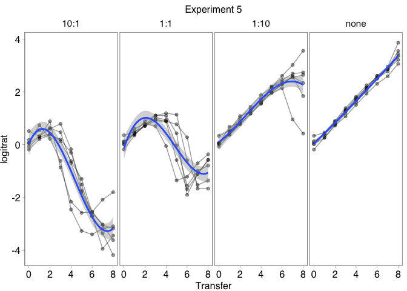<!-- -->

``` r
ggplot(data=dat_5, aes(x=Transfer, y=logitrat)) +
  geom_point(alpha=0.4) + geom_line(aes(group=Replicate), alpha=0.4) + 
  geom_smooth(method='lm', formula=y ~ poly(x, 4)) +
  ggtitle("Experiment 5") +
  facet_grid(.~Ratio) + theme(legend.position="bottom")
```

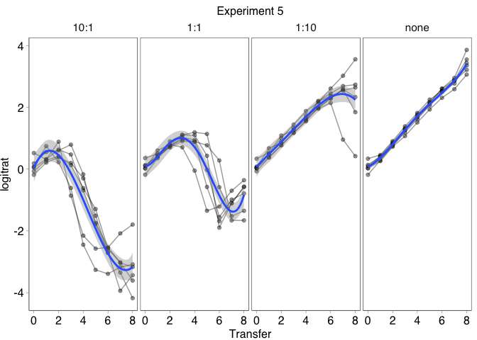<!-- -->

Again, start with a LMM. Preliminary analyses indicated issues with the
random effect on slope (low variance, high correlation) so this was not
included.

``` r
lmm_dat_5 <- lme(logitrat ~ transf * Ratio,
                 random = ~1|pop, data = dat_5)
lmm_dat_5_poly2 <- lme(logitrat ~ poly(transf,2, raw=TRUE) * Ratio,
                 random = ~1|pop, data = dat_5)
lmm_dat_5_poly3 <- lme(logitrat ~ poly(transf,3, raw=TRUE) * Ratio,
                 random = ~1|pop, data = dat_5)
lmm_dat_5_poly4 <- lme(logitrat ~ poly(transf,4, raw=TRUE) * Ratio,
                 random = ~1|pop, data = dat_5)

plot(lmm_dat_5) 
```

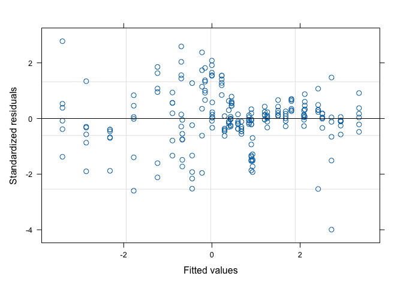<!-- -->

``` r
plot(lmm_dat_5_poly2) 
```

<!-- -->

``` r
plot(lmm_dat_5_poly3) 
```

<!-- -->

``` r
plot(lmm_dat_5_poly4)
```

<!-- -->

``` r
 # problems with heteroscedasticity at lower fitted values

qqPlot(residuals(lmm_dat_5), envelope=0.99)
```

<!-- -->

    ## 2.1:10 1.10:1 
    ##    151    145

``` r
qqPlot(residuals(lmm_dat_5_poly2), envelope=0.99)
```

<!-- -->

    ## 2.1:10 1.10:1 
    ##    151    145

``` r
qqPlot(residuals(lmm_dat_5_poly3), envelope=0.99)
```

<!-- -->

    ## 2.1:10 1.10:1 
    ##    151    145

``` r
qqPlot(residuals(lmm_dat_5_poly4), envelope=0.99)
```

<!-- -->

    ## 2.1:10 1.10:1 
    ##    151    145

``` r
# again poor fit at the extremes

VarCorr(lmm_dat_5) 
```

    ## pop = pdLogChol(1) 
    ##             Variance     StdDev      
    ## (Intercept) 2.091314e-09 4.573089e-05
    ## Residual    3.291991e-01 5.737587e-01

``` r
VarCorr(lmm_dat_5_poly2) 
```

    ## pop = pdLogChol(1) 
    ##             Variance    StdDev    
    ## (Intercept) 0.002111345 0.04594937
    ## Residual    0.274909132 0.52431778

``` r
VarCorr(lmm_dat_5_poly3) 
```

    ## pop = pdLogChol(1) 
    ##             Variance  StdDev   
    ## (Intercept) 0.0109615 0.1046972
    ## Residual    0.1952577 0.4418797

``` r
VarCorr(lmm_dat_5_poly4) 
```

    ## pop = pdLogChol(1) 
    ##             Variance   StdDev   
    ## (Intercept) 0.01247579 0.1116951
    ## Residual    0.18162916 0.4261797

Comparison of models.

``` r
anova(update(lmm_dat_5, method="ML"), 
      update(lmm_dat_5_poly2, method="ML"),
      update(lmm_dat_5_poly3, method="ML"),
      update(lmm_dat_5_poly4, method="ML"))
```

    ##                                        Model df      AIC      BIC    logLik
    ## update(lmm_dat_5, method = "ML")           1 10 384.8335 418.5863 -182.4168
    ## update(lmm_dat_5_poly2, method = "ML")     2 14 351.1701 398.4240 -161.5850
    ## update(lmm_dat_5_poly3, method = "ML")     3 18 289.2073 349.9623 -126.6037
    ## update(lmm_dat_5_poly4, method = "ML")     4 22 279.0007 353.2569 -117.5004
    ##                                          Test  L.Ratio p-value
    ## update(lmm_dat_5, method = "ML")                              
    ## update(lmm_dat_5_poly2, method = "ML") 1 vs 2 41.66346  <.0001
    ## update(lmm_dat_5_poly3, method = "ML") 2 vs 3 69.96275  <.0001
    ## update(lmm_dat_5_poly4, method = "ML") 3 vs 4 18.20658  0.0011

The fourth-degree polynomial term does actually help improve the model
here.

Test for significance of fixed effects. Preliminary analyses suggested I
needed to change the optimiser function, due to lack of convergence.

``` r
drop1(update(lmm_dat_5_poly4, method="ML"), 
             test = "Chisq") %>% kable()
```

|                                   |  Df |      AIC |      LRT | Pr(\>Chi) |
|:----------------------------------|----:|---------:|---------:|----------:|
| <none>                            |  NA | 279.0007 |       NA |        NA |
| poly(transf, 4, raw = TRUE):Ratio |  12 | 682.7010 | 427.7003 |         0 |

There is a significant interaction term, indicating the the shape of the
response varies with starting ratio.

|                       |  Df |      AIC |      LRT | Pr(\>Chi) |
|:----------------------|----:|---------:|---------:|----------:|
| <none>                |  NA | 279.0007 |       NA |        NA |
| poly(transf, 4):Ratio |  12 | 682.7010 | 427.7003 |         0 |

``` r
summary(lmm_dat_5_poly4)
```

    ## Linear mixed-effects model fit by REML
    ##   Data: dat_5 
    ##       AIC      BIC   logLik
    ##   347.136 419.2546 -151.568
    ## 
    ## Random effects:
    ##  Formula: ~1 | pop
    ##         (Intercept)  Residual
    ## StdDev:   0.1116951 0.4261797
    ## 
    ## Fixed effects:  logitrat ~ poly(transf, 4, raw = TRUE) * Ratio 
    ##                                            Value Std.Error  DF    t-value
    ## (Intercept)                            -0.993253 0.1212851 176  -8.189403
    ## poly(transf, 4, raw = TRUE)1           -2.399679 0.1522559 176 -15.760828
    ## poly(transf, 4, raw = TRUE)2           -0.246462 0.2582705 176  -0.954278
    ## poly(transf, 4, raw = TRUE)3            0.570482 0.0798738 176   7.142287
    ## poly(transf, 4, raw = TRUE)4            0.003061 0.1017536 176   0.030083
    ## Ratio1:1                                1.705356 0.1715230  20   9.942430
    ## Ratio1:10                               2.686504 0.1715230  20  15.662642
    ## Rationone                               2.699846 0.1715230  20  15.740430
    ## poly(transf, 4, raw = TRUE)1:Ratio1:1   1.035557 0.2153224 176   4.809332
    ## poly(transf, 4, raw = TRUE)2:Ratio1:1  -1.203382 0.3652497 176  -3.294683
    ## poly(transf, 4, raw = TRUE)3:Ratio1:1  -0.124483 0.1129586 176  -1.102027
    ## poly(transf, 4, raw = TRUE)4:Ratio1:1   0.413376 0.1439014 176   2.872630
    ## poly(transf, 4, raw = TRUE)1:Ratio1:10  3.419208 0.2153224 176  15.879486
    ## poly(transf, 4, raw = TRUE)2:Ratio1:10  0.131442 0.3652497 176   0.359869
    ## poly(transf, 4, raw = TRUE)3:Ratio1:10 -0.704110 0.1129586 176  -6.233349
    ## poly(transf, 4, raw = TRUE)4:Ratio1:10 -0.047917 0.1439014 176  -0.332988
    ## poly(transf, 4, raw = TRUE)1:Rationone  3.481736 0.2153224 176  16.169878
    ## poly(transf, 4, raw = TRUE)2:Rationone  0.077550 0.3652497 176   0.212321
    ## poly(transf, 4, raw = TRUE)3:Rationone -0.573528 0.1129586 176  -5.077325
    ## poly(transf, 4, raw = TRUE)4:Rationone  0.073200 0.1439014 176   0.508679
    ##                                        p-value
    ## (Intercept)                             0.0000
    ## poly(transf, 4, raw = TRUE)1            0.0000
    ## poly(transf, 4, raw = TRUE)2            0.3413
    ## poly(transf, 4, raw = TRUE)3            0.0000
    ## poly(transf, 4, raw = TRUE)4            0.9760
    ## Ratio1:1                                0.0000
    ## Ratio1:10                               0.0000
    ## Rationone                               0.0000
    ## poly(transf, 4, raw = TRUE)1:Ratio1:1   0.0000
    ## poly(transf, 4, raw = TRUE)2:Ratio1:1   0.0012
    ## poly(transf, 4, raw = TRUE)3:Ratio1:1   0.2720
    ## poly(transf, 4, raw = TRUE)4:Ratio1:1   0.0046
    ## poly(transf, 4, raw = TRUE)1:Ratio1:10  0.0000
    ## poly(transf, 4, raw = TRUE)2:Ratio1:10  0.7194
    ## poly(transf, 4, raw = TRUE)3:Ratio1:10  0.0000
    ## poly(transf, 4, raw = TRUE)4:Ratio1:10  0.7395
    ## poly(transf, 4, raw = TRUE)1:Rationone  0.0000
    ## poly(transf, 4, raw = TRUE)2:Rationone  0.8321
    ## poly(transf, 4, raw = TRUE)3:Rationone  0.0000
    ## poly(transf, 4, raw = TRUE)4:Rationone  0.6116
    ##  Correlation: 
    ##                                        (Intr) pl(,4,r=TRUE)1 pl(,4,r=TRUE)2
    ## poly(transf, 4, raw = TRUE)1            0.000                              
    ## poly(transf, 4, raw = TRUE)2           -0.698  0.000                       
    ## poly(transf, 4, raw = TRUE)3            0.000 -0.924          0.000        
    ## poly(transf, 4, raw = TRUE)4            0.577  0.000         -0.966        
    ## Ratio1:1                               -0.707  0.000          0.493        
    ## Ratio1:10                              -0.707  0.000          0.493        
    ## Rationone                              -0.707  0.000          0.493        
    ## poly(transf, 4, raw = TRUE)1:Ratio1:1   0.000 -0.707          0.000        
    ## poly(transf, 4, raw = TRUE)2:Ratio1:1   0.493  0.000         -0.707        
    ## poly(transf, 4, raw = TRUE)3:Ratio1:1   0.000  0.654          0.000        
    ## poly(transf, 4, raw = TRUE)4:Ratio1:1  -0.408  0.000          0.683        
    ## poly(transf, 4, raw = TRUE)1:Ratio1:10  0.000 -0.707          0.000        
    ## poly(transf, 4, raw = TRUE)2:Ratio1:10  0.493  0.000         -0.707        
    ## poly(transf, 4, raw = TRUE)3:Ratio1:10  0.000  0.654          0.000        
    ## poly(transf, 4, raw = TRUE)4:Ratio1:10 -0.408  0.000          0.683        
    ## poly(transf, 4, raw = TRUE)1:Rationone  0.000 -0.707          0.000        
    ## poly(transf, 4, raw = TRUE)2:Rationone  0.493  0.000         -0.707        
    ## poly(transf, 4, raw = TRUE)3:Rationone  0.000  0.654          0.000        
    ## poly(transf, 4, raw = TRUE)4:Rationone -0.408  0.000          0.683        
    ##                                        pl(,4,r=TRUE)3 pl(,4,r=TRUE)4 Rat1:1
    ## poly(transf, 4, raw = TRUE)1                                               
    ## poly(transf, 4, raw = TRUE)2                                               
    ## poly(transf, 4, raw = TRUE)3                                               
    ## poly(transf, 4, raw = TRUE)4            0.000                              
    ## Ratio1:1                                0.000         -0.408               
    ## Ratio1:10                               0.000         -0.408          0.500
    ## Rationone                               0.000         -0.408          0.500
    ## poly(transf, 4, raw = TRUE)1:Ratio1:1   0.654          0.000          0.000
    ## poly(transf, 4, raw = TRUE)2:Ratio1:1   0.000          0.683         -0.698
    ## poly(transf, 4, raw = TRUE)3:Ratio1:1  -0.707          0.000          0.000
    ## poly(transf, 4, raw = TRUE)4:Ratio1:1   0.000         -0.707          0.577
    ## poly(transf, 4, raw = TRUE)1:Ratio1:10  0.654          0.000          0.000
    ## poly(transf, 4, raw = TRUE)2:Ratio1:10  0.000          0.683         -0.349
    ## poly(transf, 4, raw = TRUE)3:Ratio1:10 -0.707          0.000          0.000
    ## poly(transf, 4, raw = TRUE)4:Ratio1:10  0.000         -0.707          0.289
    ## poly(transf, 4, raw = TRUE)1:Rationone  0.654          0.000          0.000
    ## poly(transf, 4, raw = TRUE)2:Rationone  0.000          0.683         -0.349
    ## poly(transf, 4, raw = TRUE)3:Rationone -0.707          0.000          0.000
    ## poly(transf, 4, raw = TRUE)4:Rationone  0.000         -0.707          0.289
    ##                                        Rt1:10 Ratinn pl(,4,r=TRUE)1:R1:1
    ## poly(transf, 4, raw = TRUE)1                                            
    ## poly(transf, 4, raw = TRUE)2                                            
    ## poly(transf, 4, raw = TRUE)3                                            
    ## poly(transf, 4, raw = TRUE)4                                            
    ## Ratio1:1                                                                
    ## Ratio1:10                                                               
    ## Rationone                               0.500                           
    ## poly(transf, 4, raw = TRUE)1:Ratio1:1   0.000  0.000                    
    ## poly(transf, 4, raw = TRUE)2:Ratio1:1  -0.349 -0.349  0.000             
    ## poly(transf, 4, raw = TRUE)3:Ratio1:1   0.000  0.000 -0.924             
    ## poly(transf, 4, raw = TRUE)4:Ratio1:1   0.289  0.289  0.000             
    ## poly(transf, 4, raw = TRUE)1:Ratio1:10  0.000  0.000  0.500             
    ## poly(transf, 4, raw = TRUE)2:Ratio1:10 -0.698 -0.349  0.000             
    ## poly(transf, 4, raw = TRUE)3:Ratio1:10  0.000  0.000 -0.462             
    ## poly(transf, 4, raw = TRUE)4:Ratio1:10  0.577  0.289  0.000             
    ## poly(transf, 4, raw = TRUE)1:Rationone  0.000  0.000  0.500             
    ## poly(transf, 4, raw = TRUE)2:Rationone -0.349 -0.698  0.000             
    ## poly(transf, 4, raw = TRUE)3:Rationone  0.000  0.000 -0.462             
    ## poly(transf, 4, raw = TRUE)4:Rationone  0.289  0.577  0.000             
    ##                                        pl(,4,r=TRUE)2:R1:1 pl(,4,r=TRUE)3:R1:1
    ## poly(transf, 4, raw = TRUE)1                                                  
    ## poly(transf, 4, raw = TRUE)2                                                  
    ## poly(transf, 4, raw = TRUE)3                                                  
    ## poly(transf, 4, raw = TRUE)4                                                  
    ## Ratio1:1                                                                      
    ## Ratio1:10                                                                     
    ## Rationone                                                                     
    ## poly(transf, 4, raw = TRUE)1:Ratio1:1                                         
    ## poly(transf, 4, raw = TRUE)2:Ratio1:1                                         
    ## poly(transf, 4, raw = TRUE)3:Ratio1:1   0.000                                 
    ## poly(transf, 4, raw = TRUE)4:Ratio1:1  -0.966               0.000             
    ## poly(transf, 4, raw = TRUE)1:Ratio1:10  0.000              -0.462             
    ## poly(transf, 4, raw = TRUE)2:Ratio1:10  0.500               0.000             
    ## poly(transf, 4, raw = TRUE)3:Ratio1:10  0.000               0.500             
    ## poly(transf, 4, raw = TRUE)4:Ratio1:10 -0.483               0.000             
    ## poly(transf, 4, raw = TRUE)1:Rationone  0.000              -0.462             
    ## poly(transf, 4, raw = TRUE)2:Rationone  0.500               0.000             
    ## poly(transf, 4, raw = TRUE)3:Rationone  0.000               0.500             
    ## poly(transf, 4, raw = TRUE)4:Rationone -0.483               0.000             
    ##                                        pl(,4,r=TRUE)4:R1:1 p(,4,r=TRUE)1:R1:10
    ## poly(transf, 4, raw = TRUE)1                                                  
    ## poly(transf, 4, raw = TRUE)2                                                  
    ## poly(transf, 4, raw = TRUE)3                                                  
    ## poly(transf, 4, raw = TRUE)4                                                  
    ## Ratio1:1                                                                      
    ## Ratio1:10                                                                     
    ## Rationone                                                                     
    ## poly(transf, 4, raw = TRUE)1:Ratio1:1                                         
    ## poly(transf, 4, raw = TRUE)2:Ratio1:1                                         
    ## poly(transf, 4, raw = TRUE)3:Ratio1:1                                         
    ## poly(transf, 4, raw = TRUE)4:Ratio1:1                                         
    ## poly(transf, 4, raw = TRUE)1:Ratio1:10  0.000                                 
    ## poly(transf, 4, raw = TRUE)2:Ratio1:10 -0.483               0.000             
    ## poly(transf, 4, raw = TRUE)3:Ratio1:10  0.000              -0.924             
    ## poly(transf, 4, raw = TRUE)4:Ratio1:10  0.500               0.000             
    ## poly(transf, 4, raw = TRUE)1:Rationone  0.000               0.500             
    ## poly(transf, 4, raw = TRUE)2:Rationone -0.483               0.000             
    ## poly(transf, 4, raw = TRUE)3:Rationone  0.000              -0.462             
    ## poly(transf, 4, raw = TRUE)4:Rationone  0.500               0.000             
    ##                                        p(,4,r=TRUE)2:R1:10 p(,4,r=TRUE)3:R1:10
    ## poly(transf, 4, raw = TRUE)1                                                  
    ## poly(transf, 4, raw = TRUE)2                                                  
    ## poly(transf, 4, raw = TRUE)3                                                  
    ## poly(transf, 4, raw = TRUE)4                                                  
    ## Ratio1:1                                                                      
    ## Ratio1:10                                                                     
    ## Rationone                                                                     
    ## poly(transf, 4, raw = TRUE)1:Ratio1:1                                         
    ## poly(transf, 4, raw = TRUE)2:Ratio1:1                                         
    ## poly(transf, 4, raw = TRUE)3:Ratio1:1                                         
    ## poly(transf, 4, raw = TRUE)4:Ratio1:1                                         
    ## poly(transf, 4, raw = TRUE)1:Ratio1:10                                        
    ## poly(transf, 4, raw = TRUE)2:Ratio1:10                                        
    ## poly(transf, 4, raw = TRUE)3:Ratio1:10  0.000                                 
    ## poly(transf, 4, raw = TRUE)4:Ratio1:10 -0.966               0.000             
    ## poly(transf, 4, raw = TRUE)1:Rationone  0.000              -0.462             
    ## poly(transf, 4, raw = TRUE)2:Rationone  0.500               0.000             
    ## poly(transf, 4, raw = TRUE)3:Rationone  0.000               0.500             
    ## poly(transf, 4, raw = TRUE)4:Rationone -0.483               0.000             
    ##                                        p(,4,r=TRUE)4:R1:10 pl(,4,r=TRUE)1:R
    ## poly(transf, 4, raw = TRUE)1                                               
    ## poly(transf, 4, raw = TRUE)2                                               
    ## poly(transf, 4, raw = TRUE)3                                               
    ## poly(transf, 4, raw = TRUE)4                                               
    ## Ratio1:1                                                                   
    ## Ratio1:10                                                                  
    ## Rationone                                                                  
    ## poly(transf, 4, raw = TRUE)1:Ratio1:1                                      
    ## poly(transf, 4, raw = TRUE)2:Ratio1:1                                      
    ## poly(transf, 4, raw = TRUE)3:Ratio1:1                                      
    ## poly(transf, 4, raw = TRUE)4:Ratio1:1                                      
    ## poly(transf, 4, raw = TRUE)1:Ratio1:10                                     
    ## poly(transf, 4, raw = TRUE)2:Ratio1:10                                     
    ## poly(transf, 4, raw = TRUE)3:Ratio1:10                                     
    ## poly(transf, 4, raw = TRUE)4:Ratio1:10                                     
    ## poly(transf, 4, raw = TRUE)1:Rationone  0.000                              
    ## poly(transf, 4, raw = TRUE)2:Rationone -0.483               0.000          
    ## poly(transf, 4, raw = TRUE)3:Rationone  0.000              -0.924          
    ## poly(transf, 4, raw = TRUE)4:Rationone  0.500               0.000          
    ##                                        pl(,4,r=TRUE)2:R pl(,4,r=TRUE)3:R
    ## poly(transf, 4, raw = TRUE)1                                            
    ## poly(transf, 4, raw = TRUE)2                                            
    ## poly(transf, 4, raw = TRUE)3                                            
    ## poly(transf, 4, raw = TRUE)4                                            
    ## Ratio1:1                                                                
    ## Ratio1:10                                                               
    ## Rationone                                                               
    ## poly(transf, 4, raw = TRUE)1:Ratio1:1                                   
    ## poly(transf, 4, raw = TRUE)2:Ratio1:1                                   
    ## poly(transf, 4, raw = TRUE)3:Ratio1:1                                   
    ## poly(transf, 4, raw = TRUE)4:Ratio1:1                                   
    ## poly(transf, 4, raw = TRUE)1:Ratio1:10                                  
    ## poly(transf, 4, raw = TRUE)2:Ratio1:10                                  
    ## poly(transf, 4, raw = TRUE)3:Ratio1:10                                  
    ## poly(transf, 4, raw = TRUE)4:Ratio1:10                                  
    ## poly(transf, 4, raw = TRUE)1:Rationone                                  
    ## poly(transf, 4, raw = TRUE)2:Rationone                                  
    ## poly(transf, 4, raw = TRUE)3:Rationone  0.000                           
    ## poly(transf, 4, raw = TRUE)4:Rationone -0.966            0.000          
    ## 
    ## Standardized Within-Group Residuals:
    ##         Min          Q1         Med          Q3         Max 
    ## -3.94113595 -0.22669296  0.02665738  0.33334492  3.13888797 
    ## 
    ## Number of Observations: 216
    ## Number of Groups: 24

The results here are driven by an increased persistence of plaCM under
conditions where there are fewer plasmid-free competitors.

Now attempt GLMM with glmmTMB and a beta-binomial distribution, since
preliminary analyses indicated overdispersion. Again, do not include
random effect on slope, due to preliminary analyses indicating a high
degree of correlation and poor model convergence.

``` r
glmm_dat_5 <- glmmTMB(cbind(count_plaCM, count_pQBR57) ~ transf * Ratio + (1|pop),
                 data = dat_5, family="betabinomial")

glmm_dat_5_poly2 <- glmmTMB(cbind(count_plaCM, count_pQBR57) ~ poly(transf,2,raw=TRUE) * Ratio + (1|pop),
                       data = dat_5, family="betabinomial")

glmm_dat_5_poly3 <- glmmTMB(cbind(count_plaCM, count_pQBR57) ~ poly(transf,3,raw=TRUE) * Ratio + (1|pop),
                       data = dat_5, family="betabinomial")

glmm_dat_5_poly4 <- glmmTMB(cbind(count_plaCM, count_pQBR57) ~ poly(transf,4,raw=TRUE) * Ratio + (1|pop),
                       data = dat_5, family="betabinomial")

plot(residuals(glmm_dat_5), type="p")
```

<!-- -->

``` r
plot(residuals(glmm_dat_5_poly2), type="p")
```

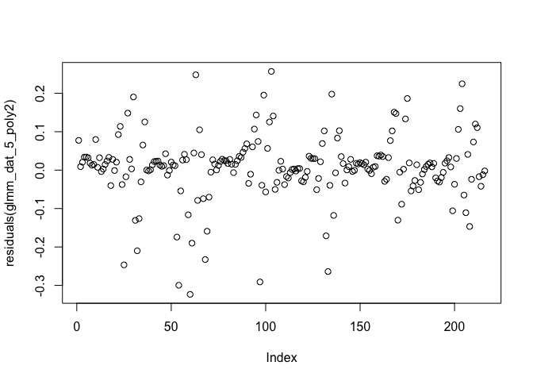<!-- -->

``` r
plot(residuals(glmm_dat_5_poly3), type="p")
```

<!-- -->

``` r
plot(residuals(glmm_dat_5_poly4), type="p")
```

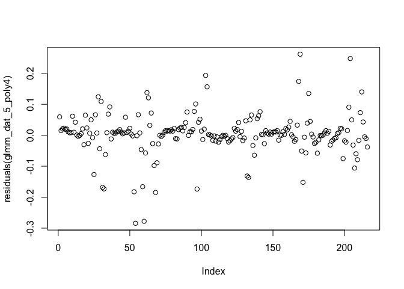<!-- -->

``` r
 # looks much better than the LMM

par(mfrow=c(1,4))
qqPlot(residuals(glmm_dat_5), envelope=0.99)
```

    ## [1] 151  32

``` r
qqPlot(residuals(glmm_dat_5_poly2), envelope=0.99)
```

    ## [1]  90 151

``` r
qqPlot(residuals(glmm_dat_5_poly3), envelope=0.99)
```

    ## [1] 151  87

``` r
qqPlot(residuals(glmm_dat_5_poly4), envelope=0.99)
```

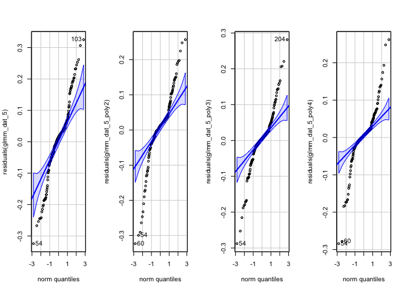<!-- -->

    ## [1] 151  90

``` r
# again, substantial divergence from expected values at the extremes
```

Select best polynomial structure.

``` r
anova(glmm_dat_5, glmm_dat_5_poly2, glmm_dat_5_poly3, glmm_dat_5_poly4)
```

    ## Data: dat_5
    ## Models:
    ## glmm_dat_5: cbind(count_plaCM, count_pQBR57) ~ transf * Ratio + (1 | pop), zi=~0, disp=~1
    ## glmm_dat_5_poly2: cbind(count_plaCM, count_pQBR57) ~ poly(transf, 2, raw = TRUE) * , zi=~0, disp=~1
    ## glmm_dat_5_poly2:     Ratio + (1 | pop), zi=~0, disp=~1
    ## glmm_dat_5_poly3: cbind(count_plaCM, count_pQBR57) ~ poly(transf, 3, raw = TRUE) * , zi=~0, disp=~1
    ## glmm_dat_5_poly3:     Ratio + (1 | pop), zi=~0, disp=~1
    ## glmm_dat_5_poly4: cbind(count_plaCM, count_pQBR57) ~ poly(transf, 4, raw = TRUE) * , zi=~0, disp=~1
    ## glmm_dat_5_poly4:     Ratio + (1 | pop), zi=~0, disp=~1
    ##                  Df    AIC    BIC  logLik deviance  Chisq Chi Df Pr(>Chisq)    
    ## glmm_dat_5       10 3190.9 3224.6 -1585.5   3170.9                             
    ## glmm_dat_5_poly2 14 3137.8 3185.1 -1554.9   3109.8 61.043      4  1.751e-12 ***
    ## glmm_dat_5_poly3 18 3075.6 3136.4 -1519.8   3039.6 70.228      4  2.032e-14 ***
    ## glmm_dat_5_poly4 22 3057.9 3132.2 -1507.0   3013.9 25.676      4  3.678e-05 ***
    ## ---
    ## Signif. codes:  0 '***' 0.001 '**' 0.01 '*' 0.05 '.' 0.1 ' ' 1

Again, the fourth-degree polynomial term helps explain patterns
significantly.

Select optimal fixed effects structure.

``` r
drop1(glmm_dat_5_poly4, test="Chisq") %>% kable()
```

|                                   |  Df |      AIC |      LRT | Pr(\>Chi) |
|:----------------------------------|----:|---------:|---------:|----------:|
| <none>                            |  NA | 3057.944 |       NA |        NA |
| poly(transf, 4, raw = TRUE):Ratio |  12 | 3448.329 | 414.3848 |         0 |

Again, we detect the significant effect of Ratio on the slope:

|                                   |  Df |      AIC |      LRT | Pr(\>Chi) |
|:----------------------------------|----:|---------:|---------:|----------:|
| <none>                            |  NA | 3057.944 |       NA |        NA |
| poly(transf, 4, raw = TRUE):Ratio |  12 | 3448.329 | 414.3848 |         0 |

``` r
summary(glmm_dat_5_poly4)
```

    ##  Family: betabinomial  ( logit )
    ## Formula:          
    ## cbind(count_plaCM, count_pQBR57) ~ poly(transf, 4, raw = TRUE) *  
    ##     Ratio + (1 | pop)
    ## Data: dat_5
    ## 
    ##      AIC      BIC   logLik deviance df.resid 
    ##   3057.9   3132.2  -1507.0   3013.9      194 
    ## 
    ## Random effects:
    ## 
    ## Conditional model:
    ##  Groups Name        Variance Std.Dev.
    ##  pop    (Intercept) 0.005679 0.07536 
    ## Number of obs: 216, groups:  pop, 24
    ## 
    ## Dispersion parameter for betabinomial family (): 40.7 
    ## 
    ## Conditional model:
    ##                                        Estimate Std. Error z value Pr(>|z|)    
    ## (Intercept)                            -0.92370    0.10022  -9.217  < 2e-16 ***
    ## poly(transf, 4, raw = TRUE)1           -2.33356    0.16805 -13.886  < 2e-16 ***
    ## poly(transf, 4, raw = TRUE)2           -0.32324    0.25928  -1.247 0.212519    
    ## poly(transf, 4, raw = TRUE)3            0.57899    0.08719   6.641 3.12e-11 ***
    ## poly(transf, 4, raw = TRUE)4            0.04817    0.10575   0.456 0.648722    
    ## Ratio1:1                                1.62491    0.13626  11.925  < 2e-16 ***
    ## Ratio1:10                               2.55242    0.15007  17.008  < 2e-16 ***
    ## Rationone                               2.56306    0.15040  17.042  < 2e-16 ***
    ## poly(transf, 4, raw = TRUE)1:Ratio1:1   0.99063    0.20655   4.796 1.62e-06 ***
    ## poly(transf, 4, raw = TRUE)2:Ratio1:1  -1.11728    0.33130  -3.372 0.000745 ***
    ## poly(transf, 4, raw = TRUE)3:Ratio1:1  -0.14087    0.10697  -1.317 0.187877    
    ## poly(transf, 4, raw = TRUE)4:Ratio1:1   0.36702    0.13318   2.756 0.005853 ** 
    ## poly(transf, 4, raw = TRUE)1:Ratio1:10  3.28345    0.22611  14.521  < 2e-16 ***
    ## poly(transf, 4, raw = TRUE)2:Ratio1:10  0.20082    0.35728   0.562 0.574064    
    ## poly(transf, 4, raw = TRUE)3:Ratio1:10 -0.69993    0.11685  -5.990 2.10e-09 ***
    ## poly(transf, 4, raw = TRUE)4:Ratio1:10 -0.08994    0.14331  -0.628 0.530281    
    ## poly(transf, 4, raw = TRUE)1:Rationone  3.35745    0.23217  14.461  < 2e-16 ***
    ## poly(transf, 4, raw = TRUE)2:Rationone  0.15855    0.36336   0.436 0.662581    
    ## poly(transf, 4, raw = TRUE)3:Rationone -0.59781    0.12363  -4.835 1.33e-06 ***
    ## poly(transf, 4, raw = TRUE)4:Rationone  0.01111    0.14767   0.075 0.940002    
    ## ---
    ## Signif. codes:  0 '***' 0.001 '**' 0.01 '*' 0.05 '.' 0.1 ' ' 1

As with the LMM, we see changes in the dynamic over time when there are
more opportunities for conjugation. The fourth-degree polynomial
controls the steepness to the first peak, which is significantly reduced
between the 10:1 and 1:1 treatments.

## Analysis of plaCM/chrCM fitness experiment

Load up data and generate overview plot.

``` r
dat_6 <- read.csv("data/relativefitness_data.txt", header=TRUE, sep=" ") %>% 
  mutate(chr = ifelse(host == "SBW25d4242", "SBW25::chrCM", host),
         pla = ifelse(plasmid == "pQBR57d0059", "pQBR57::plaCM", plasmid),
         ref_chr = ifelse(reference_host == "SBW25d4242", "SBW25::chrCM", reference_host),
         ref_pla = ifelse(reference_plasmid == "pQBR57d0059", "pQBR57::plaCM", reference_plasmid),
         ref = paste(ref_chr, "(", ref_pla, ")", sep=""),
         tst = paste(chr, "(", pla, ")", sep=""),
         selection = factor(mercury))

ggplot(data = dat_6, aes(x=tst, y=RF_r, colour=selection)) + 
  geom_boxplot() +
  geom_point(position="jitter") +
  facet_grid(.~ref) +
  theme(axis.text.x=element_text(angle=45, hjust=1))
```

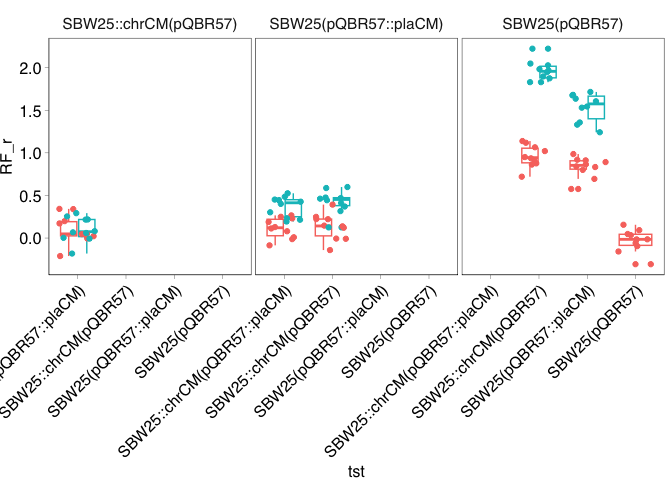<!-- -->

Produce alternative data frame correcting for test/reference
combinations, and produce the figure for the paper.

``` r
dat_6_ext <- dat_6 %>% 
  mutate(reference = ifelse(ttmt %in% c("3B","4B","4C"), tst, ref),
         test      = ifelse(ttmt %in% c("3B","4B","4C"), ref, tst),
         relative_fitness = ifelse(ttmt %in% c("3B","4B","4C"), 0-RF_r, RF_r)) %>%
  bind_rows(filter(dat_6, ttmt=="3B") %>% 
              mutate(reference = ref, test = tst, relative_fitness = RF_r)) %>%
  mutate(reference = factor(reference, levels=c("SBW25(pQBR57)","SBW25::chrCM(pQBR57)",
                              "SBW25(pQBR57::plaCM)","SBW25::chrCM(pQBR57::plaCM)")))

dat_6_summ <- dat_6_ext %>% filter(ttmt %in% c("2A","3A","3B","4B","4C")) %>%
  group_by(reference, test, selection) %>%
  summarise(mean = mean(relative_fitness), 
            n = n(), 
            se = sd(relative_fitness)/sqrt(n), 
            ci = (qt(0.95/2 + 0.5, n-1)) * se) %>%
  rename(relative_fitness=mean)
```

    ## `summarise()` has grouped output by 'reference', 'test'. You can override using
    ## the `.groups` argument.

``` r
annot <- data.frame(reference = "SBW25::chrCM(pQBR57)",
                    test = "SBW25(pQBR57::plaCM)",
                    selection = "0",
                    relative_fitness = 1,
                    label="*")

pd <- position_dodge(width=0.4)
(p6 <- ggplot(data = filter(dat_6_ext, ttmt %in% c("2A","3A","3B","4B","4C")), 
       aes(x=reference, y=relative_fitness, colour=selection)) + 
  geom_hline(yintercept=0, linetype="dotted", linewidth=0.5) +
  geom_point(position = pd, alpha=0.4, shape=16) +
  geom_point(data=dat_6_summ, shape=1, position=pd, size=2) + 
  labs(y = "relative fitness (r) of test strain") + 
  facet_grid(.~test, scales="free_x") +
  geom_text(data = annot, aes(label=label), colour="black", size=5) +
  scale_colour_discrete(name="", labels=c("no selection", "40 µM Hg")) +
  theme(axis.text.x=element_text(angle=45, hjust=1)) +
  theme(legend.position=c(0.9,0.8)))
```

<!-- -->

``` r
png("./figs/p6.png", width=3.2, height=3.6, units="in", res=300)
p6 + theme_pub() + theme(legend.position="bottom") +
  theme(axis.text.x=element_text(angle=45, hjust=1)) +
  theme(legend.position=c(0.9,0.8))
dev.off()
```

    ## quartz_off_screen 
    ##                 2

#### Analysis

Analyse the data shown in the figure. Each panel should be analysed
separately to make the model balanced, and remove the data presented
twice. Linear model with relative fitness as response, and test,
reference, selection, and their three-way interaction as independent
variables.

``` r
lm_6_l <- lm(relative_fitness ~ reference * selection,
             data=filter(dat_6_ext, test == "SBW25::chrCM(pQBR57)" & 
                           reference %in% c("SBW25(pQBR57)","SBW25(pQBR57::plaCM)","SBW25::chrCM(pQBR57::plaCM)")))

lm_6_r <- lm(relative_fitness ~ reference * selection,
             data=filter(dat_6_ext, test == "SBW25(pQBR57::plaCM)" &
                           reference %in% c("SBW25(pQBR57)","SBW25::chrCM(pQBR57::plaCM)")))

par(mfrow=c(2,2))
plot(lm_6_l)
```

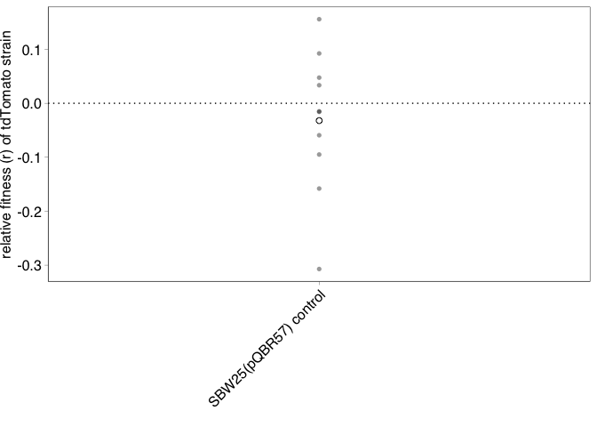<!-- -->

``` r
plot(lm_6_r)
```

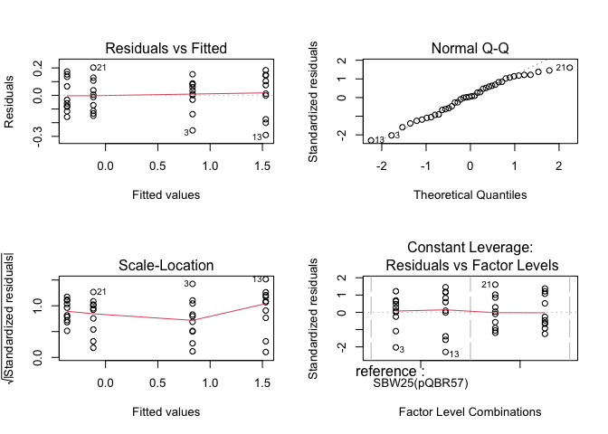<!-- -->

Acceptable fit, seems to meet all assumptions of linear model.

``` r
dat_6_ext <- within(dat_6_ext, {
  groups <- interaction(tst,ref,selection)
  groups <- reorder(groups, relative_fitness, mean)
})

library(car)
bartlett.test(relative_fitness ~ groups, data=filter(dat_6_ext, test == "SBW25::chrCM(pQBR57)" & 
                           reference %in% c("SBW25(pQBR57)","SBW25(pQBR57::plaCM)","SBW25::chrCM(pQBR57::plaCM)")))
```

    ## 
    ##  Bartlett test of homogeneity of variances
    ## 
    ## data:  relative_fitness by groups
    ## Bartlett's K-squared = 1.3271, df = 5, p-value = 0.9321

``` r
fligner.test(relative_fitness ~ groups, data=filter(dat_6_ext, test == "SBW25::chrCM(pQBR57)" & 
                           reference %in% c("SBW25(pQBR57)","SBW25(pQBR57::plaCM)","SBW25::chrCM(pQBR57::plaCM)")))
```

    ## 
    ##  Fligner-Killeen test of homogeneity of variances
    ## 
    ## data:  relative_fitness by groups
    ## Fligner-Killeen:med chi-squared = 0.78485, df = 5, p-value = 0.978

``` r
leveneTest(relative_fitness ~ groups, data=filter(dat_6_ext, test == "SBW25::chrCM(pQBR57)" & 
                           reference %in% c("SBW25(pQBR57)","SBW25(pQBR57::plaCM)","SBW25::chrCM(pQBR57::plaCM)")))
```

    ## Levene's Test for Homogeneity of Variance (center = median)
    ##       Df F value Pr(>F)
    ## group  5  0.1998 0.9612
    ##       54

``` r
shapiro.test(resid(lm_6_l))
```

    ## 
    ##  Shapiro-Wilk normality test
    ## 
    ## data:  resid(lm_6_l)
    ## W = 0.985, p-value = 0.6702

``` r
bartlett.test(relative_fitness ~ groups, data=filter(dat_6_ext, test == "SBW25(pQBR57::plaCM)" &
                           reference %in% c("SBW25(pQBR57)","SBW25::chrCM(pQBR57::plaCM)")))
```

    ## 
    ##  Bartlett test of homogeneity of variances
    ## 
    ## data:  relative_fitness by groups
    ## Bartlett's K-squared = 1.4941, df = 3, p-value = 0.6836

``` r
fligner.test(relative_fitness ~ groups,  data=filter(dat_6_ext, test == "SBW25(pQBR57::plaCM)" &
                           reference %in% c("SBW25(pQBR57)","SBW25::chrCM(pQBR57::plaCM)")))
```

    ## 
    ##  Fligner-Killeen test of homogeneity of variances
    ## 
    ## data:  relative_fitness by groups
    ## Fligner-Killeen:med chi-squared = 1.6084, df = 3, p-value = 0.6575

``` r
leveneTest(relative_fitness ~ groups,    data=filter(dat_6_ext, test == "SBW25(pQBR57::plaCM)" &
                           reference %in% c("SBW25(pQBR57)","SBW25::chrCM(pQBR57::plaCM)")))
```

    ## Levene's Test for Homogeneity of Variance (center = median)
    ##       Df F value Pr(>F)
    ## group  3  0.5961 0.6217
    ##       36

``` r
shapiro.test(resid(lm_6_r))
```

    ## 
    ##  Shapiro-Wilk normality test
    ## 
    ## data:  resid(lm_6_r)
    ## W = 0.96661, p-value = 0.2797

Tests show no significant deviation from assumptions.

``` r
anova(lm_6_l)
```

    ## Analysis of Variance Table
    ## 
    ## Response: relative_fitness
    ##                     Df  Sum Sq Mean Sq F value    Pr(>F)    
    ## reference            2 26.5120 13.2560 649.003 < 2.2e-16 ***
    ## selection            1  2.7975  2.7975 136.964 < 2.2e-16 ***
    ## reference:selection  2  2.6706  1.3353  65.376 3.773e-15 ***
    ## Residuals           54  1.1030  0.0204                      
    ## ---
    ## Signif. codes:  0 '***' 0.001 '**' 0.01 '*' 0.05 '.' 0.1 ' ' 1

Significant interaction, i.e. selection has a different effect depending
on the reference.

``` r
library(emmeans)

posthoc_l_s <- lsmeans(lm_6_l, pairwise ~ (selection|reference), adjust="none")
posthoc_l_r <- lsmeans(lm_6_l, pairwise ~ (reference|selection), adjust="none")
contr_l <- data.frame(posthoc_l_s$contrasts) %>% 
  bind_rows(data.frame(posthoc_l_r$contrasts)) %>%
  mutate(p.adjust = p.adjust(p.value, method="bonferroni"),
         sign = ifelse(p.value<0.05, "*", ""))
kable(contr_l)
```

| contrast                                           | reference                   |   estimate |        SE |  df |     t.ratio |   p.value | selection |  p.adjust | sign |
|:---------------------------------------------------|:----------------------------|-----------:|----------:|----:|------------:|----------:|:----------|----------:|:-----|
| selection0 - selection40                           | SBW25(pQBR57)               | -1.0040193 | 0.0639143 |  54 | -15.7088456 | 0.0000000 | NA        | 0.0000000 | \*   |
| selection0 - selection40                           | SBW25(pQBR57::plaCM)        | -0.2925314 | 0.0639143 |  54 |  -4.5769349 | 0.0000281 | NA        | 0.0002527 | \*   |
| selection0 - selection40                           | SBW25::chrCM(pQBR57::plaCM) |  0.0009808 | 0.0639143 |  54 |   0.0153453 | 0.9878132 | NA        | 1.0000000 |      |
| SBW25(pQBR57) - SBW25(pQBR57::plaCM)               | NA                          |  0.8259458 | 0.0639143 |  54 |  12.9227152 | 0.0000000 | 0         | 0.0000000 | \*   |
| SBW25(pQBR57) - SBW25::chrCM(pQBR57::plaCM)        | NA                          |  1.0584511 | 0.0639143 |  54 |  16.5604847 | 0.0000000 | 0         | 0.0000000 | \*   |
| SBW25(pQBR57::plaCM) - SBW25::chrCM(pQBR57::plaCM) | NA                          |  0.2325054 | 0.0639143 |  54 |   3.6377695 | 0.0006154 | 0         | 0.0055382 | \*   |
| SBW25(pQBR57) - SBW25(pQBR57::plaCM)               | NA                          |  1.5374336 | 0.0639143 |  54 |  24.0546259 | 0.0000000 | 40        | 0.0000000 | \*   |
| SBW25(pQBR57) - SBW25::chrCM(pQBR57::plaCM)        | NA                          |  2.0634512 | 0.0639143 |  54 |  32.2846756 | 0.0000000 | 40        | 0.0000000 | \*   |
| SBW25(pQBR57::plaCM) - SBW25::chrCM(pQBR57::plaCM) | NA                          |  0.5260176 | 0.0639143 |  54 |   8.2300498 | 0.0000000 | 40        | 0.0000000 | \*   |

Significant effects of mercury for all comparisons except chrCM vs
double-compensated. Significant differences between all modes of
compensation, both with and without mercury.

Compare all measurements against 0.

``` r
(posthoc_l_0 <- filter(dat_6_ext, test == "SBW25::chrCM(pQBR57)" & 
                           reference %in% c("SBW25(pQBR57)","SBW25(pQBR57::plaCM)","SBW25::chrCM(pQBR57::plaCM)")) %>%
  select(reference, test, selection, relative_fitness) %>%
  group_by(reference, test, selection) %>% 
  summarise(values = list(relative_fitness),
            coef = t.test(unlist(values), mu = 0)$estimate,
            df = t.test(unlist(values), mu = 0)$parameter,
            t_value = t.test(unlist(values), mu = 0)$statistic,
            p_value = t.test(unlist(values), mu = 0)$p.value) %>%
  select(-values) %>%
  mutate(p_adj = p.adjust(p_value, method="bonferroni"))) %>% kable()
```

    ## `summarise()` has grouped output by 'reference', 'test'. You can override using
    ## the `.groups` argument.

| reference                   | test                 | selection |       coef |  df |   t_value |   p_value |     p_adj |
|:----------------------------|:---------------------|:----------|-----------:|----:|----------:|----------:|----------:|
| SBW25(pQBR57)               | SBW25::chrCM(pQBR57) | 0         |  0.9593259 |   9 | 23.495140 | 0.0000000 | 0.0000000 |
| SBW25(pQBR57)               | SBW25::chrCM(pQBR57) | 40        |  1.9633452 |   9 | 52.228528 | 0.0000000 | 0.0000000 |
| SBW25(pQBR57::plaCM)        | SBW25::chrCM(pQBR57) | 0         |  0.1333801 |   9 |  2.749415 | 0.0224983 | 0.0449967 |
| SBW25(pQBR57::plaCM)        | SBW25::chrCM(pQBR57) | 40        |  0.4259115 |   9 |  9.864781 | 0.0000040 | 0.0000080 |
| SBW25::chrCM(pQBR57::plaCM) | SBW25::chrCM(pQBR57) | 0         | -0.0991252 |   9 | -1.864956 | 0.0950599 | 0.1901198 |
| SBW25::chrCM(pQBR57::plaCM) | SBW25::chrCM(pQBR57) | 40        | -0.1001060 |   9 | -2.167918 | 0.0583109 | 0.1166217 |

After Bonferroni adjustment, chrCM is significantly fitter than all
comparisons except for the double-compensated strain.

For the right-hand panel:

``` r
anova(lm_6_r)
```

    ## Analysis of Variance Table
    ## 
    ## Response: relative_fitness
    ##                     Df  Sum Sq Mean Sq  F value    Pr(>F)    
    ## reference            1 20.2868 20.2868 1145.416 < 2.2e-16 ***
    ## selection            1  0.5033  0.5033   28.418 5.449e-06 ***
    ## reference:selection  1  2.2617  2.2617  127.697 2.149e-13 ***
    ## Residuals           36  0.6376  0.0177                       
    ## ---
    ## Signif. codes:  0 '***' 0.001 '**' 0.01 '*' 0.05 '.' 0.1 ' ' 1

Again significant interaction.

``` r
posthoc_r_s <- lsmeans(lm_6_r, pairwise ~ (selection|reference), adjust="none")
posthoc_r_r <- lsmeans(lm_6_r, pairwise ~ (reference|selection), adjust="none")
contr_r <- data.frame(posthoc_r_s$contrasts) %>% 
  bind_rows(data.frame(posthoc_r_r$contrasts)) %>%
  mutate(p.adjust = p.adjust(p.value, method="bonferroni"),
         sign = ifelse(p.value<0.05, "*", ""))
kable(contr_r)
```

| contrast                                    | reference                   |   estimate |        SE |  df |    t.ratio |   p.value | selection |  p.adjust | sign |
|:--------------------------------------------|:----------------------------|-----------:|----------:|----:|-----------:|----------:|:----------|----------:|:-----|
| selection0 - selection40                    | SBW25(pQBR57)               | -0.6999194 | 0.0595169 |  36 | -11.760004 | 0.0000000 | NA        | 0.0000000 | \*   |
| selection0 - selection40                    | SBW25::chrCM(pQBR57::plaCM) |  0.2512244 | 0.0595169 |  36 |   4.221057 | 0.0001574 | NA        | 0.0006295 | \*   |
| SBW25(pQBR57) - SBW25::chrCM(pQBR57::plaCM) | NA                          |  0.9487468 | 0.0595169 |  36 |  15.940787 | 0.0000000 | 0         | 0.0000000 | \*   |
| SBW25(pQBR57) - SBW25::chrCM(pQBR57::plaCM) | NA                          |  1.8998905 | 0.0595169 |  36 |  31.921848 | 0.0000000 | 40        | 0.0000000 | \*   |

Significant effects of mercury for all comparisons. Significant
differences between each mode of compensation, both with and without
mercury.

``` r
(posthoc_r_0 <- filter(dat_6_ext, test == "SBW25(pQBR57::plaCM)" &
                           reference %in% c("SBW25(pQBR57)","SBW25::chrCM(pQBR57::plaCM)")) %>%
  select(reference, test, selection, relative_fitness) %>%
  group_by(reference, test, selection) %>% 
  summarise(values = list(relative_fitness),
            coef = t.test(unlist(values), mu = 0)$estimate,
            df = t.test(unlist(values), mu = 0)$parameter,
            t_value = t.test(unlist(values), mu = 0)$statistic,
            p_value = t.test(unlist(values), mu = 0)$p.value) %>%
  select(-values) %>%
  mutate(p_adj = p.adjust(p_value, method="bonferroni"))) %>% kable()
```

    ## `summarise()` has grouped output by 'reference', 'test'. You can override using
    ## the `.groups` argument.

| reference                   | test                 | selection |       coef |  df |   t_value |   p_value |     p_adj |
|:----------------------------|:---------------------|:----------|-----------:|----:|----------:|----------:|----------:|
| SBW25(pQBR57)               | SBW25(pQBR57::plaCM) | 0         |  0.8320867 |   9 | 22.061996 | 0.0000000 | 0.0000000 |
| SBW25(pQBR57)               | SBW25(pQBR57::plaCM) | 40        |  1.5320061 |   9 | 29.174454 | 0.0000000 | 0.0000000 |
| SBW25::chrCM(pQBR57::plaCM) | SBW25(pQBR57::plaCM) | 0         | -0.1166601 |   9 | -3.083325 | 0.0130696 | 0.0261392 |
| SBW25::chrCM(pQBR57::plaCM) | SBW25(pQBR57::plaCM) | 40        | -0.3678845 |   9 | -9.585403 | 0.0000051 | 0.0000102 |

After Bonferroni adjustment, plaCM is significantly fitter than
uncompensated, but significantly less fit than the double-compensated.

### Conjugation experiments

Short (4h) conjugation experiments were run using strains that were in
the exponential phase of growth.

``` r
counts <- read.csv("./data/conjugation_data.csv", header=TRUE, sep=",") %>% filter(crop != "x") %>%
  select(!(c(notes, crop))) %>%
  mutate(white = (1000/spread) * (10^dilution) * count_white,
         blue = (1000/spread) * (10^dilution) * count_blue)

dat_7 <- left_join(
    counts %>% filter(time_h==0 & media == "kb"),
    counts %>% filter(time_h==4 & media == "kb"),
    by=c("strain", "rep"),
    suffix=c(".start",".end")
    ) %>% 
  select(strain, rep, white.start, blue.start, white.end, blue.end) %>%
  rename(R.0 = white.start, D.0 = blue.start, R.t = white.end, D.t = blue.end) %>%
  left_join(
    counts %>% filter(time_h==4 & media != "kb") %>% select("strain","rep","white"),
    by=c("strain", "rep")
  ) %>%
  rename(T.t = white) %>%
  mutate(psi.R = log(R.t/R.0)/4,
         psi.D = log(D.t/D.0)/4,
         psi.T = psi.D, 
         gamma = (psi.D + psi.R - psi.T) * (T.t / ((D.t * R.t) - (D.0 * R.0 * exp(psi.T * 4)))))
```

Can output for analysis using the [online Shiny
app](https://ibz-shiny.ethz.ch/jhuisman/conjugator/) for
cross-validation.

``` r
# output for analysis with Conjugator

dat_7 %>% mutate(ID = paste(strain, rep, sep = "."), T.0 = 0, t = 4) %>% 
  select(ID, psi.D, psi.R, psi.T, D.0, R.0, T.0, D.t, R.t, T.t, t) %>% 
  write.csv(file = "./data/output_for_conjugator.csv", row.names = FALSE)
```

Plot:

``` r
dat_7_summ <- dat_7 %>%
  group_by(strain) %>%
  summarise(gamma = mean(gamma))

pd <- position_dodge(width = 0.2)

(p7 <- ggplot(data = dat_7, aes(x = factor(strain, levels=c("pQ57","delta_59")), y = log10(gamma))) +
    geom_hline(yintercept=-11.34, linetype="dotted", linewidth=0.5) +
  geom_point(position=pd, aes(group=rep), alpha=0.4, shape=16) +
    geom_point(data=dat_7_summ, shape=1, size=2) +
  scale_y_continuous(limits=c(-15,-10), breaks=seq(-15,-10,by=1), name=expression(paste("log"[10], "(\u03B3)"))) +
  scale_x_discrete(labels=c("pQBR57", "pQBR57::plaCM"), name="donor")) +
  theme(axis.text.x=element_text(angle=45, hjust=1))
```

<!-- -->

``` r
png("./figs/p7.png", width=1.8, height=2.2, units="in", res=300)
p7 + theme_pub() + theme(legend.position="bottom") +
  theme(axis.text.x=element_text(angle=45, hjust=1))
dev.off()
```

    ## quartz_off_screen 
    ##                 2

Statistics:

``` r
dat_7 <- dat_7 %>% mutate(log10_gamma = log10(gamma))

t.test(log10_gamma ~ strain, data=dat_7)
```

    ## 
    ##  Welch Two Sample t-test
    ## 
    ## data:  log10_gamma by strain
    ## t = 0.075085, df = 9.8597, p-value = 0.9416
    ## alternative hypothesis: true difference in means between group delta_59 and group pQ57 is not equal to 0
    ## 95 percent confidence interval:
    ##  -0.4558745  0.4876072
    ## sample estimates:
    ## mean in group delta_59     mean in group pQ57 
    ##              -11.53879              -11.55465

No significant difference detected by t.test.

Perform equivalence test.

``` r
library(TOSTER)

t_TOST(log10_gamma ~ strain, eqb = 0.5,
       data=dat_7)
```

    ## 
    ## Welch Two Sample t-test
    ## 
    ## The equivalence test was significant, t(9.86) = -2.3, p = 0.02
    ## The null hypothesis test was non-significant, t(9.86) = 0.075p = 0.94
    ## NHST: don't reject null significance hypothesis that the effect is equal to zero 
    ## TOST: reject null equivalence hypothesis
    ## 
    ## TOST Results 
    ##                   t   df p.value
    ## t-test      0.07509 9.86   0.942
    ## TOST Lower  2.44126 9.86   0.018
    ## TOST Upper -2.29109 9.86   0.023
    ## 
    ## Effect Sizes 
    ##                Estimate     SE              C.I. Conf. Level
    ## Raw             0.01587 0.2113 [-0.3677, 0.3994]         0.9
    ## Hedges's g(av)  0.03995 0.6471 [-0.8364, 0.9143]         0.9
    ## Note: SMD confidence intervals are an approximation. See vignette("SMD_calcs").

Equivalence test significant, indicating that the values are not
different at significance level p = 0.02 to +/- 0.5 units.

------------------------------------------------------------------------

**[Back to index.](../README.md)**
