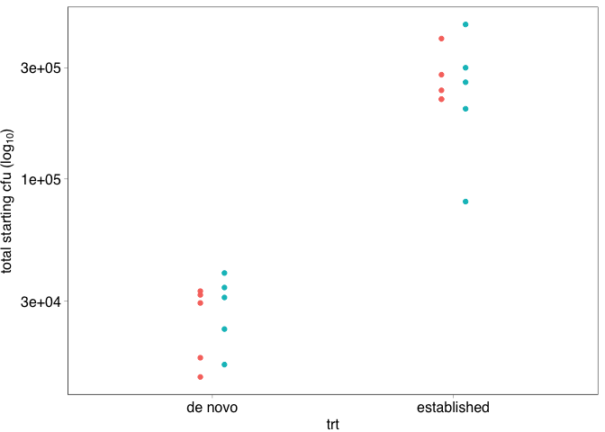
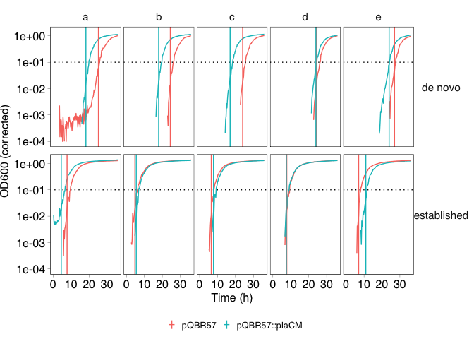

COMPMUT Dynamics 5: Transconjugant experiments
================
jpjh
compiled Aug 2024

## Experiments investigating the fitness (acquisition) costs and conjugation rates from new pQBR57 and pQBR57∆0059 transconjugants

The dynamics data suggested a trade-off between fitness and conjugation
for the pQBR57::plaCM, but this was not observed in bulk conjugation
experiments, even when a short conjugation time was used. Therefore,
further hypotheses were developed:

1.  pQBR57∆0059 suffers from a greater acquisition cost than wild-type
    pQBR57, such that new transconjugants of pQBR57::plaCM need more
    time to exit lag phase.
2.  pQBR57∆0059 suffers from reduced conjugation derepression than
    wild-type pQBR57, such that the conjugation rate from new
    transconjugants is significantly lower for pQBR57::plaCM;

To investigate these processes, two experiments were conducted.

- Growth curves were set up with fresh transconjugants and grown under
  constant selection for transconjugants, and compared with established
  transconjugants.
- A conjugation assay (18 hours conjugation time) was run with an excess
  (100x) of recipient cells, which should provide increased opportunity
  for conjugation from transconjugants.

### Growth curve assay

``` r
full_counts <- read.csv("./data/6_TransconjugantConjugation.csv", header=TRUE) %>%
  mutate(white_cfu = 10^dilution * (1000/spread) * count_white,
         blue_cfu = 10^dilution * (1000/spread) * count_blue)

exptdat_acqcost <- read.csv("./data/7_AcqusitionCosts.csv", header=TRUE)
```

Plot starting counts for the experiment.

``` r
pd <- position_dodge(width=0.2)
full_counts %>% filter(expt == "expt_1") %>%
  mutate(total_cfu_start = (white_cfu + blue_cfu) * 0.01) %>%
  ggplot(aes(x=trt, y=total_cfu_start, colour=strain)) +
  geom_point(position=pd) +
  scale_x_discrete(breaks=c("T1_trt","T1old_trt"), labels=c("de novo","established")) +
  scale_y_log10(name = expression(paste("total starting cfu (log"[10],")")))
```

<!-- -->

Is there a significant difference in starting counts between the two
plasmids?

``` r
t.test(count_blue ~ strain, data=filter(full_counts, expt == "expt_1" & trt == "T1_trt"))
```

    ## 
    ##  Welch Two Sample t-test
    ## 
    ## data:  count_blue by strain
    ## t = -0.625, df = 7.9708, p-value = 0.5494
    ## alternative hypothesis: true difference in means between group pQBR57 and group pQBR57_delta59 is not equal to 0
    ## 95 percent confidence interval:
    ##  -842.6799  483.4799
    ## sample estimates:
    ##         mean in group pQBR57 mean in group pQBR57_delta59 
    ##                       1255.6                       1435.2

No significant difference in the means between the groups.

Plot OD600 measurements, correcting by a minimum blank value.

``` r
growthcurve_min <- filter(exptdat_acqcost, Time < 1) %>%
    select(Measurements) %>% arrange(Measurements) %>% pull() %>% mean()

exptdat_acqcost_gc <- exptdat_acqcost %>% 
  filter(Strain != "blank" & Trt %in% c("T1_trt","T1old_trt")) %>%
  mutate(Measure_corr = Measurements - growthcurve_min,
         Transconjugant = factor(Trt, levels=c("T1_trt","T1old_trt"), labels=c("de novo","established")),
         Strain = factor(Strain, levels=c("pQBR57","pQBR57_delta59"), labels=c("pQBR57","pQBR57::plaCM")))

exptdat_acqcost_gc %>%
  ggplot(aes(x=Time, y=Measure_corr, colour=Strain, group=Well)) +
  geom_line() +
  facet_grid(Transconjugant ~ Rep) +
  labs(colour="", y="OD600 (corrected)", x = "Time (h)") +
  theme(legend.position = "bottom")
```

<!-- -->

Clearly shows that for the T1_trt strains, pQBR57∆0059 has a reduced lag
time compared with pQBR57 wild-type.

Calculate growth rates and lag time using gcplyr. Previous studies
showed the moving-average and window width of 5 helped smooth noisy
data. Small values (\< 0.015) were removed to avoid noise around 0.

``` r
exptdat_acqcost_gcplyr <- filter(exptdat_acqcost_gc, Trt %in% c("T1_trt","T1old_trt")) %>%
    group_by(Well, Row, Col, Rep, Strain, Transconjugant) %>%
    mutate(smoothed = smooth_data(x = Time, y = Measure_corr,
                                  sm_method = "moving-average", window_width_n = 5),
           smderivpercap_3 = calc_deriv(x = Time, y = smoothed,
                                        percapita = TRUE, blank = 0, window_width_n = 3))

set_threshold <- 0.1

(exptdat_acqcost_gcplyrsumm <- exptdat_acqcost_gcplyr %>% 
    filter(smoothed > 0.015) %>%
    summarize(max_percap = max_gc(smderivpercap_3, na.rm = TRUE),
              max_percap_time = extr_val(Time, which_max_gc(smderivpercap_3)),
              threshold_time = Time[which(smoothed > set_threshold)[1]],
              doub_time = doubling_time(y = max_percap))) %>%
  kable()
```

    ## `summarise()` has grouped output by 'Well', 'Row', 'Col', 'Rep', 'Strain'. You
    ## can override using the `.groups` argument.

| Well | Row | Col | Rep | Strain        | Transconjugant | max_percap | max_percap_time | threshold_time | doub_time |
|:-----|:----|----:|:----|:--------------|:---------------|-----------:|----------------:|---------------:|----------:|
| F1   | F   |   1 | a   | pQBR57        | de novo        |  0.9867468 |           25.25 |          26.00 | 0.7024570 |
| F10  | F   |  10 | e   | pQBR57::plaCM | de novo        |  1.1030961 |           24.00 |          24.25 | 0.6283652 |
| F2   | F   |   2 | a   | pQBR57::plaCM | de novo        |  1.3445292 |           18.25 |          20.00 | 0.5155315 |
| F3   | F   |   3 | b   | pQBR57        | de novo        |  1.2974961 |           24.50 |          26.25 | 0.5342191 |
| F4   | F   |   4 | b   | pQBR57::plaCM | de novo        |  1.4331318 |           18.00 |          19.50 | 0.4836591 |
| F5   | F   |   5 | c   | pQBR57        | de novo        |  1.4178939 |           24.00 |          25.50 | 0.4888569 |
| F6   | F   |   6 | c   | pQBR57::plaCM | de novo        |  1.1632162 |           17.00 |          18.50 | 0.5958885 |
| F7   | F   |   7 | d   | pQBR57        | de novo        |  1.3388825 |           24.25 |          26.25 | 0.5177058 |
| F8   | F   |   8 | d   | pQBR57::plaCM | de novo        |  1.2211019 |           24.00 |          24.50 | 0.5676407 |
| F9   | F   |   9 | e   | pQBR57        | de novo        |  1.1942417 |           27.00 |          27.75 | 0.5804078 |
| G1   | G   |   1 | a   | pQBR57        | established    |  1.4897683 |            7.75 |           9.75 | 0.4652718 |
| G10  | G   |  10 | e   | pQBR57::plaCM | established    |  1.4305025 |           11.00 |          11.75 | 0.4845481 |
| G2   | G   |   2 | a   | pQBR57::plaCM | established    |  0.8774745 |            4.50 |           6.50 | 0.7899343 |
| G3   | G   |   3 | b   | pQBR57        | established    |  1.6600817 |            4.75 |           6.25 | 0.4175380 |
| G4   | G   |   4 | b   | pQBR57::plaCM | established    |  1.8432769 |            5.50 |           7.25 | 0.3760407 |
| G5   | G   |   5 | c   | pQBR57        | established    |  1.5266337 |            6.50 |           8.00 | 0.4540363 |
| G6   | G   |   6 | c   | pQBR57::plaCM | established    |  2.1871124 |            7.75 |           9.25 | 0.3169234 |
| G7   | G   |   7 | d   | pQBR57        | established    |  2.0054481 |            7.75 |           9.25 | 0.3456321 |
| G8   | G   |   8 | d   | pQBR57::plaCM | established    |  1.6254696 |            7.50 |           9.00 | 0.4264289 |
| G9   | G   |   9 | e   | pQBR57        | established    |  2.2009785 |            7.00 |           8.25 | 0.3149268 |

``` r
exptdat_acqcost_gc %>%
  ggplot(aes(x=Time, y=Measure_corr, colour=Strain, group=Well)) +
  geom_line() +
  geom_hline(yintercept=set_threshold, colour="black", linetype="dotted") + 
  geom_vline(data=exptdat_acqcost_gcplyrsumm,
             aes(xintercept=max_percap_time, colour=Strain)) +
  facet_grid(Transconjugant ~ Rep) + scale_y_log10() + 
  labs(colour="", y="OD600 (corrected)", x = "Time (h)") +
  theme(legend.position = "bottom")
```

    ## Warning in self$trans$transform(x): NaNs produced

    ## Warning: Transformation introduced infinite values in continuous y-axis

    ## Warning: Removed 886 rows containing missing values (`geom_line()`).

<!-- -->

``` r
(acqcost <- ggplot(data=exptdat_acqcost_gcplyrsumm, aes(x=Transconjugant, y=threshold_time,
                                            colour=Strain)) +
  geom_point(position=pd, shape=16, alpha=0.5) + labs(colour="", y="time to reach OD600 = 0.1") +
    stat_summary(fun = mean, geom = "point", size = 2, shape = 1, position=pd) + 
  theme(legend.position="bottom"))
```

<!-- -->

``` r
png("./figs/p_acqcost.png", width=1.8, height=2.2, units="in", res=300)
acqcost + theme_pub() + theme(legend.position="bottom") +
  theme(axis.text.x=element_text(angle=45, hjust=1)) +
  theme(legend.position=c(0.7,0.85))
dev.off()
```

    ## quartz_off_screen 
    ##                 2

``` r
exptdat_acqcost_gc %>%
  ggplot(aes(x=Time, y=Measure_corr, colour=Strain, group=Well)) +
  geom_line(alpha=0.5) +
  facet_grid(Transconjugant ~ .) +
  labs(colour="", y="OD600 (corrected)", x = "Time (h)") +
  theme(legend.position = c(0.2, 0.8))
```

<!-- -->

``` r
t.test(threshold_time ~ Strain, filter(exptdat_acqcost_gcplyrsumm, Transconjugant == "de novo"))
```

    ## 
    ##  Welch Two Sample t-test
    ## 
    ## data:  threshold_time by Strain
    ## t = 3.8056, df = 4.7073, p-value = 0.01406
    ## alternative hypothesis: true difference in means between group pQBR57 and group pQBR57::plaCM is not equal to 0
    ## 95 percent confidence interval:
    ##  1.558444 8.441556
    ## sample estimates:
    ##        mean in group pQBR57 mean in group pQBR57::plaCM 
    ##                       26.35                       21.35

There is a significantly reduced lag time for de novo transconjugants of
plaCM compared with pQBR57.

### Onward conjugation assay

A standard 18 hour conjugation assay was set up with cells in the late
exponential phase, attempting to use approximately 100x more recipients
than donors. This follows Lundquist and Levin’s 1986 experiments, in
which an excess of recipients means that secondary conjugation events
will become increasingly important during the assay.

Plot donors and recipients.

``` r
(expt2_counts <- full_counts %>% filter(expt=="expt_2") %>%
  mutate(white = 10^dilution * (1000/spread) * as.numeric(count_white),
         blue = 10^dilution * (1000/spread) * as.numeric(count_blue),
         total = white + blue,
         ratio = white/total)) %>%
  filter(time=="t0") %>%
  ggplot(aes(x=strain, y=ratio, shape=rep)) +
  geom_point() + facet_grid(.~trt) +
  geom_hline(yintercept=0.5, linetype="dotted", linewidth=0.2)
```

<!-- -->

Note: these counts were made from separate plates, with donors being
diluted 100x for the start of the experiment. The similar ratios here
mean that the 1:100 dilutions used in the experiment were likely to be
accurate.

``` r
filter(expt2_counts, time=="t0") %>%
  ggplot(aes(x=strain, y=white, shape=rep)) +
  geom_point() + facet_grid(.~trt) + scale_y_log10()
```

<!-- -->

Similar start counts (around 1e9/ml).

Plot of endpoint counts:

``` r
filter(expt2_counts, time=="t1" & trt == "endpoint_DR" & media == "KB+X-gal") %>%
  ggplot(aes(x=strain, y=ratio, shape=rep)) +
  geom_point()
```

<!-- -->

Endpoint ratios around 1:99, which is consistent with a 1:100 dilution
at the start.

Calculate conjugation rates.

``` r
expt2_conj_data <- left_join(
    expt2_counts %>% filter(time=="t0" & trt == "D_R_premix" & media == "KB+X-gal"),
    expt2_counts %>% filter(time=="t1" & trt == "endpoint_DR" & media == "KB+X-gal"),
    by=c("expt","rep","strain"),
    suffix=c(".start",".end")
    ) %>%
  mutate(blue.start_corrected = blue.start*0.01) %>%
  select(expt, rep, strain, white.start, blue.start_corrected, white.end, blue.end) %>%
  left_join(
    filter(expt2_counts, time=="t1" & trt == "endpoint_T" & media == "KB+Km50+Hg20+X-gal"), 
    by=c("expt","rep","strain")) %>%
  rename(D.0 = "blue.start_corrected", R.0 = "white.start", D.t = "blue.end", R.t = "white.end",
         T.t = "white") %>%
  mutate(psi.R = log(R.t/R.0)/18,
         psi.D = log(D.t/D.0)/18,
         psi.T = psi.D, 
         gamma = (psi.D + psi.R - psi.T) * (T.t / ((D.t * R.t) - (D.0 * R.0 * exp(psi.T * 18)))),
         w = psi.D/psi.R,
         log10_gamma = log10(gamma)) %>%
  select(rep, strain, D.0, R.0, D.t, R.t, T.t, psi.R, psi.D, psi.T, gamma, log10_gamma, w)

(p_outnumbered <- expt2_conj_data  %>%
    ggplot(aes(x=strain, y=log10_gamma)) +
    geom_point(alpha=0.5, shape=16, position=pd) + 
    geom_hline(yintercept=-11.34, linetype="dotted", linewidth=0.2) +
    stat_summary(fun = mean, geom = "point", size = 2, shape = 1, position=pd) + 
    scale_y_continuous(limits=c(-15,-10), breaks=seq(-15,-10,by=1), name=expression(paste("log"[10], "(\u03B3)"))) +
    scale_x_discrete(breaks = c("pQBR57","pQBR57_delta59"),
                     labels = c("pQBR57","pQBR57::plaCM")))
```

<!-- -->

``` r
png("./figs/p_outnumbered.png", width=1.8, height=2.2, units="in", res=300)
p_outnumbered + theme_pub() + theme(legend.position="bottom") +
  theme(axis.text.x=element_text(angle=45, hjust=1)) +
  theme(legend.position=c(0.9,0.8))
dev.off()
```

    ## quartz_off_screen 
    ##                 2

Results in very similar conjugation rates to before!

``` r
t.test(log10_gamma ~ strain, data=expt2_conj_data)
```

    ## 
    ##  Welch Two Sample t-test
    ## 
    ## data:  log10_gamma by strain
    ## t = -0.33009, df = 4.8989, p-value = 0.755
    ## alternative hypothesis: true difference in means between group pQBR57 and group pQBR57_delta59 is not equal to 0
    ## 95 percent confidence interval:
    ##  -1.169866  0.905075
    ## sample estimates:
    ##         mean in group pQBR57 mean in group pQBR57_delta59 
    ##                     -11.7399                     -11.6075

p = 0.775, indicating no significant differences between the strains.

------------------------------------------------------------------------

**[Back to index.](../README.md)**
