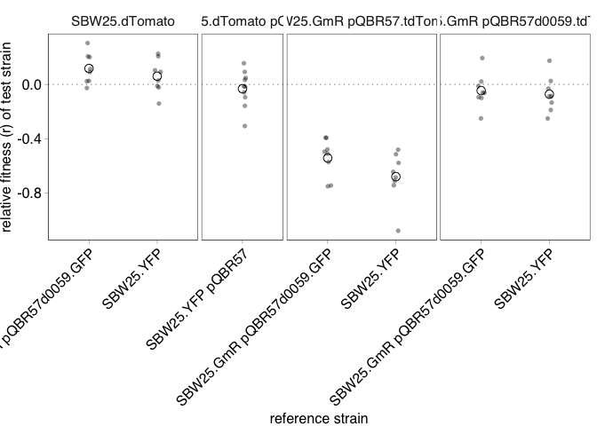
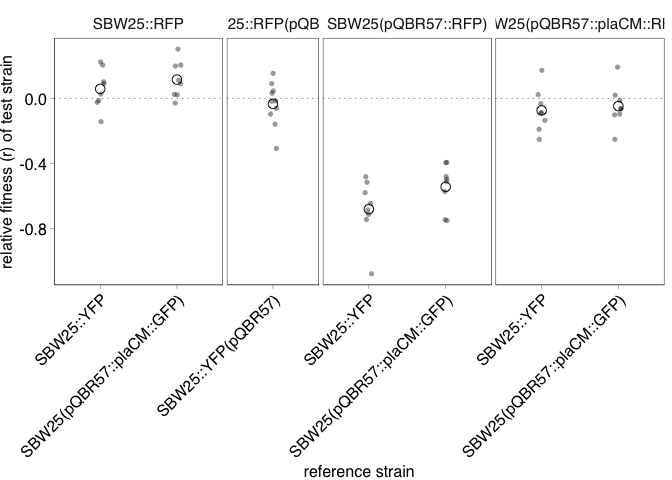
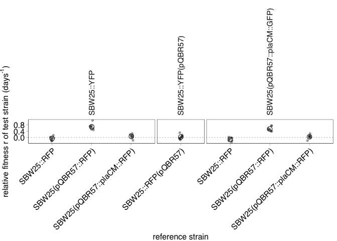

COMPMUT Dynamics 7: Control Plots
================
jpjh
compiled Aug 2024

### Load up data for plotting

Plotting and analysing control competitions to test for marker effects.

``` r
compdat <- read.csv("./data/8_ControlCompetitionData.csv",
                             header=TRUE)

competition_data <- read.csv("./data/1_RelativeFitnessData.csv", 
                            header=TRUE) %>%
  filter(ttmt == "1A") %>%
  bind_rows(compdat)
```

Make a plot.

``` r
pd <- position_jitter(width=0.05)

ggplot(competition_data, aes(x=reference, y=RF_r)) +
  geom_hline(yintercept=0, linetype="dotted", linewidth=0.2) + 
  geom_point(alpha=0.4, shape=16, position=pd) + 
  facet_grid(.~strain, scales="free_x", space="free_x") +
  stat_summary(fun = mean, geom = "point", shape=21, size = 3) +
  labs(y="relative fitness (r) of test strain", x="reference strain") +
  theme(axis.text.x = element_text(angle=45, hjust=1))
```

<!-- -->

Looks good – but ideally want to relabel it and flip it around so it
resembles the figure in the main manuscript.

To do this, we want to rename pQBR57d0059 to pQBR57::plaCM.

``` r
competition_data <- competition_data %>%
  mutate(str = factor(strain, 
                      levels = c("SBW25.dTomato", "SBW25.dTomato pQBR57", 
                                 "SBW25.GmR pQBR57.tdTomato", "SBW25.GmR pQBR57d0059.tdTomato"),
                      labels = c("SBW25::RFP", "SBW25::RFP(pQBR57)", 
                                 "SBW25(pQBR57::RFP)","SBW25(pQBR57::plaCM::RFP)")),
         ref = factor(reference,
                      levels = c("SBW25.YFP", "SBW25.YFP pQBR57", "SBW25.GmR pQBR57d0059.GFP"),
                      labels = c("SBW25::YFP", "SBW25::YFP(pQBR57)", "SBW25(pQBR57::plaCM::GFP)")))

ggplot(competition_data, aes(x=ref, y=RF_r)) +
  geom_hline(yintercept=0, linetype="dotted", linewidth=0.2) + 
  geom_point(alpha=0.4, shape=16, position=pd) + 
  facet_grid(.~str, scales="free_x", space="free_x") +
  stat_summary(fun = mean, geom = "point", shape=21, size = 3) +
  labs(y="relative fitness (r) of test strain", x="reference strain") +
  theme(axis.text.x = element_text(angle=45, hjust=1))
```

<!-- -->

Flip the plot so that the main plaCM strain (i.e. the reference) is on
the facets, but reorient such that fitness is given of the facet
relative to the x-axis, as in the figure in the main text. This requires
plotting the inverse of the relative fitness measurement, and labelling
the ‘test’ as the ‘reference’ (and vice versa).

``` r
(plot_controls <- ggplot(competition_data, aes(x=str, y=-RF_r)) +
  geom_hline(yintercept=0, linetype="dotted", linewidth=0.2) + 
  geom_point(alpha=0.4, shape=16, position=pd) + 
  facet_grid(.~ref, scales="free_x", space="free_x") +
  stat_summary(fun = mean, geom = "point", shape=21, size = 3) +
  labs(y = expression(paste("relative fitness r of test strain (days"^"-1",")")), 
       x = "reference strain") +
  theme(axis.text.x = element_text(angle=45, hjust=1),
        strip.text.x=element_text(angle=90, hjust=0)))
```

<!-- -->

``` r
tiff("./figs/FigS11.tiff", width=5.6, height=8.4, units="in", res=300)
plot_controls
dev.off()
```

    ## quartz_off_screen 
    ##                 2

Analysis.

Compare all controls with 0 (equal fitness).

``` r
(posthoc_r_0 <- competition_data %>%
   select(ref, str, RF_r) %>%
  group_by(ref, str) %>% 
  summarise(values = list(-RF_r),
            coef = t.test(unlist(values), mu = 0)$estimate,
            df = t.test(unlist(values), mu = 0)$parameter,
            t_value = t.test(unlist(values), mu = 0)$statistic,
            p_value = t.test(unlist(values), mu = 0)$p.value) %>%
  select(-values) %>%
    mutate(p_adj = p.adjust(p_value, method="bonferroni"),
         sign = ifelse(p_adj<0.05, "*", ""))) %>% kable()
```

    ## `summarise()` has grouped output by 'ref'. You can override using the `.groups`
    ## argument.

| ref                       | str                       |       coef |  df |    t_value |   p_value |     p_adj | sign |
|:--------------------------|:--------------------------|-----------:|----:|-----------:|----------:|----------:|:-----|
| SBW25::YFP                | SBW25::RFP                | -0.0603607 |   7 | -1.3882363 | 0.2076402 | 0.6229207 |      |
| SBW25::YFP                | SBW25(pQBR57::RFP)        |  0.6806835 |   7 | 10.3390252 | 0.0000172 | 0.0000515 | \*   |
| SBW25::YFP                | SBW25(pQBR57::plaCM::RFP) |  0.0724031 |   7 |  1.5508050 | 0.1648848 | 0.4946545 |      |
| SBW25::YFP(pQBR57)        | SBW25::RFP(pQBR57)        |  0.0321011 |   9 |  0.7656176 | 0.4635084 | 0.4635084 |      |
| SBW25(pQBR57::plaCM::GFP) | SBW25::RFP                | -0.1175864 |   7 | -2.9498501 | 0.0214114 | 0.0642343 |      |
| SBW25(pQBR57::plaCM::GFP) | SBW25(pQBR57::RFP)        |  0.5433326 |   7 | 10.9686213 | 0.0000116 | 0.0000348 | \*   |
| SBW25(pQBR57::plaCM::GFP) | SBW25(pQBR57::plaCM::RFP) |  0.0457496 |   7 |  1.0263559 | 0.3388773 | 1.0000000 |      |

We are most interested in uncorrected p-values, because we want maximum
power to detect if strains act differently to expected.

Three competitions give significant results:

- SBW25::YFP vs. SBW25(pQBR57::RFP) – significant fitness cost of
  pQBR57::RFP in competition with plasmid free (as expected).
- SBW25(pQBR57::plaCM::GFP) vs. SBW25(pQBR57::RFP) – significant
  amelioration of pQBR57::plaCM in competition with wild-type
  plasmid-bearers (as expected).
- A marginal result: SBW25(pQBR57::plaCM::GFP) vs. SBW25::RFP – a
  significant cost of plaCM relative to plasmid free, again expected
  given the likely incompleteness of plaCM amelioration.

The relevant marker controls show that the YFP and RFP chromosomal
markers are very similar, that these remain similar when carrying
plasmids, and that the plaCM markers are very similar.

------------------------------------------------------------------------

**[Back to index.](../README.md)**
